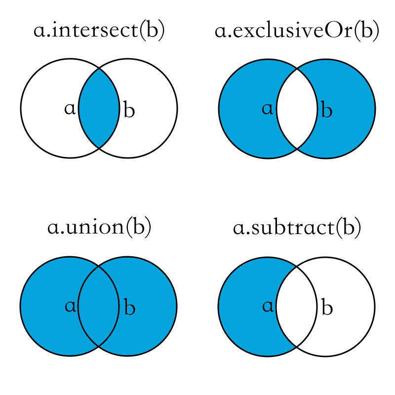
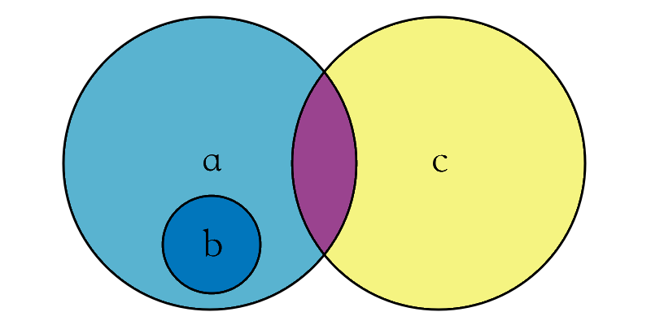

# 集合型別

- [陣列](#array)
- [Sets 集合](#set)
- [字典](#dictionary)

Swift 提供三種基本的集合型別：`Arrays`、`Sets`、`Dictionaries`來儲存集合資料。儲存的資料**型別必須明確**，且都**只能儲存同一種型別**的資料。

- Array 陣列：按順序儲存資料。
- Set 集合：沒有順序、不能重複儲存資料。
- Dictionary 字典：沒有順序，鍵值對 `key : value` ，也就是可以經由唯一的識別鍵找到需要的值。

<a name="array"></a>
### 陣列

陣列(`array`)使用有序列表儲存同一型別的多個值。相同的值可以多次出現在一個陣列的不同位置中。

宣告陣列變數或常數時的型別，有`Array<Element>`及`[Element]`兩種方式(`Element`是需要明確表示的型別，如`Int`、`String`、`Double`等等)。

```swift
// 宣告儲存 Int 型別的陣列
var arr: Array<Int>
var arr2: [Int]
// 兩種陣列型別表示方式 在功能上是一樣的 所以用第二種就好

```

#### 創建一個空陣列

```swift
// 宣告一個型別為 Int 的空陣列
var arr = [Int]()

// 為這個陣列加上一個值
arr.append(12)

// 這時如果又要再將這個陣列指派成空陣列
// 因為前面宣告時已經定義好型別
// 所以可以很簡單的使用 [] 來指派成空陣列
arr = []

// 或是首次宣告變數時 有明確定義好型別 也可以使用 []
var anotherArr: [Int] = []

```

#### 創建一個帶有預設值的陣列

陣列型別還提供一個可以創建特定大小並且所有資料都被預設的建構方法。將準備加入新陣列的資料項數量`count`和適當型別的初始值`repeatedValue`傳入陣列建構函式：

```swift
var threeInts = [Int](count: 3, repeatedValue:0)
// threeInts 是一種 [Int] 陣列, 等於 [0, 0, 0]

```

#### 合併兩個陣列

陣列可以使用加法運算子`+`來合併兩個陣列。

```swift
// 首先創建一個 [0,0,0] 的陣列
var threeInts = [Int](count: 3, repeatedValue:0)

// 接著再創建一個 [2,2,2] 的陣列
var anotherThreeInts = [Int](count: 3, repeatedValue:2)

// 最後將兩個陣列合併
var SixInts = threeInts + anotherThreeInts
// 會變成 [0,0,0,2,2,2]

```

#### 直接填入值來創建陣列

可以直接填入值來創建陣列，每個值以逗號`,`分隔。

```swift
var shoppingList: [String] = ["Eggs", "Milk"]
// 即創建了一個型別為 [String] 且包含兩個值的陣列

// 因為 Swift 會自動的型別推斷 所以陣列中如果明確的表示了是什麼型別的值 便不用再標註型別
var anotherList = ["Rice", "Apples"]
// 因為陣列包含著型別為 String 的值, Swift 可以推斷這個陣列的型別為 [String]

```

#### 存取與修改陣列

一開始說過陣列是有序的集合，所以可以依照索引值(依照順序的排列序號)來取得陣列內的值。

##### Hint

- 陣列的索引值是從 0 開始算起。

```swift
var arr = ["Apples", "Eggs", "Milk", "Rice", "Water"]

// 陣列的索引值是由 0 開始計算 所以 arr[2] 指的是第三個
// 印出：Milk
print(arr[2])

// 要修改一個索引值對應的值 直接將其指派新的值就可以了
arr[2] = "Oranges"
// 這時已將 Milk 改成 Oranges 所以會印出：Oranges
print(arr[2])

// 如果要修改一個區間內的值 可以使用區間寫法修改
arr[1...4] = ["Milk"]
// 這樣會將原本索引值 1 到 4 的值修改成 Milk
// 所以現在 arr 會變成 ["Apples", "Milk"]
print(arr)

```

可以使用屬性`count`來表示陣列內值的數量，會返回一個非負的整數。另外也可以使用屬性`isEmpty`來檢查陣列內是否有值，會返回一個布林值。例子如下：

```swift
var arr = ["Apples", "Eggs", "Milk"]

// 印出陣列中的個數：3
print(arr.count)

// 將陣列指派為空陣列
arr = []

if arr.isEmpty {
    print("Empty !")
} else {
    print("Not Empty !")
}
// 因為為空陣列 內部沒有值 所以會印出：Empty !

```

加入或移除陣列內的值：

```swift
// 使用 append(_:) 方法來加入新的值
var arr = ["Apples", "Eggs"]
arr.append("Milk") // 加入新的值 順序會在最後一個
// 現在 arr 會變成 ["Apples", "Eggs", "Milk"]

// 如果要選擇加入的索引值的位置 使用 insert(_:atIndex:) 方法
// arr.insert(要加入的值, atIndex:要加入的索引值位置)
arr.insert("Rice" ,atIndex:0 )
// 現在 arr 會變成 ["Rice" ,"Apples", "Eggs", "Milk"]
// 所有索引值在後面的都會順延往後一個位置

// 移除一個索引位置的值 使用 removeAtIndex(_:) 方法
arr.removeAtIndex(1) // 將排在第二個的 Apples 移除
// 所有後面的值都會遞補向前一個位置
// 現在 arr 會變成 ["Rice", "Eggs", "Milk"]

// 或者是移除最後一個值 使用 removeLast() 方法
arr.removeLast()
// 現在 arr 會變成 ["Rice", "Eggs"]

```

使用`for-in`遍歷陣列中的所有值

```swift
var arr = ["Rice" ,"Apples", "Eggs", "Milk"]
for item in arr {
    print(item)
}
// 會依序印出：
// Rice
// Apples
// Eggs
// Milk

// 當你同時也需要獲得陣列值時 可以使用 enumerate() 方法
for (index, value) in arr.enumerate() {
    print("Item \(index + 1): \(value)")
}
// 會依序印出：
// Item 1: Rice
// Item 2: Apples
// Item 3: Eggs
// Item 4: Milk

```

後面章節會正式介紹 [for-in 的使用方法](../ch1/control_flow.md#for)。

<a name="set"></a>
### Sets 集合

集合(`Set`)用來儲存相同型別且沒有順序、沒有重複的值，當順序不重要或是需要每個值只能出現一次時，可以選擇使用`Set`。

宣告`Set`型別時，使用`Set<Element>`這個方式，這裡的`Element`表示`Set`中儲存的型別。

```swift
// 宣告一個集合型別
var mySet: Set<String>

```

與陣列使用上有點類似，基本使用方法如下：

```swift
//創建一個空的 Set
var mySet = Set<Int>()

// 可以在宣告時直接填入值
var anotherSet: Set<String> = ["Rock", "Classical", "Hip hop"]

// 指派為一個空 Set, 雖然長得跟陣列使用方法一樣 
// 但因為前面已經有明確宣告是 Set, 所以這仍然是 Set<String> 型別
anotherSet = []

// Set 所含的值的數量
// 因為目前是空 Set,印出：0
print(anotherSet.count)

// 使用 isEmpty 檢查 Set 內是否有值
if anotherSet.isEmpty {
    print("Empty !")
} else {
    print("Not empty !")
}
// 印出：Empty !

```

加入或移除 Set 內的值：

```swift
var mySet: Set<String> = ["Rock", "Classical"]
// 使用 insert(_:) 來加入新的值
mySet.insert("Hip hop")
// 目前為 ["Rock", "Classical", "Hip hop"] (無順序)

// 使用 remove(_:) 來移除一個值
// 如果這個值是 mySet 裡的一個值, 會移除掉這個值並返回此值
// 反之 不存在裡面的話 則是返回 nil
mySet.remove("Rock")
// 目前為 ["Classical", "Hip hop"] (無順序)

// 使用 contains(_:) 來檢查 Set 裡是否包含一個特定的值
if mySet.contains("Classical") {
    print("Classical is here !")
} else {
    print("Not Here !")
}
// 印出：Classical is here !

// 使用 removeAll() 來移除其內所有的值
mySet.removeAll()

```

使用`for-in`遍歷`Set`中的所有值：

```swift
var mySet: Set<String> = ["Rice" ,"Apples", "Eggs"]
for item in mySet {
    print(item)
}
// 會印出；(順序不一定) 
// Rice
// Apples
// Eggs

// 因為 Set 沒有順序, 可以使用 sort() 方法來返回一個有序的陣列
for item in mySet.sort() {
    print(item)
}
// 會印出：
// Apples
// Eggs
// Rice

```

#### 集合(Sets)操作

Swift 提供以下幾個方法，依據兩個 Set 之間交集(有相同的值)與否的關係來創建新的 Set。

- `intersect(_:)` 創建一個新的 Set，其內的值為**兩個 Set 中個別都包含的值**。
- `exclusiveOr(_:)` 創建一個新的 Set，其內的值為**兩個 Set 中只單獨存在其中一個 Set 的值**。
- `union(_:)` 創建一個新的 Set，其內的值**包含兩個 Set 中所有的值**。
- `subtract(_:)` 創建一個新的 Set，其內的值**在一個 Set 內,但不在另一個 Set 內**。

或參考下圖依據兩個 Set 之間關係表現的圖：



例子如下：

```swift
let oddDigits: Set = [1, 3, 5, 7, 9]
let evenDigits: Set = [0, 2, 4, 6, 8]
let singleDigitPrimeNumbers: Set = [2, 3, 5, 7]

oddDigits.intersect(evenDigits).sort()
// [] 空 Set 因為兩個 Set 沒有交集

oddDigits.exclusiveOr(singleDigitPrimeNumbers).sort()
// [1, 2, 9] 因為兩個 Set 都有 3,5,7 
// 所以返回兩個 Set 中 除了這三個值以外的值

oddDigits.union(evenDigits).sort()
// [0, 1, 2, 3, 4, 5, 6, 7, 8, 9] 包含兩個 Set 中所有的值

oddDigits.subtract(singleDigitPrimeNumbers).sort()
// [1, 9] 因為 3,5,7 在 singleDigitPrimeNumbers 內
// 所以返回 oddDigits 中 除了這三個值之外的值

```

Swift 提供幾個方法來比對兩個 Set 的關係，皆是返回一個布林值。

- `isSubsetOf(_:)` 判斷一個 Set 是否被包含在另一個 Set 中。
- `isSupersetOf(_:)` 判斷一個 Set 是否包含另一個 Set 所有的值。
- `isStrictSubsetOf(_:)` 判斷一個 Set 是否被包含在另一個 Set 中，且兩個 Set 不相等。
- `isStrictSupersetOf(_:)` 判斷一個 Set 是否包含另一個 Set 所有的值，且兩個 Set 不相等。
- `isDisjointWith(_:)` 判斷兩個集合是否不含有相同的值(是否沒有交集)。

或參考下圖依據兩個 Set 之間的關係表示的圖：



例子如下：

```swift
let houseAnimals: Set = ["狗", "貓"]
let farmAnimals: Set = ["牛", "雞", "羊", "狗", "貓"]
let cityAnimals: Set = ["鳥", "鼠"]

houseAnimals.isSubsetOf(farmAnimals)
// 返回 true 因為 farmAnimals 包含 houseAnimals 內所有的值

farmAnimals.isSupersetOf(houseAnimals)
// 與上一行意思一樣 只是效果相反 所以也是返回 true

farmAnimals.isDisjointWith(cityAnimals)
// 返回 true 因為 farmAnimals 跟 cityAnimals 沒有交集

```

<a name="dictionary"></a>
### 字典

字典(`dictionary`)用來儲存多個相同型別的值。每個值(`value`)都屬於一個唯一的鍵(`key`)，鍵作為字典中這個值的識別符號，所有鍵的型別也必須相同(鍵與值的型別不一定要相同)。

因為字典內的值沒有順序，所以需要根據這個鍵(`key`)來找到需要的值(`value`)。宣告字典型別時，使用`Dictionary<Key, Value>`這個方式，這裡的`Key`表示字典裡鍵的型別，`Value`表示字典裡儲存的型別。

```swift
// 宣告一個字典型別
var myDict: Dictionary<String, String>

// 或是這樣也可以
var anothierDict: [String: String]

```

創建一個空字典。如果已經有型別標註了，則可以使用`[:]`設為空字典。

```swift
// 宣告一個空字典 鍵的型別是 String , 值的型別是 Int
var myDict = [String: Int]()

// 在字典中新增一個值
myDict["one"] = 1

// 再將字典設為空字典 因為前面已經有型別標註過了 所以使用 [:] 
myDict = [:]

```

一個`key`跟一個`value`組成一組鍵值對，一個字典以中括號`[]`前後包起來，可以包含多組鍵值對，每組以逗號`,`分隔。

```swift
[key1:value1, key2:value2, key3:value3]

```

#### 存取與修改字典

使用下標(`subscript`)來存取或是修改字典的值。其餘使用方法與陣列類似。

##### Hint

- 下標(`subscript`)的表示方法為字典變數後加一個中括號`[]`，中括號裡面填入鍵(`key`)，以取得對應的值(`value`)。

```swift
// 宣告一個型別為 [String: String] 的字典
var myDict = ["TYO": "Tokyo", "DUB": "Dublin"]

// 字典裡值的數量
// 印出：2
print(myDict.count)

// 檢查字典裡是否有值
if myDict.isEmpty {
    print("Empty !")
} else {
    print("Not empty !")
}
// 印出：Not empty !

// 如果這個 key 沒有對應到字典裡的值, 就新增一個值
myDict["LHR"] = "London"

// 如果 key 有對應到字典裡的值, 則是修改這個值
myDict["LHR"] = "London Heathrow"

// 如果要移除這個值 則是將其設為 nil
myDict["LHR"] = nil

```

除了使用下標語法，字典也提供方法可以修改或刪除，如下：

```swift
var myDict = ["LHR": "London", "DUB": "Dublin"]

// 使用 updateValue(_:forKey:) 更新一個值
// 返回一個對應值的型別的可選值 (這邊就是返回一個 String? )
myDict.updateValue("London Heathrow", forKey: "LHR")
// 印出：London Heathrow
print(myDict["LHR"])

// 使用 removeValueForKey(_:) 移除一個值
// 返回被刪除的值, 如果沒有對應的值的話則會返回 nil
myDict.removeValueForKey("DUB")

```

只需要字典中的鍵或值時，可以使用`keys`或`values`屬性。這時會建立一個鍵或值的新陣列，例子如下：

```swift
var myDict = ["LHR": "London", "DUB": "Dublin"]

// 只需要鍵時, 使用 keys 屬性, 取得一個只有鍵的陣列
var arr1 = [String](myDict.keys)
// arr1 為 ["LHR", "DUB"]

// 只需要值時, 使用 values 屬性, 取得一個只有值的陣列
var arr2 = [String](myDict.values)
// arr2 為 ["London", "Dublin"]

// 如果需要固定順序的話 可以加上 sort() 方法
arr1.sort()
arr2.sort()

```

使用`for-in`遍歷字典中的所有值：

```swift
var myDict = ["LHR": "London", "DUB": "Dublin"]

for (code, n) in myDict {
    print("\(code): \(n)")
}
// 印出：
// LHR: London
// DUB: Dublin

// 如果只需要鍵或值時, 使用 keys 或 values 屬性
for code in myDict.keys {
    print(code)
}
// 印出：
// LHR
// DUB

for n in myDict.values {
    print(n)
}
// 印出：
// London
// Dublin

```

