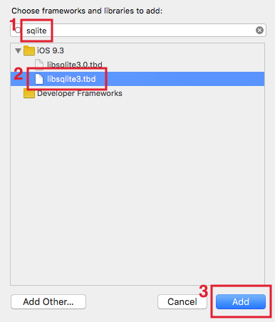
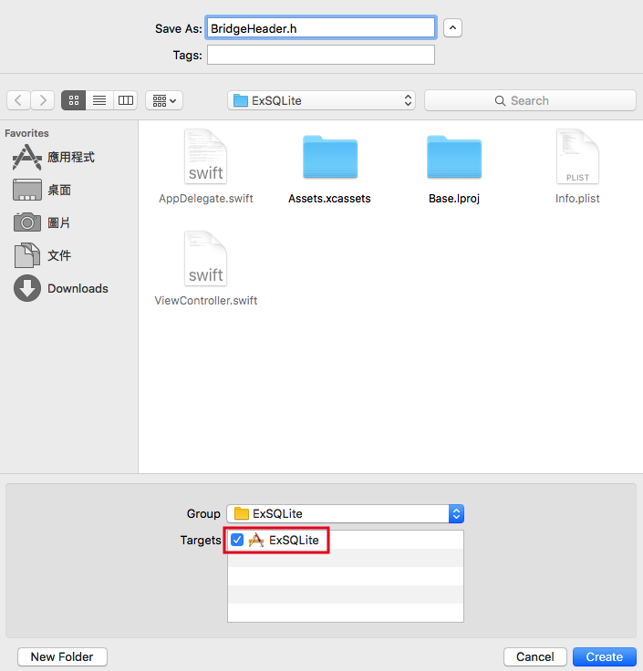

# SQLite

iOS 系統支援很常見的資料庫 SQLite ，這是一個很輕量的關聯式資料庫管理系統( Relational Database Management System ，縮寫為 RDBMS )，所有的資料內容其實就是一個檔案，而且絕大部分的 SQL 指令都可以使用。

以下會先介紹在應用程式中如何加入 SQLite ，接著會介紹如何新增、讀取、更新與刪除資料，最後會將 SQLite 功能獨立寫在一個類別中，以便日後其他應用程式需要時可以重複使用。

本節內容已假設你已經會使用簡單的 SQL 指令，所以不會詳細介紹如何使用，如果尚未熟悉，請先了解相關內容再繼續本節的範例。


### 加入 SQLite

其實 Swift 本身是無法直接使用 SQLite 的功能，必須要利用 Objective-C (在 Swift 之前用來編寫 iOS 應用程式的程式語言)來與 SQLite 連結。

首先在 Xcode 裡，[新建一個 **Single View Application** 類型的專案](../more/open_project.md#create_a_new_project)，取名為 ExSQLite 。

以下會介紹如何加入的步驟：

#### 加入 sqlite 函式庫

▼ 預設的應用程式沒有 sqlite 函式庫，所以需要手動加入，先找到`TARGETS > ExSQLite > General > Linked Frameworks and Libraries`，並按下加號` + `，如下圖：


▼ 這邊會列出來所有可以加入的函式庫，所以填入`sqlite`來過濾，最後會出現兩個類似的函式庫，實際上兩個指的是一樣的東西，所以選一個加入就好，這邊選取`libsqlite3.tbd`，按下`Add`加入：



▼ 如果有順利加入的話， sqlite 函式庫就會出現在列表中，如下圖：


#### 新增 header 檔案

▼ 前面提到需要利用 Objective-C 來與 SQLite (也就是前一步驟加入的 sqlite 函式庫)連結，所以接著必須為應用程式加上一個 header 檔案。先以[新增檔案](../more/addfile.md)的方式加入，但請注意選擇檔案類型時，要選擇`iOS > Source > Header File`，如下圖：


▼ 接著將檔案命名為 BridgeHeader.h ( .h 就是一個 header 檔案)，請記得要勾選 Targets ，如下圖：



建立好 header 檔案後，請點開這隻檔案，並填入一行程式，如下：

```swift
#include "sqlite3.h"

```

這隻 header 檔案就是用來引入 sqlite 函式庫，所以填寫這一行程式即可。

#### 與 Objective-C 連結

▼ 最後要將 Swift 與前一步驟設置好的 header 檔案連結起來，首先找到`TARGETS > ExSQLite > Build Settings > Objective-C Bridging Header`，這邊有很多東西可以設定，所以你可以在右上角的搜尋框輸入`bridg`來過濾，如下圖：


▼ 接著對下圖標示` 1 `的地方點兩下，會彈出一個輸入框，填入 header 檔案的路徑與檔案(**請記得路徑也要填**)：


▼ 如果順利加入的話，會顯示如下圖的樣子：


這樣便完成了加入 SQLite 的步驟，你可以先試著 Build (`cmd + b`)專案，看看有沒有錯誤，如果有的話請檢查前面步驟有沒有做錯，如果沒有錯誤的話就是順利加入 SQLite 了。


### 使用 SQLite

首先會需要宣告一個變數來儲存 SQLite 的連線資訊，型別為`COpaquePointer`，後續的資料庫操作都會需要這個變數：

```swift
var db :COpaquePointer = nil

```

#### 資料庫檔案路徑

前面有提過 SQLite 其實操作的是一個檔案，所以要先取得這個資料庫檔案的路徑：

```swift
// 資料庫檔案的路徑
let sqlitePath = NSHomeDirectory() + "/Documents/sqlite3.db"

```

`NSHomeDirectory()`會取得 iPhone 為這個應用程式設置可供儲存資訊的路徑，而其內的 Documents 目錄則是開放給開發者儲存檔案的路徑，有任何需要儲存的檔案都是放在這裡，而`sqlite3.db`則是這個資料庫檔案名稱，你也可以命名為`db.sqlite`之類，其他可供辨識的檔案名稱。

如果沒有這個檔案，系統會自動嘗試建立起來。

#### 開啟資料庫連線

接著要與資料庫連線，會用到前面兩個步驟宣告的變數：

```swift
if sqlite3_open(sqlitePath, &db) == SQLITE_OK {
    print("資料庫連線成功")
} else {
    print("資料庫連線失敗")
}

```

使用`sqlite3_open()`函式來連線，請注意第二個參數前面必須加上`&`，這是一個指標的概念(與前面章節提過的[輸入輸出參數 In-Out Parameters ](../ch1/functions.md#inout)類似)，函式內使用的就是傳入參數`db`本身，所以稍後操作資料庫時可以直接使用這個`db`變數。

#### 建立資料表

建立一個名為 **students** 的資料表，欄位分別為 id, name, height ，欄位類型依序為 integer, text, double ：

```swift
let sql = "create table if not exists students "
        + "( id integer primary key autoincrement, "
        + "name text, height double)" as NSString

if sqlite3_exec(db, sql.UTF8String, nil, nil, nil) 
  == SQLITE_OK{
    print("建立資料表成功")
}

```

使用`sqlite3_exec()`函式來建立資料表，第一個參數就是前面建立資料庫連線後的`db`，第二個參數就是 SQL 指令，這邊會先轉成`NSString`型別，再將文字編碼轉成 UTF8。

如果返回為`SQLITE_OK`，則表示建立成功。

##### Hint

- 如果要查看模擬器的 SQLite 檔案，可以使用桌機的 Firefox 瀏覽器的一個套件[ SQLite Manager ](https://addons.mozilla.org/zh-tw/firefox/addon/sqlite-manager/)，它可以讓你檢視與編輯本機上的 SQLite 檔案。實際檔案路徑可藉由將前面提過的`sqlitePath`印出來取得。

#### 新增資料

這邊需要另一個型別為`COpaquePointer`的變數`statement`，用來取得操作資料庫後回傳的資訊：

```swift
var statement :COpaquePointer = nil
let sql = "insert into students "
        + "(name, height) "
        + "values ('小強', 178.2)" as NSString

if sqlite3_prepare_v2(
  self.db, sql.UTF8String, -1, &statement, nil) == SQLITE_OK{
    if sqlite3_step(statement) == SQLITE_DONE {
        print("新增資料成功")
    }
    sqlite3_finalize(statement)
}

```

新增資料是使用`sqlite3_prepare_v2()`函式，前面兩個參數與`sqlite3_exec()`使用的相同，第三個參數則是設定資料庫可以讀取的最大資料量，單位是位元組( Byte )，設為` -1 `表示不限制讀取量，第四個參數是用來取得操作返回的資訊，記得參數前面要加上`&`。

`statement`要再當做`sqlite3_step()`函式的參數傳入，如果返回`SQLITE_DONE`，則是表示新增成功。

最後要使用`sqlite3_finalize()`函式來釋放掉`statement`，以免發生記憶體洩漏的問題。

#### 讀取資料

#### 更新資料

#### 刪除資料

