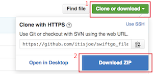

Swift 起步走
=======
v1.0.0

本書內容包含：

- Swift 語法的詳細介紹
- UIKit 常用元件的詳細介紹
- 35 個範例 App
- 3 個完整實戰 App

使用 Swift 2.2 版本，對應 iOS 9 作業系統。

### 需要工具

目前 Swift 主要是用來開發 iPhone 應用程式(另外還可以開發 iPad 、 Mac 及 Apple Watch 的應用程式)，所以你必須先有一台 Mac ( MacBook 、 Mac mini 或是 Mac Pro)，且必須安裝足夠新的作業系統版本，才能夠安裝開發軟體 Xcode 。(像是 Xcode 7.3 只能安裝在 OS X 10.11 以上的作業系統。)

如果你只是想嘗鮮 Swift 的語法而還沒有 Mac ，你也可以選擇線上即時編譯的工具來寫寫 Swift ， IBM 提供了一個線上環境 [IBM Swift Sandbox](https://swiftlang.ng.bluemix.net) ，讓你可以直接在瀏覽器上測試 Swift 語法。

### 課程內容

以下是本書會介紹的內容，如果時間允許，建議依照下列章節依序閱讀，以達較佳學習效果。另外如果是第一次接觸 Xcode ，可以先看看[ Xcode 介紹](more/xcode_intro.md)章節，來熟悉軟體操作。

* [Swift 基礎](ch1/ch1.md)
   * [基本知識](ch1/basics.md)
   * [基本型別](ch1/types.md)
   * [基本運算子](ch1/basic_operators.md)
   * [字串及字元](ch1/strings_characters.md)
   * [集合型別](ch1/collection_types.md)
   * [控制流程](ch1/control_flow.md)
   * [函式](ch1/functions.md)
   * [閉包](ch1/closures.md)
* [Swift 進階](ch2/ch2.md)
   * [列舉](ch2/enumerations.md)
   * [類別及結構](ch2/classes_structures.md)
   * [屬性](ch2/properties.md)
   * [方法](ch2/methods.md)
   * [下標](ch2/subscripts.md)
   * [繼承](ch2/inheritance.md)
   * [建構過程及解構過程](ch2/initialization_deinitialization.md)
   * [自動參考計數](ch2/arc.md)
   * [可選鏈](ch2/optional-chaining.md)
   * [錯誤處理](ch2/error-handling.md)
   * [型別轉換](ch2/type-casting.md)
   * [巢狀型別](ch2/nested-types.md)
   * [擴展](ch2/extensions.md)
   * [協定](ch2/protocols.md)
   * [泛型](ch2/generics.md)
   * [存取控制](ch2/access-control.md)
* [UIKit](uikit/uikit.md)
   * [UIKit 初探](uikit/uikit_intro.md)
   * [文字標籤 UILabel](uikit/uilabel.md)
   * [文字輸入 UITextField](uikit/uitextfield.md)
   * [輸入多行文字 UITextView](uikit/uitextview.md)
   * [按鈕 UIButton](uikit/uibutton.md)
   * [提示框 UIAlertController](uikit/uialertcontroller.md)
   * [圖片 UIImageView](uikit/uiimageview.md)
   * [選取日期時間 UIDatePicker](uikit/uidatepicker.md)
   * [選擇器 UIPickerView](uikit/uipickerview.md)
   * [開關 UISwitch](uikit/uiswitch.md)
   * [分段控制 UISegmentedControl](uikit/uisegmentedcontrol.md)
   * [進度條 UIProgressView](uikit/uiprogressview.md)
   * [滑桿 UISlider](uikit/uislider.md)
   * [步進器 UIStepper](uikit/uistepper.md)
   * [網頁 UIWebView](uikit/uiwebview.md)
   * [表格 UITableView](uikit/uitableview.md)
   * [網格 UICollectionView](uikit/uicollectionview.md)
   * [搜尋 UISearchController](uikit/uisearchcontroller.md)
   * [滑動視圖 UIScrollView](uikit/uiscrollview.md)
   * [多頁面](uikit/multipages.md)
   * [導覽控制器 UINavigationController](uikit/uinavigationcontroller.md)
   * [標籤列控制器 UITabBarController](uikit/uitabbarcontroller.md)
   * [手勢 UIGestureRecognizer](uikit/uigesturerecognizer.md)
   * [簡單動畫 Animations](uikit/animations.md)
   * [儲存資訊 NSUserDefaults](uikit/nsuserdefaults.md)
* [資料庫](database/database.md)
   * [SQLite](database/sqlite.md)
   * [Core Data](database/coredata.md)
* [iPhone Apps](apps/apps.md)
   * [待辦事項](apps/todo/todo.md)
       * [規劃與實作](apps/todo/intro.md)
       * [程式之外的設定](apps/todo/settings.md)
       * [播放音效](apps/todo/sound.md)
       * [UITableView 的編輯模式](apps/todo/edituitableview.md)
   * [遊玩臺北](apps/taipeitravel/taipeitravel.md)
       * [規劃與實作](apps/taipeitravel/intro.md)
       * [取得遠端 API 資料並儲存](apps/taipeitravel/fetchdataandstorage.md)
       * [地圖與定位](apps/taipeitravel/map.md)
   * [記帳](apps/money/money.md)
       * [規劃與實作](apps/money/intro.md)

### 範例

本書範例程式碼放在 [https://github.com/itisjoe/swiftgo_files](https://github.com/itisjoe/swiftgo_files) ，請在閱讀本書內容時，交互搭配範例程式碼。強烈建議先將範例程式碼下載回本地隨時閱讀，以簡省時間。

下載方式請點擊該頁面右上方` Clone or download `，接著點擊`Download ZIP`，如下圖：

