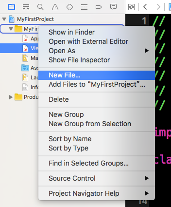
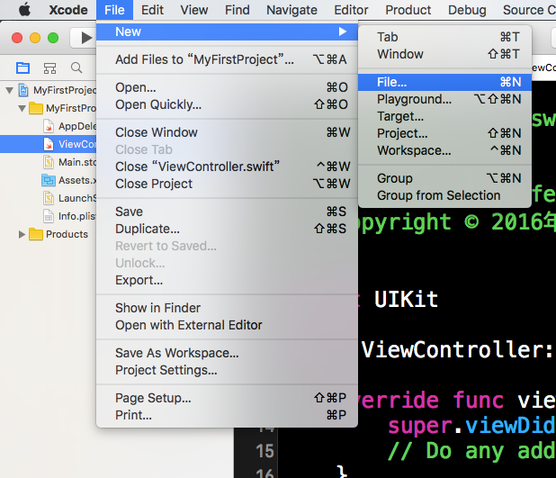
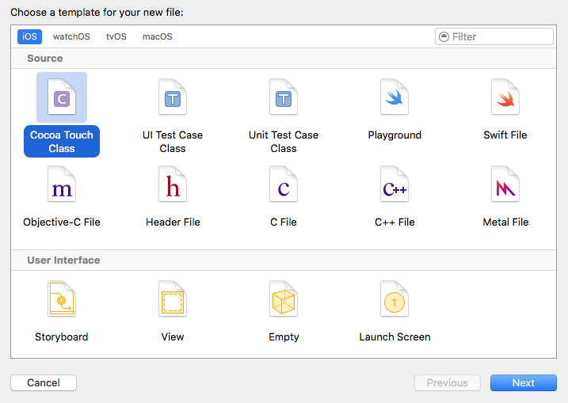
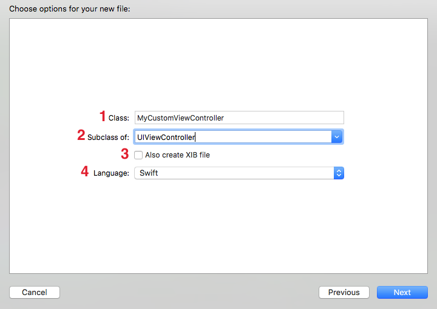
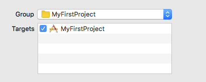
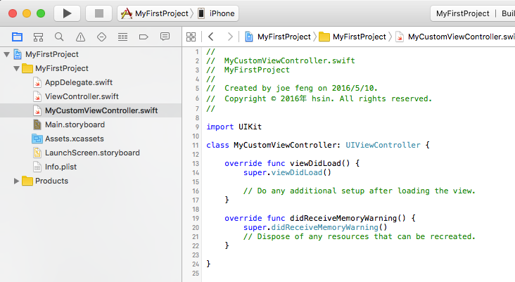

# 新增檔案

▼ 在左側專案檔案列表中，找到你想要新增檔案的目錄按下右鍵，並點擊`New File...`，即可新增檔案，如下圖：

▼ 或是你也可以從工具列的`File > New > File...`來新增檔案，如下圖：

▼ 接著要選擇檔案的類型，這邊示範新增的是一個繼承自`UIViewController`的子類別，所以要選擇`iOS > Source > Cocoa Touch Class`這個模版的檔案，再點擊`Next`按鈕，如下圖：

##### Hint

- 預設的選擇可能是`OS X > Source > Cocoa Class`，記得要再點選前述正確的類型。
- 這些模版檔案都會預設寫好一些程式碼，讓你可以快速的建立新檔案，當然你也可以選擇`iOS > Source > Swift File`，這就會建立一個空的 Swift 檔案，再交由你自己寫後續的程式。

▼ 接著需要填寫這個檔案的資訊：

1. Class：是這個檔案的名稱，同時也是檔案內部的類別(`Class`)名稱，這裡你可以先填寫`MyCustom`(或是你要取的名字，記得這邊建議使用[大駝峰式命名法](/more/camel_case_naming.md#upper))。
2. Subclass of：這個類別要繼承自哪一個父類別，因為是要建立一個自定義的`UIViewController`，所以這邊填寫`UIViewController`，你應該可以注意到他會提示有哪些可以用的 UIKit 元件並會自動補齊名稱，同時也會將前一個欄位補齊為`MyCustomViewController`。
3. Also create XIB file：XIB 檔案是一個介面設計檔案，這邊不勾選。
4. Language：選擇 Swift。

都填寫完畢後，點擊`Next`按鈕繼續：

##### Hint

- 檔案的命名是習慣上的方式，不是必定要遵循，但還是強烈建議使用一樣的命名方式。
- 繼承自的父類別可以有很多種選擇，你要自定義任何一個元件，像是`UIButton`、`UIImage`或是`UITextField`都可以。

▼ 最後需要選擇儲存檔案的位置，會根據你一開始選擇要新增檔案的目錄為準，當然你也可以再另外選擇新的位置。有一點要注意，下方可以看到有個`Targets`列表可以勾選，記得這個要打勾，其功能是讓這個新增的檔案可以作用於哪一個`Target`，最後點擊`Create`即會建立好檔案：

##### Hint

- 本書內容的每一個範例大多都只會有一個`Target`，不過未來遇到不同功能的應用程式時，可能會有多個`Target`。

▼ 建立好的檔案，可以看到類別名稱及繼承自的父類別，與已經有些預定義好的方法：

