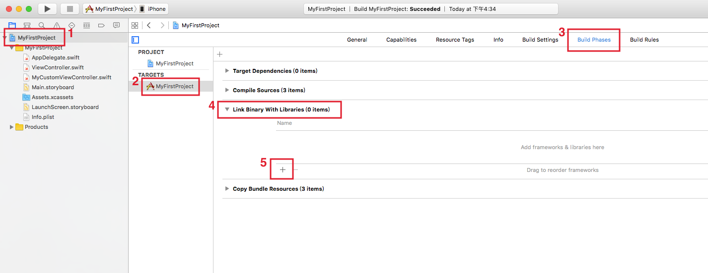
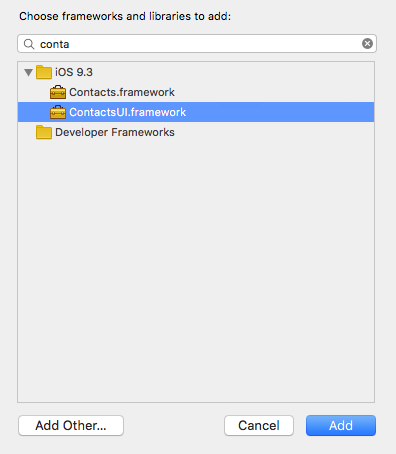
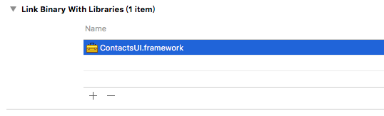

# 新增 Framework

Xcode 內建了很多功能的 Framework (像是要使用通訊錄、相機或是資料庫等等)，但預設不會先加入專案裡，所以必須依照需求自己將 Framework 加入專案。

▼ 請依照下圖的提示，找到 Framework 的列表所在位置，位於 TARGET > MyFirstProject > Build Phases > Link Binary With Libraries ，點擊加號按鈕：

▼ 原先會列出全部可以載入的 Framework ，這邊示範要加入通訊錄使用的 ContactsUI.framework ，所以在搜尋框中填入`contact` ，會依據搜尋的文字篩選出 framework ，接著點選這個  ContactsUI.framework 並點擊`Add`加入：

▼ 這樣便完成了加入 Framework 的步驟：

