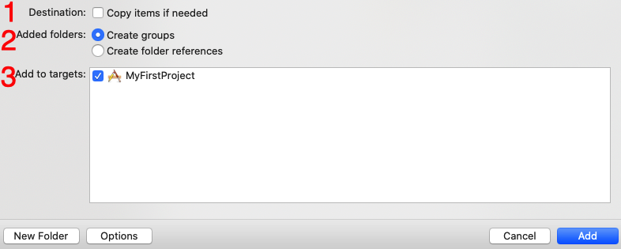

# 加入檔案

▼ 你可以直接從 Finder 拖曳檔案進 Xcode 左側檔案列表中，或是從工具列的`File > Add Files to "MyFirstProject"...`加入檔案，如下圖：

▼ 接著會詢問這個檔案加入的方式：

1. Destination：是否要將檔案真的複製進專案中，如果勾選就是會將檔案複製進專案，而不勾選時，則是會從此檔案原目錄參考的方式使用，專案目錄裡不會有另一份檔案。例如當你使用一個第三方套件時，可能有多個專案用到，這時如果不想每個專案都放一份檔案時，就可以不勾選。
2. Added folders：以`group`還是`folder`的方式加入檔案的目錄。
3. Add to targets：檔案要作用於哪一個`Target`，必須勾選才會作用。

最後按下`Finish`，就完成了加入檔案的動作。

##### Hint

- 簡單來說，`group`(黃色)與`folder`(藍色)的不同在於，group 是以參考的方式對這個目錄做操作，是邏輯性的目錄，如果你將這個 group 更名或變動位置，實際的檔案目錄不會變動。而 folder 則是作為被使用的資源，是實際的目錄，對其變動都會實際更動到檔案，且程式編譯時不會被一併加入編譯，而是將整個目錄複製進`Bundle`中，另外如果程式中需要用到這個檔案資源，必須寫出完整的檔案路徑。
- 本書內容的每一個範例大多都只會有一個`Target`，不過未來遇到不同功能的應用程式時，可能會有多個`Target`。

