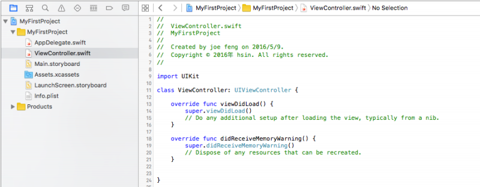
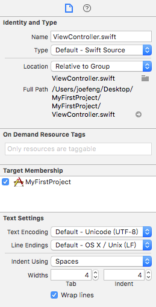
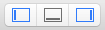

# 介面簡介

在你建立或開啟一個專案後，可以看到整個專案的內容如下，這節會介紹這些常用的功能：

### 專案設定

首先看到這個專案的設定：

- 先點選左側側邊欄的 1. MyFirstProject。
- 再點選中間畫面 PROJECT 中的 2. MyFirstProject。

如下圖：

在 Info 這個頁籤中，顯示專案的一些設定：

- Deployment Target：應用程式支援的 iOS 版本，會向上支援但不能向下支援，所以如果應用程式要給較舊版本的 iOS 使用，記得設定較低的 iOS 版本。(像是要給 iOS 8.2 以上的裝置使用，這邊就要)
- Configurations：可以為不同模式下的編譯給予不同的設定，像是測試模式(`Debug`)與釋出模式(`Release`)。
- Localizations：應用程式需要支援多語系時，可在這邊增加需要支援的語言。

在 Build Settings 頁籤中則是用於編譯時的設定，初期可以先不用更動，使用預設設定就好。

接著點擊 TARGETS 中的 MyFirstProject，如下圖：

General 頁籤：

- Identity：
  - Bundle Identifier：建立專案時一同建立的專案的唯一識別碼。
  - Version：專案(也就是應用程式)的版本，會顯示在 App Store 中，每次程式有更新要提交時都必須更新，數字只能更大(像是 1.1.2 版本之後，只能更新為 1.1.3 或 1.2.0 ，不能再降為 1.1.1)。
  - Build：編譯版本，每次提交至 App Store 的應用程式，即使 Version 是一樣的，這個 Build 數字都必須更大，來表示是不同編譯版本。
  - Team：與開發者帳號有關。
- Deployment Info：
  - Deployment Target：應用程式支援的 iOS 版本。
  - Devices：適用的 iOS 裝置。
  - Main Interface：主要使用的 Storyboard。
  - Device Orientation：提供支援的裝置翻轉方向，依序為 Portrait (正向)、Upside Down (上下顛倒)、Landscape Left (向左翻轉)及 Landscape Right (向右翻轉)。
  - Status Bar Style：狀態列的樣式。
- App Icons and Launch Images：
  - 設定應用程式的圖示與起始畫面。
- Embedded Binaries 與 Linked Frameworks and Libraries：
  - 使用額外功能框架或第三方套件時要匯入檔案的地方。

Capabilities 頁籤：

- 啟用 Apple 各個支援的功能，像是 iCloud、Push Notifications 或是 Game Center。開啟前都會需要開發者帳號認證。

Resource Tags 頁籤：

- 你可以為專案內使用的資源檔案設置不同的標籤(`tag`)，用來設定獲取這個資源的時間點。

Info 頁籤：

- 記錄一些專案的基本資料。

Build Settings、Build Phases 與 Build Rules 頁籤：

- 編譯時的設定，初期可以先不用更動，使用預設設定就好。

### 專案導覽區塊

專案導覽區塊(`Project Navigator`)位於畫面的左邊側邊欄，這邊會顯示有關這個專案檔案的資訊，以下依序介紹常用的部份：

▼ 點擊第一個頁籤，會顯示這個專案裡的所有檔案，如下圖：

可以看到兩個目錄，一個與專案名稱相同`MyFirstProject`，另一個為`Products`。

- MyFirstProject：專案主要目錄，所有介面與程式檔案都放於此內。
- Products：放置專案編譯後的檔案，基本上是不會更動到。

專案預設建立的個別檔案如下：

- AppDelegate.swift：負責這個應用程式與外部整個手機交流互動時的程式，像是應用程式啟動、閒置、進入後台、返回前台或是退出時要執行的動作。
- ViewController.swift：主要的視圖(`View`)控制器(`Controller`)，應用程式啟動時，會由這隻檔案的`viewDidLoad()`方法開始執行，如果只有一個頁面的話，大部分的程式都會寫在這裡面。
- Main.storyboard：可使用拖曳元件的方式設計應用程式的介面，本書因為主要使用純程式碼， Storyboard 部分不會詳細說明。
- Assets.xcassets：放置用於應用程式的圖檔，像是應用程式在列表中的圖示。
- LaunchScreen.storyboard：用於應用程式啟動時，尚未載入完畢前顯示的畫面，也是一個介面設計檔案(`storyboard`)。
- Info.plist：plist 是 Cocoa 的一種屬性列表檔案，以一種序列化的方式條列各屬性，可以看到這隻檔案裡面記錄著一些專案的基本資料。

▼ 點擊第二個頁籤，會顯示這個專案裡的所有類別(`Class`)及其內所有的方法(`method`)與屬性(`property`)：

▼ 點擊第三個頁籤，可以讓你搜尋專案內的文字：

▼ 點擊第四個頁籤，會顯示編譯後出現的警告(`warning`)與錯誤(`error`)，這邊為了示範，故意寫了一個沒有使用的常數`number`，編譯後便會自動跳到這個頁籤，並告訴你有什麼警告(黃色)與錯誤(紅色)：

### 專案編輯區塊

專案編輯區塊(`Project Editor`)位於畫面大部分的中間區塊，編寫程式碼都是寫在這裡，點擊左側檔案後，編輯區塊就會顯示程式，如下：

### 工具區塊

工具區塊(`Utility`)位於畫面的右側側邊欄，主要用於提示當前畫面檔案的額外資訊，如下圖：

上圖為工具區塊中左邊頁籤的內容，當左側側邊欄檔案列表點擊到 ViewController.swift 時，右側側邊欄會隨即顯示這個檔案的資訊，像是檔案名稱或檔案位置。

工具區塊中右邊頁籤則是會提示目前游標指到的方法或類別等等的詳細資訊，如下：

將游標點擊程式中的`viewDidLoad()`時，右側側邊欄則會顯示這個方法的詳細資訊，像是它的用途、從幾版的 iOS 開始支援或是繼承自哪個類別等等。

### 除錯區塊

畫面右上角可以看到下面這排按鈕，可以顯示及收起左側欄、底邊欄及右側欄：

而尚未介紹到的底側欄就是除錯區塊(`Debug`)，點擊這個按鈕後，下方即會顯示除錯區塊，如下：

當程式使用`print()`印出文字、程式運行中的動作或是發生錯誤，都會顯示詳細資訊在這裡。

