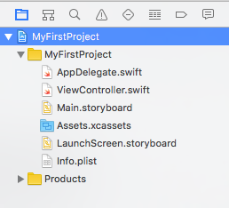

# 介面簡介

在你建立或開啟一個專案後，可以看到整個專案的內容如下，這節會介紹這些常用的功能：

### 專案導覽區塊

專案導覽區塊(`Project Navigator`)位於畫面的左邊側邊欄，這邊會顯示有關這個專案檔案的資訊，以下依序介紹常用的部份：

▼ 點擊第一個頁籤，會顯示這個專案裡的所有檔案，如下圖：

可以看到兩個目錄，一個與專案名稱相同`MyFirstProject`，另一個為`Products`。

- MyFirstProject：專案主要目錄，所有介面與程式檔案都放於此內。
- Products：放置專案編譯後的檔案，基本上是不會更動到。

專案預設建立的個別檔案如下：

- AppDelegate.swift：負責這個應用程式與外部整個手機交流互動時的程式，像是應用程式啟動、閒置、進入後台、返回前台或是退出時要執行的動作。
- ViewController.swift：主要的視圖(`View`)控制器(`Controller`)，應用程式啟動時，會由這隻檔案的`viewDidLoad()`方法開始執行，如果只有一個頁面的話，大部分的程式都會寫在這裡面。
- Main.storyboard：可使用拖曳元件的方式設計應用程式的介面，本書因為主要使用純程式碼， Storyboard 部分不會詳細說明。
- Assets.xcassets：放置用於應用程式的圖檔，像是應用程式在列表中的圖示。
- LaunchScreen.storyboard：用於應用程式啟動時，尚未載入完畢前顯示的畫面，也是一個介面設計檔案(`storyboard`)。
- Info.plist：plist 是 Cocoa 的一種屬性列表檔案，以一種序列化的方式條列各屬性，可以看到這隻檔案裡面記錄著一些專案的基本資料。

▼ 點擊第二個頁籤，會顯示這個專案裡的所有類別(`Class`)及其內所有的方法(`method`)與屬性(`property`)：

▼ 點擊第三個頁籤，可以讓你搜尋專案內的文字：

▼ 點擊第四個頁籤，會顯示編譯後出現的警告(`warning`)與錯誤(`error`)，這邊為了示範，故意寫了一個沒有使用的常數`number`，編譯後便會自動跳到這個頁籤，並告訴你有什麼警告(黃色)與錯誤(紅色)：

