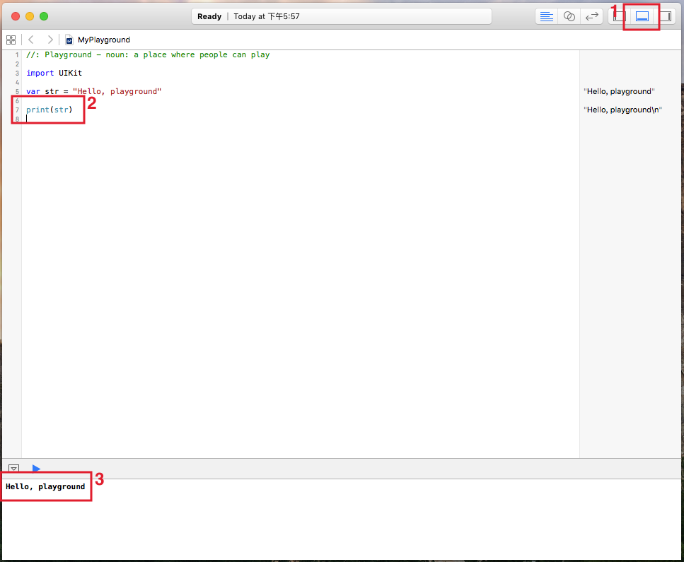

# 開啟 playground

自 Xcode 6 之後，便內建了 playground ，它可以讓你用即時的方式測試 Swift 程式碼，它會在你打完程式後，立即顯示結果。對於剛上手 Swift 的階段來說，是一個相當方便的工具。

### 建立一個新的 playground

▼ 在首次打開 Xcode 時會顯示下面這個畫面，請先點擊`Get started with a playground`按鈕：

▼ 接著會詢問你檔案名稱(`Name`)及平台(`Platform`)，這邊示範都使用預設的即可，命名為`MyPlayground`並選擇`iOS`平台，按下`Next`後，接著會詢問要儲存在哪，找好地方後按下`Create`，便會完成建立：

▼ 建立完 playground 後，下面可以看到最初的畫面，已預設寫了一個變數`str`，在稍等幾秒後，右邊就會即時顯示目前有的變數、常數及各程式操作內容結果：

▼ 除了起始畫面外，你也可以從工具列的`File > New > Playground...`建立一個新的 playground ，如下：

### 使用 playground

▼ 使用 playground 其實很直覺，就是寫什麼右邊就顯示什麼，有錯誤也會即時出現，有一點提醒：

1. 點擊視窗右上角的這個按鈕，視窗下方會顯示執行結果，當使用`print()`印出文字時，就會印出在這裡。
2. 程式中寫下`print(str)`。
3. 視窗下方就會印出結果。

