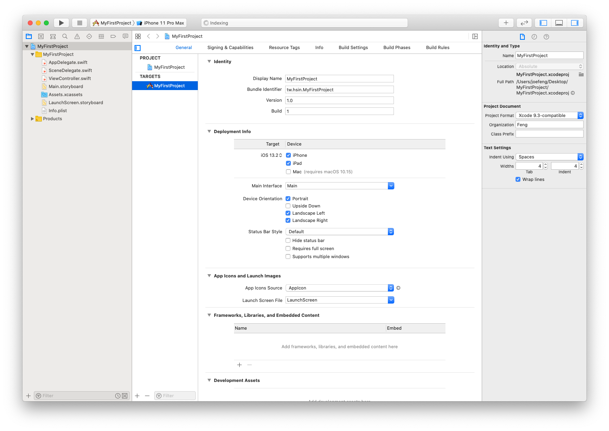

# 開啟專案

如果你要寫一個完整的 iPhone App，則是必須要建立一個專案，以下會介紹如何建立及開啟專案。

### 建立一個新的專案

▼ 在首次打開 Xcode 時會顯示下面這個畫面，請先點擊`Create a new Xcode project`按鈕：

▼ 首先可以看到左邊列出可以製作應用程式的平台 iOS、watchOS、tvOS、OS X，這邊先選擇 iOS 中的 Application。右邊可以看到有數個模版可以選擇，每個模版都會預設提供一些常用的元件，可以讓你依照不同需求，快速的建立起應用程式。而此書大部分內容都是從純程式碼開始建構，所以這邊選擇 **Single View Application** ，也就是一個單頁的應用程式，接著點擊`Next`按鈕繼續： 

▼ 接著是下圖這個步驟，填寫專案的基本資料：

1. 專案名稱，這邊範例是填入`MyFirstProject`。
2. 公司或個人名稱。
3. 公司或個人的唯一識別碼，這在提交應用程式給 App Store 時會用來辨識，通常會以點`.`來連接，像是反過來的網域名稱，這邊範例使用`tw.hsin`，你也可以寫像是`com.yourname`或是`tw.com.someone`之類的，只要不要與別人的一樣即可(如果撞名，提交時會跟你講)。
4. 這個專案的唯一識別碼，是以**公司或個人的唯一識別碼**與**專案名稱**組成(所以這個欄位會依據前兩個名稱動態更新，無法獨自修改)，這在整個 App Store 裡面會是唯一的。
5. 選擇要使用的程式語言，目前仍然可以在 Swift 和 Objective-C 擇一使用，不過本書在講 Swift，所以當然是選擇 Swift。
6. 選擇適用的 iOS 裝置，有 iPhone、iPad 或 Universal 三個選項，看是要專屬 iPhone、iPad 或是兩者通用，本書以 iPhone 為主，所以這邊選擇 iPhone。
7. 額外的選項， Core Data 是一種資料庫的應用，是一個可以讓你簡化新增儲存刪除資料的功能，本書除非特別提起，不然都不用勾選。另外兩個都是用作程式測試的功能，本書不會提到，所以都不勾選。

都填好之後，點擊`Next`繼續。

▼ 接著在儲存專案目錄的步驟下方，可以看到有個 Source Control 的選項，可以讓你的專案支援版本控制，本書不會提到，所以這邊不勾選。(預設可能是無法勾選，如果有需要請到 Xcode 設定中開啟。)

▼ 最後看到下面這個畫面時，即是完成了新專案的建立(請接著繼續閱讀下節，會詳細介紹這些介面。)：

▼ 除了起始畫面外，你也可以從 Xcode 工具列的`File > New > Project...`建立一個新的專案，如下：

### 開啟一個存在的專案

▼ 在 Finder 找到專案目錄後，在裡面可以看到如下圖，有一個目錄以及一個 `.xcodeproj`檔案，點擊這個`.xcodeproj`檔案即可打開專案：

▼ 或是你也可以從 Xcode 工具列的`File > Open...`開啟一個專案：

