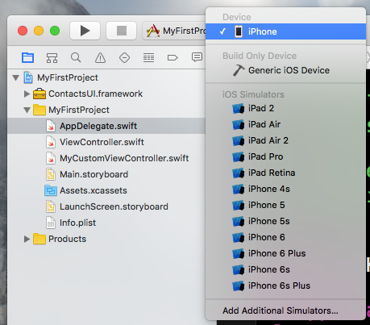
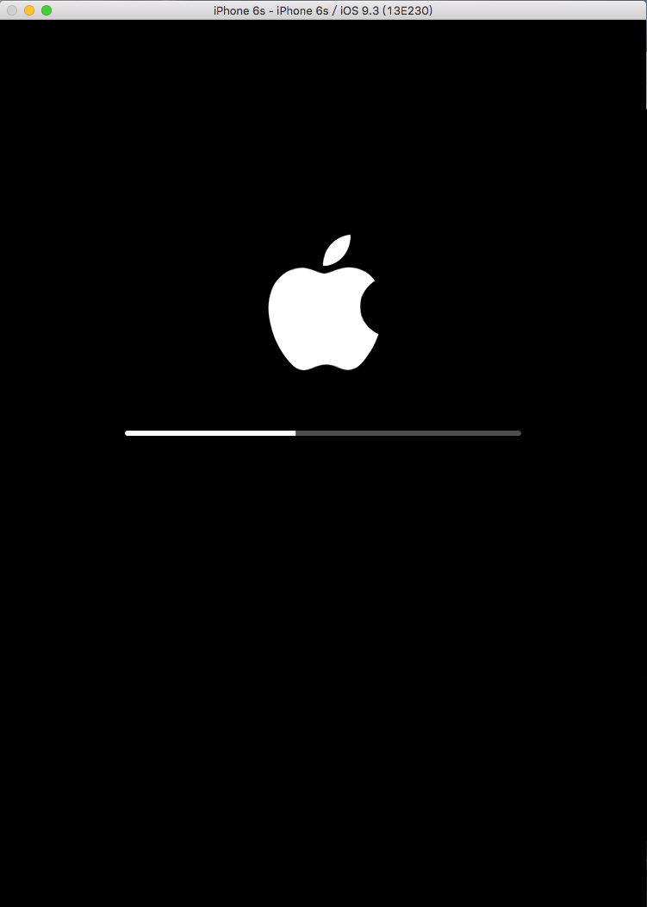
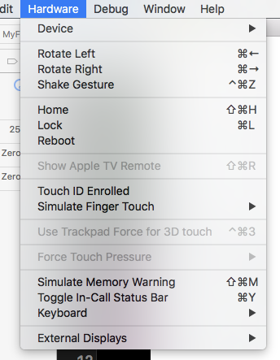
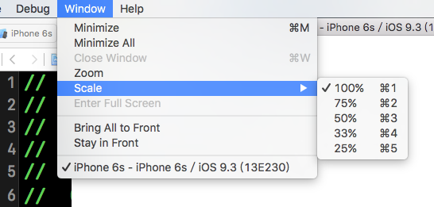
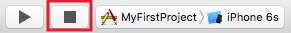

# 使用模擬器及實機測試

▼ 完成應用程式後，可以直接使用模擬器或實機測試，你可以看到 Xcode 畫面的左上角這一排按鈕，如下圖：

1. 點擊便會開始使用模擬器或實機執行測試。(或你也可以使用熱鍵`cmd + r`執行。)
2. 停止測試。
3. 選擇要執行測試的實機或是模擬器型號。

▼ 在你點擊前圖的第 3 點時，會列出來目前可供測試的實機(`Device`)與模擬器(`iOS Simulators`)，如下圖：

##### Hint

- 實機名稱不一定為 iPhone，是看你為裝置設定的名稱為何，如果有多台裝置連至 Mac 時，這邊都會全部列出來。
- 實機測試需要登入 Apple ID 。

▼ 這邊選擇 iPhone 6S 作為模擬器測試，第一次啟動時會需要初始化，會需要幾秒鐘啟動：

▼ 啟動完後，即會直接進入到應用程式的畫面，目前因為是一個空的專案，所以會顯示空白，如果電腦螢幕不夠大的話，可以上下捲動：

▼ 你可以在 OS X 的工具列中的 Hardware 看到一些用來模擬手機動作的功能，像是你可以把模擬器往左擺(`Rotate Left`)、往右擺(`Rotate Right`)或是按下 Home 鍵：

##### Hint

- 擷取模擬器畫面則是按下`cmd + s`，畫面會存在 OS X 的桌面上。

▼ 如果你覺得上下捲動很不方便，可以在 OS X 的工具列中的 Window 看到以下這些功能，你可以將模擬器的視窗縮小為 100% ~ 25%： 

▼ 測試完成後要結束時，則是點擊方形按鈕，模擬器就會結束測試：

 