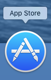
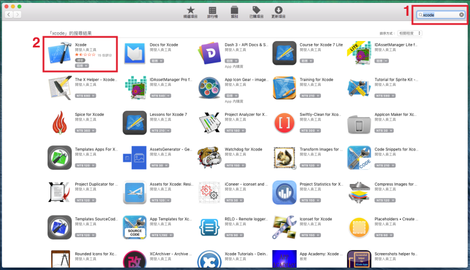
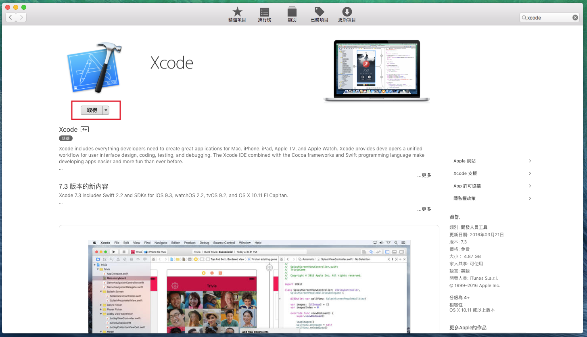
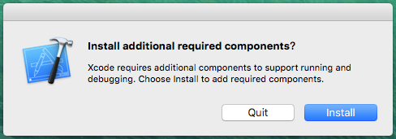

# 安裝 Xcode

要練習 Swift 或開發 iOS App ，都必須先安裝 Xcode。Xcode 是一個整合開發環境(`Integrated Development Environment`，簡稱`IDE`)，它提供了所有開發 iOS App 需要的工具，當然也包含 iPhone 模擬器，讓你不需要有實體裝置也能測試 App。

OS X 裡預設是沒有安裝 Xcode 的，所以首先必須從 App Store 裡下載安裝。

▼ 找到 Mac 中 Dock 的這個 app 並點擊開啟，如下：

▼ 開啟後會看到下面這個畫面：

1. 輸入 `xcode` ，會列出相關的 app ，通常 Xcode 都會出現在第一個。
2. 點擊 Xcode 進入詳細頁面。

▼ 點擊 Icon 下方的`取得`按鈕，就會開始安裝(如果尚未登入 App Store，會先要求登入)，安裝過程可能會需要一段時間，軟體滿大的，約是 4 G 多：

▼ 安裝完畢後， Dock 應該就會出現 Xcode App ，請點擊它開啟，首次開啟時可能會詢問安裝一些額外的元件，就直接安裝就好：

▼ 第一次開啟 Xcode 後，會出現下面這個畫面，依序為**開啟一個 playground**、**開啟一個新專案**以及**開啟一個已存在的專案**：

(編寫文章時的 Xcode 版本為 7.3 ，未來如有更新，請安裝最新版的。)

這樣就完成了 Xcode 的安裝，接著就按照需求繼續其他步驟囉。

