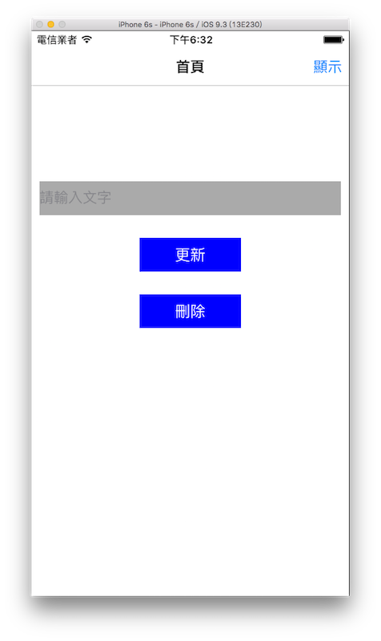

# 儲存資訊 NSUserDefaults

iOS 系統提供儲存資訊的方式有很多種，最為簡單的就是 NSUserDefaults ，像是儲存使用者的開啟次數、使用時間或是有沒有使用過了哪些功能等等，這些少量資訊就可以使用 NSUserDefaults 來儲存。(大量資訊就不建議使用 NSUserDefaults 儲存)

實際上 NSUserDefaults 是屬於 Foundation Framework 的功能( NS 開頭的函式像是前面提過的 NSDate、NSTimer 大多都是)，但因為這個功能實在太常見又方便了，幾乎每個應用程式都會使用，所以仍然分了一節作說明。

以下是本節範例目標，設置一個輸入框來儲存一段文字，可以按下按鈕儲存及更新，以及另一個按鈕用來刪除，上方導覽列右邊的按鈕可以前往下一頁，會顯示出這個儲存的文字：



首先在 Xcode 裡，[新建一個 **Single View Application** 類型的專案](../more/open_project.md#create_a_new_project)，取名為 ExNSUserDefaults 。

因為有使用到導覽列，請依照前面介紹的[導覽控制器 UINavigationController](../uikit/uinavigationcontroller.md)，建立一個有導覽列的應用程式。並以[新增檔案](../more/addfile.md)的方式加入一個繼承自 UIViewController 的`.swift`檔案，命名為`DisplayViewController`。

請依照之前學習過的內容，在`ViewController`的`viewDidLoad()`方法中，設置導覽列、輸入框以及按鈕，這邊便省略這個部分，如有需要詳細內容請參考節末的完整範例程式碼。

除此之外，為了這節範例所需，首先為 ViewController 建立一個屬性`myUserDefaults`：

```swift
class ViewController: UIViewController {
    var myUserDefaults :NSUserDefaults!

    // 省略
}

```


### 儲存及更新資訊

在應用程式建立時，系統已經為 NSUserDefaults 建立了一些應用程式所需的資訊。這邊在`viewDidLoad()`取得資訊：

```swift
// 取得儲存的預設資料
myUserDefaults = NSUserDefaults.standardUserDefaults()

```

接著看到按下**更新按鈕**執行動作的方法：

```swift
func updateInfo() {
    print("update info")

    // 結束編輯 把鍵盤隱藏起來
    self.view.endEditing(true)
    
    myUserDefaults.setObject(
      myTextField.text, forKey: "info")
    myUserDefaults.synchronize()
}

```

要儲存資訊是使用到 NSUserDefaults 的方法`.setObject(_:forKey:)`，兩個參數分別為**要儲存的資訊**以及** key 值**，有點像是[字典](../ch1/collection_types.md#dictionary)的**鍵值對 `key : value`** 。

如果尚未有這個 key 值資訊時，就會新增，如果已經有了的話，則是會更新它。

設置好新的值之後，有時系統不會即時更新儲存內容，如果你要確實讓它儲存起來時，就是使用 NSUserDefaults 的方法`synchronize()`，這可以讓資訊確實儲存。


### 移除資訊

接著看到按下**移除按鈕**執行動作的方法：

```swift
func removeInfo() {
    print("remove info")

    myUserDefaults.removeObjectForKey("info")
    
    myTextField.text = ""
}

```

移除資訊則是使用到 NSUserDefaults 的方法`removeObjectForKey()`，依照傳入的 key 值移除資訊。


### 存取資訊

最後看到下一頁 DisplayViewController ，其內的`viewDidLoad()`中，建立一個 UILabel 來顯示資訊：

```swift
if let info = myUserDefaults.objectForKey("info") as? String {
    myLabel.text = info
} else {
    myLabel.text = "尚未儲存資訊"
    myLabel.textColor = UIColor.redColor()
}

```

上述程式省略其他部分，僅說明存取資訊，使用 NSUserDefaults 的方法`objectForKey()` 來取得資訊，因為不只可以儲存單純文字，所以這邊會將它先轉為字串( String )再作後續使用。

以上即為這節範例的內容。


### 範例

本節範例程式碼放在 [uikit/nsuserdefaults](https://github.com/itisjoe/swiftgo_files/tree/master/uikit/nsuserdefaults)


