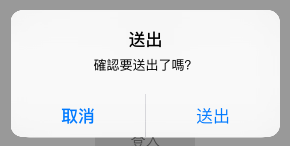
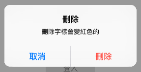

# 提示框 UIAlertController

在一些情況下，你可能會需要向使用者確認動作是否執行，或是提示一些內容，這時可以使用 UIAlertController 。不過因為這是一個強制將畫面焦點集中於這個提示的動作，所以要確認真的需要才使用，如果過於濫用會帶來不佳的使用者體驗。

本節的目標會建立五個按鈕，按下後會分別示範不同功能的提示框，如下：


首先在 Xcode 裡，[新建一個 **Single View Application** 類型的專案](../more/open_project.md#create_a_new_project)，取名為 ExUIAlert 。

一開始先在`viewDidLoad()`中取得螢幕尺寸，以供後續使用，如下：

```swift
// 取得螢幕的尺寸
let fullScreenSize = UIScreen.mainScreen().bounds.size

```


### 簡單的提示

首先先建立一個簡單的提示，可以用來說明一些簡單的內容，如下：


先建立一個按鈕：

```swift
// 設置一個按下會顯示簡單提示的按鈕
var myButton = UIButton(type: .System)
myButton.frame = CGRect(
  x: 0, y: 0, width: 100, height: 30)
myButton.setTitle("簡單提示", forState: .Normal)
myButton.backgroundColor = UIColor.init(
  red: 0.9, green: 0.9, blue: 0.9, alpha: 1)
myButton.addTarget(
	nil, 
	action: #selector(ViewController.simpleHint), 
	forControlEvents: .TouchUpInside)
myButton.center = CGPoint(
	x: fullScreenSize.width * 0.5, 
	y: fullScreenSize.height * 0.15)
self.view.addSubview(myButton)

```

接著在`ViewController`新增一個按下按鈕後要執行動作的方法：

```swift
func simpleHint() {
    // 建立一個提示框
    let alertController = UIAlertController(
		title: "提示",
		message: "一個簡單提示，請按確認繼續", 
        preferredStyle: .Alert)

    // 建立[確認]按鈕
    let okAction = UIAlertAction(
        title: "確認",
        style: .Default,
        handler: {
        (action: UIAlertAction!) -> Void in
          print("按下確認後，閉包裡的動作")
    })
    alertController.addAction(okAction)
    
    // 顯示提示框
    self.presentViewController(
      alertController,
      animated: true,
      completion: nil)
}

```

上述程式中，首先看到提示框控制器：`UIAlertController(title:, message:, preferredStyle:)`，是用來建立一個提示框的函式，參數如下：

- title：提示的標題，會以粗體顯示。
- message：提示的內容。
- preferredStyle：提示框的類型，這邊填寫`.Alert`，會顯示在畫面中間，另外如果填寫`.ActionSheet`則是顯示在畫面底部。

接著可以看到用來建立提示框按鈕的`UIAlertAction(title:, style:, handler:)`，參數如下：

- title：按鈕的文字。
- style：按鈕的樣式，可選擇`.Cancel`、`.Default`、`.Destructive`等等。
- handler：按下按鈕後要執行的動作，是一個型別為`(action: UIAlertAction!) -> Void`的**閉包**，如果不要有動作則是填入`nil`。

按鈕設置好之後，再使用`alertController.addAction()`方法，將按鈕加入到提示框控制器中。

最後則是對`self`使用`presentViewController()`方法來顯示提示框。


### 有確認與取消的提示框



先建立一個按鈕：

```swift
// 設置一個按下會顯示確認及取消提示的按鈕
myButton = UIButton(type: .System)
myButton.frame = CGRect(
  x: 0, y: 0, width: 100, height: 30)
myButton.setTitle("送出", forState: .Normal)
myButton.backgroundColor = UIColor.init(
  red: 0.9, green: 0.9, blue: 0.9, alpha: 1)
myButton.addTarget(
	nil,
    action: #selector(ViewController.confirm),
    forControlEvents: .TouchUpInside)
myButton.center = CGPoint(
	x: fullScreenSize.width * 0.5,
    y: fullScreenSize.height * 0.3)
self.view.addSubview(myButton)

```

接著在`ViewController`新增一個按下按鈕後要執行動作的方法：

```swift
func confirm() {
    // 建立一個提示框
    let alertController = UIAlertController(
		title: "送出",
        message: "確認要送出了嗎？",
        preferredStyle: .Alert)
    
    // 建立[取消]按鈕
    let cancelAction = UIAlertAction(
      title: "取消",
      style: .Cancel,
      handler: nil)
    alertController.addAction(cancelAction)
    
    // 建立[送出]按鈕
    let okAction = UIAlertAction(
      title: "送出",
      style: .Default,
      handler: nil)
    alertController.addAction(okAction)
    
    // 顯示提示框
    self.presentViewController(
      alertController,
      animated: true,
      completion: nil)
}

```

##### Hint

- 按鈕的順序會如同使用`addAction()`方法加入的順序。
- 習慣上會將`Cancel`按鈕放在左邊。
- `Cancel`按鈕(也就是`style`設置為`.Cancel`的`UIAlertAction()`)在一個提示框控制器中只能有一個。


### 警示提示框



先建立一個按鈕：

```swift
// 設置一個按下會提示刪除的按鈕
myButton = UIButton(type: .System)
myButton.frame = CGRect(
  x: 0, y: 0, width: 100, height: 30)
myButton.setTitle("刪除", forState: .Normal)
myButton.backgroundColor = UIColor.init(
  red: 0.9, green: 0.9, blue: 0.9, alpha: 1)
myButton.addTarget(
  nil, 
  action: #selector(ViewController.deleteSomething),
  forControlEvents: .TouchUpInside)
myButton.center = CGPoint(
  x: fullScreenSize.width * 0.5,
  y: fullScreenSize.height * 0.45)
self.view.addSubview(myButton)

```

接著在`ViewController`新增一個按下按鈕後要執行動作的方法：

```swift
func deleteSomething() {
    // 建立一個提示框
    let alertController = UIAlertController(
		title: "刪除",
        message: "刪除字樣會變紅色的",
        preferredStyle: .Alert)
    
    // 建立[取消]按鈕
    let cancelAction = UIAlertAction(
      title: "取消",
      style: .Cancel,
      handler: nil)
    alertController.addAction(cancelAction)

    // 建立[刪除]按鈕
    let okAction = UIAlertAction(
      title: "刪除",
      style: .Destructive,
      handler: nil)
    alertController.addAction(okAction)

    // 顯示提示框
    self.presentViewController(
      alertController,
      animated: true,
      completion: nil)
}

```

上述程式可以看到建立刪除按鈕的`UIAlertAction()`的參數`style`設置為`.Destructive`，這會將按鈕文字改為紅色的，表示這個按鈕選項是警示用的，一般用在可能會改變或刪除資料的動作上。


### 有輸入框的提示框


先建立一個按鈕：

```swift
// 設置一個按下會提示登入的按鈕
myButton = UIButton(type: .System)
myButton.frame = CGRect(
  x: 0, y: 0, width: 100, height: 30)
myButton.setTitle("登入", forState: .Normal)
myButton.backgroundColor = UIColor.init(
  red: 0.9, green: 0.9, blue: 0.9, alpha: 1)
myButton.addTarget(
	nil,
	action: #selector(ViewController.login),
    forControlEvents: .TouchUpInside)
myButton.center = CGPoint(
	x: fullScreenSize.width * 0.5,
    y: fullScreenSize.height * 0.6)
self.view.addSubview(myButton)

```

接著在`ViewController`新增一個按下按鈕後要執行動作的方法：

```swift
func login() {
    // 建立一個提示框
    let alertController = UIAlertController(
		title: "登入",
        message: "請輸入帳號與密碼",
        preferredStyle: .Alert)
    
    // 建立兩個輸入框
alertController.addTextFieldWithConfigurationHandler {
        (textField: UITextField!) -> Void in
        textField.placeholder = "帳號"
    }
alertController.addTextFieldWithConfigurationHandler {
        (textField: UITextField!) -> Void in
        textField.placeholder = "密碼"
        
        // 如果要輸入密碼 這個屬性要設定為 true
        textField.secureTextEntry = true
    }

    // 建立[取消]按鈕
    let cancelAction = UIAlertAction(
      title: "取消",
      style: .Cancel,
      handler: nil)
    alertController.addAction(cancelAction)
    
    // 建立[登入]按鈕
    let okAction = UIAlertAction(
      title: "登入",
      style: UIAlertActionStyle.Default) {
        (action: UIAlertAction!) -> Void in
        let acc = 
          (alertController.textFields?.first)!
            as UITextField
        let password = 
          (alertController.textFields?.last)!
            as UITextField
    
        print("輸入的帳號為：\(acc.text)")
        print("輸入的密碼為：\(password.text)")
      }
    alertController.addAction(okAction)
    
    // 顯示提示框
    self.presentViewController(
      alertController,
      animated: true,
      completion: nil)
}

```

要在提示框中加入輸入框，要使用提示框控制器`UIAlertController`的`addTextFieldWithConfigurationHandler()`方法加入，參數為一個型別為`(textField: UITextField!) -> Void`的閉包，可以在這個閉包內為輸入框作額外的設定。

最後在按下登入按鈕函式的閉包中，獲得輸入的帳號與密碼，並使用`print()`印出來。

##### Hint 

- `as`的用法請參考[向下型別轉換](../ch2/type-casting.md#change)。
- 這部份示範的閉包有使用尾隨閉包的特性，請參考[尾隨閉包](../ch1/closures.md#trailing_closure)。


### 從底部彈出的提示框


先建立一個按鈕：

```swift
// 設置一個按下會從底部彈出提示的按鈕
myButton = UIButton(type: .System)
myButton.frame = CGRect(
  x: 0, y: 0, width: 100, height: 30)
myButton.setTitle("底部提示", forState: .Normal)
myButton.backgroundColor = UIColor.init(
  red: 0.9, green: 0.9, blue: 0.9, alpha: 1)
myButton.addTarget(
    nil,
	action: #selector(ViewController.bottomAlert),
    forControlEvents: .TouchUpInside)
myButton.center = CGPoint(
	x: fullScreenSize.width * 0.5,
    y: fullScreenSize.height * 0.75)
self.view.addSubview(myButton)

```

接著在`ViewController`新增一個按下按鈕後要執行動作的方法：

```swift
func bottomAlert() {
    // 建立一個提示框
    let alertController = UIAlertController(
		title: "底部提示",
        message: "這個提示會從底部彈出",
        preferredStyle: .ActionSheet)
    
    // 建立[取消]按鈕
    let cancelAction = UIAlertAction(
      title: "取消",
      style: .Cancel,
      handler: nil)
    alertController.addAction(cancelAction)
    
    // 建立[確認]按鈕
    let okAction = UIAlertAction(
      title: "確認",
      style: .Default,
      handler: nil)
    alertController.addAction(okAction)
    
    // 顯示提示框
    self.presentViewController(
      alertController,
      animated: true,
      completion: nil)
}

```

上述程式中可以看到`UIAlertController()`的參數`preferredStyle`設置為`.ActionSheet`，這便會讓提示框從畫面底部彈出來，要使用哪種方式則是看你自己的需求。

##### Hint

- 底部提示框不能加入輸入框。
- 如果有加入`Cancel`按鈕到底部提示框，它會永遠在最底下一個。


### 範例

本節範例程式碼放在 [uikit/uialert](https://github.com/itisjoe/swiftgo_files/tree/master/uikit/uialert)

