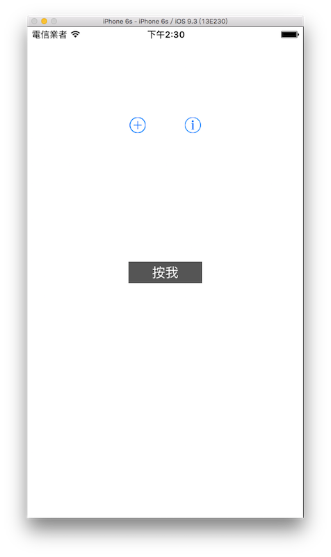

# 按鈕 UIButton

按鈕是最常見的控制元件，按下按鈕後可以執行許多動作，例如送出表單、切換頁面等等，應用程式的互動幾乎都與 UIButton 有關，是不可缺少的元件。本節的目標如下：



首先在 Xcode 裡，[新建一個 **Single View Application** 類型的專案](../more/open_project.md#create_a_new_project)，取名為 ExUIButton 。

一開始先在`viewDidLoad()`中取得螢幕尺寸，以及設置`self.view`的底色，以供後續使用，如下：

```swift
// 取得螢幕的尺寸
let fullScreenSize = UIScreen.mainScreen().bounds.size

// 為基底的 self.view 設置底色
self.view.backgroundColor = UIColor.whiteColor()

```

### 建立預設樣式的按鈕

UIKit 提供幾個內建預設樣式的按鈕，都是系統中可以看得到的樣式，如果你有一樣的需求，可以直接使用這樣的方式建立按鈕，如下：

```swift
// 預設的按鈕樣式
var myButton = UIButton(type: .ContactAdd)
myButton.center = CGPoint(
  x: fullScreenSize.width * 0.4,
  y: fullScreenSize.height * 0.2)
self.view.addSubview(myButton)

myButton = UIButton(type: .InfoLight)
myButton.center = CGPoint(
  x: fullScreenSize.width * 0.6,
  y: fullScreenSize.height * 0.2)
self.view.addSubview(myButton)

```

上述程式分別建立了加號`+`及驚嘆號`!`的按鈕(請參考上圖)，這邊可以注意到，這兩個按鈕用的是同一個變數`myButton`，因為各別都使用了`UIButton(type:)`來初始化一個按鈕，所以可以這樣使用。當然你也可以分別建立兩個常數(像是`let myButton1, myButton2`這樣)。


### 建立自定義的按鈕

如果要建立自定義的按鈕，則是使用`UIButton(frame:)`，如下：

```swift
// 使用 UIButton(frame:) 建立一個 UIButton
myButton = UIButton(
  frame: CGRect(x: 0, y: 0, width: 100, height: 30))

// 按鈕文字
myButton.setTitle("按我", forState: .Normal)

// 按鈕文字顏色
myButton.setTitleColor(
  UIColor.whiteColor(),
  forState: .Normal)

// 按鈕是否可以使用
myButton.enabled = true

// 按鈕背景顏色
myButton.backgroundColor = UIColor.darkGrayColor()

// 按鈕按下後的動作
myButton.addTarget(
	self, 
	action: #selector(ViewController.clickButton),
	forControlEvents: .TouchUpInside)

// 設置位置並加入畫面
myButton.center = CGPoint(
	x: fullScreenSize.width * 0.5,
    y: fullScreenSize.height * 0.5)
self.view.addSubview(myButton)

```

上述程式要注意到的是`addTarget(target:, action:, forControlEvents:)`這個方法，用來負責按下按鈕後的動作，這是由 UIControl 所提供的方法，再繼承給 UIButton。這個方法的參數說明如下：

- target：當事件發生時，要呼叫哪一個物件
- action：呼叫的物件要執行的方法
- forControlEvents：觸發的事件(這裡則是**按下**事件)

##### Hint

- 觸控事件是由 UIControl 所負責的動作。 UIControl 是繼承自 UIView 的子類別，而這些需要觸控事件的元件則是再繼承自 UIControl ，除了 UIButton 之外，還有像是往後會學習到的 UISwitch、UISlider 都是。

接著則是為`ViewController`新增按下按鈕需要的方法`clickButton()`，如下：

```swift
func clickButton() {
    // 為基底的 self.view 的底色在黑色與白色兩者間切換
    if self.view.backgroundColor!.isEqual(
      UIColor.whiteColor()) {
        self.view.backgroundColor = 
          UIColor.blackColor()
    } else {
        self.view.backgroundColor = 
          UIColor.whiteColor()
    }
}

```


### 範例

本節範例程式碼放在 [uikit/uibutton](https://github.com/itisjoe/swiftgo_files/tree/master/uikit/uibutton)

