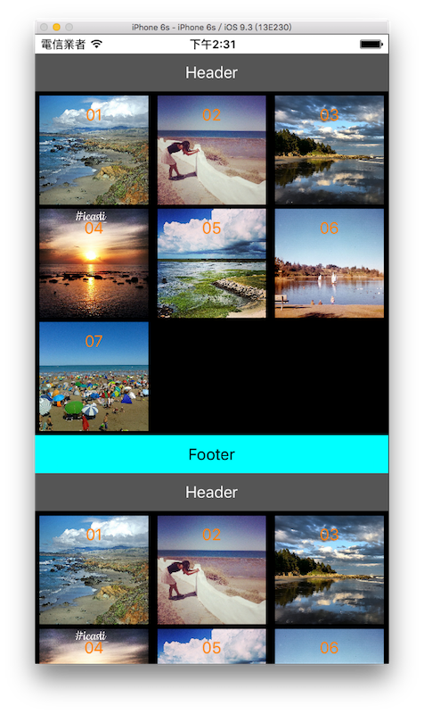

# 網格 UICollectionView

UICollectionView 可以用來表現網格這樣多行多列元件的樣式， iPhone 內建的 **照片 App** 就是用 UICollectionView 為主要呈現方式。

本節的目標如下，分成兩組照片依序往下排列，每組有七張照片，一行有三張照片，點擊照片可以有自定義執行的動作：



首先在 Xcode 裡，[新建一個 **Single View Application** 類型的專案](../more/open_project.md#create_a_new_project)，取名為 ExUICollectionView 。

一開始先以[加入檔案](../more/copyfile.md)的方式加入七張示範用的圖片。

首先為`ViewController`建立一個屬性，以及在`viewDidLoad()`中取得螢幕尺寸跟設置底色，以供後續使用，如下：

```swift
class ViewController: UIViewController {
    var fullScreenSize :CGSize!

    override func viewDidLoad() {
        super.viewDidLoad()

        // 取得螢幕的尺寸
        fullScreenSize =
          UIScreen.mainScreen().bounds.size
        
        // 設置底色
        self.view.backgroundColor =
          UIColor.whiteColor()

        // 省略
    }

    // 省略
}

```

UICollectionView 有些地方與 UITableView 類似，它的每個儲存格也稱為 cell ，委任對象實作的方法也差不多。而 UICollectionView 有更多需要設置的地方，所以本節範例步驟較多，這邊先簡單講解一下：

1. 一開始需要先設置`UICollectionViewFlowLayout`，用來自定義呈現的樣式，再交給建立 UICollectionView 元件時的函式使用。
2. 接著建立 UICollectionView 元件，除了要註冊 cell 之外，如果要自定義每個 section 的 header 或 footer 時，也必須註冊 header 或 footer ，以供後續重複使用。(註冊 cell 原因請[參考前節說明](../uikit/uitableview.md#registerclass))
3. UICollectionView 的 cell 需要自定義一個繼承自 UICollectionViewCell 的類別，用來加上需要的元件，這邊會加上一張圖片( UIImageView )及一行字( UILabel )。
4. 最後要實作委任對象需要的方法。


### 建立 UICollectionViewFlowLayout

UICollectionView 大部分的建立步驟與 UITableView 相同，UICollectionViewFlowLayout 則是需要額外建立的部份，用來自定義呈現的樣式，首先在`viewDidLoad()`裡建立 UICollectionViewFlowLayout ：

```swift
// 建立 UICollectionViewFlowLayout
let layout = UICollectionViewFlowLayout()

// 設置 section 的間距 四個數值分別代表 上、左、下、右 的間距
layout.sectionInset = UIEdgeInsetsMake(5, 5, 5, 5);

// 設置每一行的間距
layout.minimumLineSpacing = 5

// 設置每個 cell 的尺寸
layout.itemSize = CGSizeMake(
  CGFloat(fullScreenSize.width)/3 - 10.0, 
  CGFloat(fullScreenSize.width)/3 - 10.0)

// 設置 header 及 footer 的尺寸
layout.headerReferenceSize = CGSize(
  width: fullScreenSize.width, height: 40)
layout.footerReferenceSize = CGSize(
  width: fullScreenSize.width, height: 40)

```


### 建立 UICollectionView

緊接著在`viewDidLoad()`裡建立 UICollectionView ，這邊會使用到前面建立的 UICollectionViewFlowLayout (常數`layout`)：

```swift
// 建立 UICollectionView
let myCollectionView = UICollectionView(frame: CGRect(
      x: 0, y: 20,
      width: fullScreenSize.width,
      height: fullScreenSize.height - 20),
    collectionViewLayout: layout)

// 註冊 cell 以供後續重複使用
myCollectionView.registerClass(
  MyCollectionViewCell.self,
  forCellWithReuseIdentifier: "Cell")

// 註冊 section 的 header 跟 footer 以供後續重複使用
myCollectionView.registerClass(
  UICollectionReusableView.self, 
  forSupplementaryViewOfKind: 
    UICollectionElementKindSectionHeader, 
  withReuseIdentifier: "Header")
myCollectionView.registerClass(
  UICollectionReusableView.self, 
  forSupplementaryViewOfKind: 
    UICollectionElementKindSectionFooter, 
  withReuseIdentifier: "Footer")

// 設置委任對象
myCollectionView.delegate = self
myCollectionView.dataSource = self

// 加入畫面中
self.view.addSubview(myCollectionView)

```

section 的 header 與 footer 都是屬於 UICollectionReusableView 類別，所以註冊時就是使用這個類別註冊。


### 自定義的 UICollectionViewCell 類別

前面註冊 cell 時用到的就是自定義的 UICollectionViewCell 類別 **MyCollectionViewCell**，這邊會介紹如何建立。

先以[新增檔案](../more/addfile.md)的方式增加一個新的`.swift`檔案，其中要注意的是，因為是要建立繼承自 UICollectionViewCell 的類別，所以進行到下圖這個步驟時，`Subclass of:`要填寫`UICollectionViewCell`，並將檔案名稱設為`MyCollectionViewCell`：


建立完成後，接著進到`MyCollectionViewCell.swift`這隻檔案中，加入需要顯示的元件，一張圖片( UIImageView )及一行字( UILabel )：

```swift
class MyCollectionViewCell: UICollectionViewCell {
    var imageView:UIImageView!
    var titleLabel:UILabel!
    
    override init(frame: CGRect) {
        super.init(frame: frame)

        // 取得螢幕寬度
        let w = Double(
          UIScreen.mainScreen().bounds.size.width)
        
        // 建立一個 UIImageView
        imageView = UIImageView(frame: CGRect(
          x: 0, y: 0,
          width: w/3 - 10.0, height: w/3 - 10.0))
        self.addSubview(imageView)
        
        // 建立一個 UILabel
        titleLabel = UILabel(frame:CGRect(
          x: 0, y: 0, width: w/3 - 10.0, height: 40))
        titleLabel.textAlignment = .Center
        titleLabel.textColor = UIColor.orangeColor()
        self.addSubview(titleLabel)
    }
    
    required init?(coder aDecoder: NSCoder) {
        fatalError("init(coder:) has not been implemented")
    }

}

```


### 委任模式

接著再回到`ViewController`，先加上委任需要的協定：

```swift
class ViewController: UIViewController,
  UICollectionViewDelegate,
  UICollectionViewDataSource {
  // 省略
}
```

以及必須實作的方法：

```swift
// 必須實作的方法：每一組有幾個 cell
func collectionView(collectionView: UICollectionView,
  numberOfItemsInSection section: Int) -> Int {
    return 7
}

// 必須實作的方法：每個 cell 要顯示的內容
func collectionView(collectionView: UICollectionView,
  cellForItemAtIndexPath indexPath: NSIndexPath)
  -> UICollectionViewCell {
    // 依據前面註冊設置的識別名稱 "Cell" 取得目前使用的 cell
    let cell =
collectionView.dequeueReusableCellWithReuseIdentifier(
  "Cell", forIndexPath: indexPath)
  as! MyCollectionViewCell
    
    // 設置 cell 內容 (即自定義元件裡 增加的圖片與文字元件)
    cell.imageView.image = 
      UIImage(named: "0\(indexPath.item + 1).jpg")
    cell.titleLabel.text = "0\(indexPath.item + 1)"
    
    return cell
}

```

最後則是其餘委任對象需要的方法，以完善整個 UICollectionView 元件：

```swift
// 有幾個 section
func numberOfSectionsInCollectionView(
  collectionView: UICollectionView) -> Int {
    return 2
}

// 點選 cell 後執行的動作
func collectionView(collectionView: UICollectionView,
  didSelectItemAtIndexPath indexPath: NSIndexPath) {
    print("你選擇了第 \(indexPath.section + 1) 組的")
    print("第 \(indexPath.item + 1) 張圖片")
}

// 設置 reuse 的 section 的 header 或 footer
func collectionView(collectionView: UICollectionView, 
	viewForSupplementaryElementOfKind kind: String,
    atIndexPath indexPath: NSIndexPath) 
    -> UICollectionReusableView {
    // 建立 UICollectionReusableView
    var reusableView = UICollectionReusableView()
    
    // 顯示文字
    let label = UILabel(frame: CGRect(
      x: 0, y: 0, 
      width: fullScreenSize.width, height: 40))
    label.textAlignment = .Center
    
    // header
    if kind == UICollectionElementKindSectionHeader {
// 依據前面註冊設置的識別名稱 "Header" 取得目前使用的 header
        reusableView = 
collectionView.dequeueReusableSupplementaryViewOfKind(
		UICollectionElementKindSectionHeader, 
        withReuseIdentifier: "Header",
        forIndexPath: indexPath)
        // 設置 header 的內容
        reusableView.backgroundColor = 
          UIColor.darkGrayColor()
        label.text = "Header";
        label.textColor = UIColor.whiteColor()

    } else if kind ==
    UICollectionElementKindSectionFooter {
// 依據前面註冊設置的識別名稱 "Footer" 取得目前使用的 footer
        reusableView = 
collectionView.dequeueReusableSupplementaryViewOfKind(
		UICollectionElementKindSectionFooter,
        withReuseIdentifier: "Footer",
        forIndexPath: indexPath)
        // 設置 footer 的內容
        reusableView.backgroundColor =
          UIColor.cyanColor()
        label.text = "Footer";
        label.textColor = UIColor.blackColor()

    }
    
    reusableView.addSubview(label)
    return reusableView
}

```

上述程式中需要注意的是最後一個方法，用來顯示每個 section 的 header 與 footer (如果你前面有設置的話)，因為 header 與 footer 是共用一個方法，且都是屬於`UICollectionReusableView`元件，所以需要先建立一個`UICollectionReusableView`元件，並使用`kind`參數來分辨這時是要設置 header 或 footer 。

接著就與 cell 類似，依據註冊時使用的識別名稱，取得重複使用的元件，再設置其內的內容，這邊範例是單純的加上一個 UILabel 。

以上即為本節範例的內容。


### 圖片來源

- https://www.flickr.com/photos/sloalan/15367448967/
- https://www.flickr.com/photos/14076637@N04/15097401627/
- https://www.flickr.com/photos/126692641@N04/16389075922/
- https://www.flickr.com/photos/134525588@N04/20333376532/
- https://www.flickr.com/photos/jane_nospecial/15076368915/
- https://www.flickr.com/photos/sdasmarchives/8871276526/
- https://www.flickr.com/photos/14076637@N04/16178682209/


### 範例

本節範例程式碼放在 [uikit/uicollectionview](https://github.com/itisjoe/swiftgo_files/tree/master/uikit/uicollectionview)

