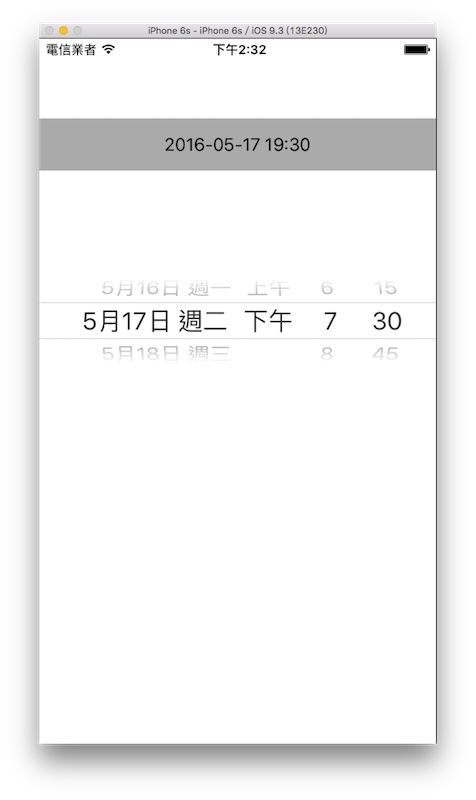

# 選取時間 UIDatePicker

UIDatePicker 可以用來選取日期或時間，以下為本節的目標，設置一個 UIDatePicker ，並在改變日期時間時同步更新 UILabel 的內容：



首先在 Xcode 裡，[新建一個 **Single View Application** 類型的專案](../more/open_project.md#create_a_new_project)，取名為 ExUIDatePicker 。

首先為`ViewController`建立兩個屬性，如下：

```swift
class ViewController: UIViewController {
    var myDatePicker: UIDatePicker!
    var myLabel: UILabel!
 
    // 省略
}
```

以及在`viewDidLoad()`中取得螢幕尺寸，以供後續使用，如下：

```swift
// 取得螢幕的尺寸
let fullScreenSize = UIScreen.mainScreen().bounds.size

```


### 建立 UIDatePicker

```swift
// 使用 UIDatePicker(frame:) 建立一個 UIDatePicker
myDatePicker = UIDatePicker(frame: CGRect(
  x: 0, y: 0,
  width: fullScreenSize.width, height: 100))

// 設置 UIDatePicker 格式
myDatePicker.datePickerMode = .DateAndTime

// 選取時間時的分鐘間隔 這邊以 15 分鐘為一個間隔
myDatePicker.minuteInterval = 15

// 設置預設時間為現在時間
myDatePicker.date = NSDate()

// 設置 NSDate 的格式
let formatter = NSDateFormatter()

// 設置時間顯示的格式
formatter.dateFormat = "yyyy-MM-dd HH:mm"

// 可以選擇的最早日期時間
let fromDateTime = formatter.dateFromString("2016-01-02 18:08")

// 設置可以選擇的最早日期時間
myDatePicker.minimumDate = fromDateTime

// 可以選擇的最晚日期時間
let endDateTime = formatter.dateFromString("2017-12-25 10:45")

// 設置可以選擇的最晚日期時間
myDatePicker.maximumDate = endDateTime

// 設置顯示的語言環境
myDatePicker.locale = NSLocale(
  localeIdentifier: "zh_TW")

// 設置改變日期時間時會執行動作的方法
myDatePicker.addTarget(self,
	action: #selector(ViewController.datePickerChanged), forControlEvents: .ValueChanged)

// 設置位置並加入到畫面中
myDatePicker.center = CGPoint(x: fullScreenSize.width * 0.5, y: fullScreenSize.height * 0.4)
self.view.addSubview(myDatePicker)

```

UIDatePicker 常用的屬性如下：

- datePickerMode：可以顯示的模式，有**只顯示時間**、**只顯示日期**、**顯示日期與時間**以及**倒數計時器**。
- minuteInterval：時間選取時的分鐘間隔，單位是分鐘。
- date：設置預設顯示的日期時間。
- minimumDate：可以選擇的最早日期時間。
- maximumDate：可以選擇的最晚日期時間。
- locale：顯示的語言環境。

NSDate 與 NSDateFormatter 會在稍後介紹。

接著建立一個 UILabel ，在 UIDatePicker 改變時可以同步更新內容：

```swift
// 建立一個 UILabel 來顯示改變日期時間後的結果
myLabel = UILabel(frame: CGRect(
  x: 0, y: 0,
  width: fullScreenSize.width, height: 50))
myLabel.backgroundColor = UIColor.lightGrayColor()
myLabel.textAlignment = .Center
myLabel.textColor = UIColor.blackColor()
myLabel.center = CGPoint(
  x: fullScreenSize.width * 0.5,
  y: fullScreenSize.height * 0.15)
self.view.addSubview(myLabel)

```

最後在`ViewController`中新建一個改變 UIDatePicker 時會執行動作的方法：

```swift
func datePickerChanged(datePicker:UIDatePicker) {
    // 設置要顯示在 UILabel 的日期時間格式
    let formatter = NSDateFormatter()
    formatter.dateFormat = "yyyy-MM-dd HH:mm"
    
    // 更新 UILabel 的內容
    myLabel.text = formatter.stringFromDate(
      datePicker.date)
}

```


### NSDate 與 NSDateFormatter

在 Swift 中要處理有關於日期或時間的功能時，都是使用 NSDate ，而要怎麼呈現日期時間的顯示格式，則是需要搭配 NSDateFormatter 來使用。

```swift
// 簡單的建立了一個目前時間的常數
// 型別為 NSDate
let nowDate = NSDate()

// 你可以使用型別為 NSDate 的常數來對日期時間作處理
// 例如將現在時間加上一天
// dateByAddingTimeInterval 的單位是秒
let oneDayAfter = nowDate.dateByAddingTimeInterval(
  60 * 60 * 24)

// 現在處理完後
// 如果要將這個 NSDate 常數轉換成字串
// 則是要利用 NSDateFormatter
let formatter = NSDateFormatter()

// 先設置日期時間顯示的格式
formatter.dateFormat = "yyyy-MM-dd HH:mm"

// 再將 oneDayAfter 轉換成字串
let oneDayAfterToString =
  formatter.stringFromDate(oneDayAfter)

// 印出：明天這一刻的日期時間
print(oneDayAfterToString)

// 或是你要從一個顯示日期時間的字串 轉換成 NSDate
let xmasDate = formatter.dateFromString(
  "2016-12-25 21:30")
// 這時便可以再對這個 NSDate 常數作處理

```

UIDatePicker 的`date`、`minimumDate`及`maximumDate`屬性，型別都是`NSDate`，所以如果你要設置或修改這些屬性時，都必須使用 NSDate 及 NSDateFormatter 來做處理。

以下列出常使用到的日期時間顯示的格式，你可以用在 NSDateFormatter 的屬性`dateFormat`，依照需求來組合你要的格式：

- yyyy：西元年份，像是 2015、1998。
- yy：西元年份末兩位數，像是 15、95。
- MMMM：月份，像是 December、January。
- MMM：月份簡寫，像是 Oct、Feb。
- MM：以數字代表月份，像是 08、12。
- dd：日期，像是 07、31。
- EEEE：星期幾，像是 Saturday、Monday。
- EEE：星期幾的簡寫，像是 Sun、Wed。
- HH：24 小時制的時。
- hh：12 小時制的時。
- mm：分。
- ss：秒。

前面範例設置的格式為`formatter.dateFormat = "yyyy-MM-dd HH:mm"`，你也可以設置為年月日，像是`formatter.dateFormat = "yyyy 年 MM 月 dd 日"`。


### 範例

本節範例程式碼放在 [uikit/uidatepicker](https://github.com/itisjoe/swiftgo_files/tree/master/uikit/uidatepicker)

