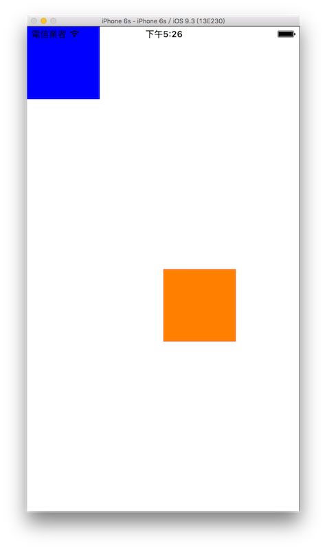
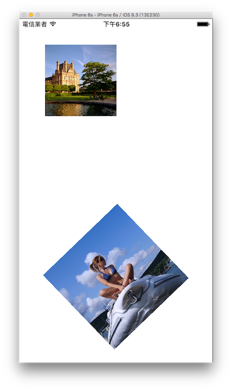

# 手勢 UIGestureRecognizer

UIKit 提供了六種不同的手勢可供監聽，分別為** Tap 輕點**、** Long Press 長按**、** Swipe 滑動**、** Pan 拖曳**、** Pinch 縮放**及**Rotation 旋轉**，你可以為元件加上這些手勢的監聽，並執行觸發時的動作。

其實在前面介紹的[輸入多行文字 UITextView](../uikit/uitextview.md)就已經有使用過了，當時是加上輕點手勢來關閉鍵盤，這節會完整的介紹支援的手勢。

這節會分開為兩個應用程式作為示範，第一個會以單純的 UIView 示範** Tap 輕點**、** Long Press 長按**、** Swipe 滑動**及** Pan 拖曳**，第二個則是搭配圖片示範** Pinch 縮放**及** Rotation 旋轉**


### 搭配 UIView 示範

這個範例的目標如下，輕點( Tap )、長按( Long Press )與滑動( Swipe )是加在基底視圖`self.view`上，輕點與長按會印出文字，而滑動時會控制藍色方塊上下左右移動。拖曳( Pan )則是加在橘色方塊上，可以將這個方塊拖曳到要移動的位置：



首先在 Xcode 裡，[新建一個 **Single View Application** 類型的專案](../more/open_project.md#create_a_new_project)，取名為 ExUIGestureRecognizer 。

一開始先為`ViewController`建立三個屬性：

```swift
class ViewController: UIViewController {
    var fullSize :CGSize!
    var myUIView :UIView!
    var anotherUIView :UIView!
 
    // 省略
}

```

以及在`viewDidLoad()`中取得螢幕尺寸，以供後續使用，如下：

```swift
// 取得螢幕的尺寸
fullSize = UIScreen.mainScreen().bounds.size

```

#### Tap 輕點

Tap 輕點手勢可以支援單指與多指，請在實機上測試或是模擬機上按住`option`鍵，會出現兩個灰色圈圈，即可模擬兩指操作。以下先在`viewDidLoad()`加入程式，示範單指與兩指的手勢：

```swift
// 雙指輕點 (雙指以上手勢只能用實機測試)
let doubleFingers =
  UITapGestureRecognizer(
    target:self,
    action:#selector(ViewController.doubleTap(_:)))

// 點幾下才觸發 設置 1 時 則是點一下會觸發 依此類推
doubleFingers.numberOfTapsRequired = 1

// 幾根指頭觸發
doubleFingers.numberOfTouchesRequired = 2

// 為視圖加入監聽手勢
self.view.addGestureRecognizer(doubleFingers)


// 單指輕點
let singleFinger = UITapGestureRecognizer(
  target:self,
  action:#selector(ViewController.singleTap(_:)))

// 點幾下才觸發 設置 2 時 則是要點兩下才會觸發 依此類推
singleFinger.numberOfTapsRequired = 2

// 幾根指頭觸發
singleFinger.numberOfTouchesRequired = 1

// 雙指輕點沒有觸發時 才會檢測此手勢 以免手勢被蓋過
singleFinger.requireGestureRecognizerToFail(doubleFingers)

// 為視圖加入監聽手勢
self.view.addGestureRecognizer(singleFinger)

```

接著則是在`ViewController`加上觸發手勢後執行動作的方法：

```swift
// 觸發單指輕點兩下手勢後 執行的動作
func singleTap(recognizer:UITapGestureRecognizer){
    print("單指連點兩下時觸發")
    
    // 取得每指的位置
    self.findFingersPositon(recognizer)
}

// 觸發雙指輕點一下手勢後 執行的動作
func doubleTap(recognizer:UITapGestureRecognizer){
    print("雙指點一下時觸發")

    // 取得每指的位置
    self.findFingersPositon(recognizer)
}

func findFingersPositon(recognizer:UITapGestureRecognizer) {
    // 取得每指的位置
    let number = recognizer.numberOfTouches()
    for i in 0..<number {
        let point = recognizer.locationOfTouch(
          i, inView: recognizer.view)
        print(
        "第 \(i + 1) 指的位置：\(NSStringFromCGPoint(point))")
    }
}

```

上述程式可以看到，還可以獲得每指輕點時的位置(是一個點 CGPoint )。

#### Long Press 長按

以下先在`viewDidLoad()`加入程式：

```swift
// 長按
let longPress = UILongPressGestureRecognizer(
  target: self, 
  action: #selector(ViewController.longPress(_:)))

// 為視圖加入監聽手勢
self.view.addGestureRecognizer(longPress)

```

接著則是在`ViewController`加上觸發手勢後執行動作的方法：

```swift
// 觸發長按手勢後 執行的動作
func longPress(recognizer:UILongPressGestureRecognizer) {
    if recognizer.state == .Began {
        print("長按開始")
    } else if recognizer.state == .Ended {
        print("長按結束")
    }
    
}

```

#### Swipe 滑動

以下先在`viewDidLoad()`加入程式，因為每個方向滑動都算獨立的手勢，所以這邊會加上四個滑動手勢，分別為是上、左、下、右：

```swift
// 一個可供移動的 UIView
myUIView = UIView(frame: CGRect(
  x: 0, y: 0, width: 100, height: 100))
myUIView.backgroundColor = UIColor.blueColor()
self.view.addSubview(myUIView)

// 向上滑動
let swipeUp = UISwipeGestureRecognizer(
  target:self, 
  action:#selector(ViewController.swipe(_:)))
swipeUp.direction = .Up

// 幾根指頭觸發 預設為 1
swipeUp.numberOfTouchesRequired = 1

// 為視圖加入監聽手勢
self.view.addGestureRecognizer(swipeUp)


// 向左滑動
let swipeLeft = UISwipeGestureRecognizer(
  target:self, 
  action:#selector(ViewController.swipe(_:)))
swipeLeft.direction = .Left

// 為視圖加入監聽手勢
self.view.addGestureRecognizer(swipeLeft)


// 向下滑動
let swipeDown = UISwipeGestureRecognizer(
  target:self, 
  action:#selector(ViewController.swipe(_:)))
swipeDown.direction = .Down

// 為視圖加入監聽手勢
self.view.addGestureRecognizer(swipeDown)


// 向右滑動
let swipeRight = UISwipeGestureRecognizer(
  target:self, 
  action:#selector(ViewController.swipe(_:)))
swipeRight.direction = .Right

// 為視圖加入監聽手勢
self.view.addGestureRecognizer(swipeRight)

```

接著則是在`ViewController`加上觸發手勢後執行動作的方法：

```swift
// 觸發滑動手勢後 執行的動作
func swipe(recognizer:UISwipeGestureRecognizer) {
    let point = myUIView.center

    if recognizer.direction == .Up {
        print("Go Up")
        if point.y >= 150 {
            myUIView.center = CGPoint(
              x: myUIView.center.x, 
              y: myUIView.center.y - 100)
        } else {
            myUIView.center = CGPoint(
              x: myUIView.center.x, y: 50)
        }
    } else if recognizer.direction == .Left {
        print("Go Left")
        if point.x >= 150 {
            myUIView.center = CGPoint(
              x: myUIView.center.x - 100, 
              y: myUIView.center.y)
        } else {
            myUIView.center = CGPoint(
              x: 50, y: myUIView.center.y)
        }
    } else if recognizer.direction == .Down {
        print("Go Down")
        if point.y <= fullSize.height - 150 {
            myUIView.center = CGPoint(
              x: myUIView.center.x, 
              y: myUIView.center.y + 100)
        } else {
            myUIView.center = CGPoint(
              x: myUIView.center.x, 
              y: fullSize.height - 50)
        }
    } else if recognizer.direction == .Right {
        print("Go Right")
        if point.x <= fullSize.width - 150 {
            myUIView.center = CGPoint(
              x: myUIView.center.x + 100, 
              y: myUIView.center.y)
        } else {
            myUIView.center = CGPoint(
              x: fullSize.width - 50, 
              y: myUIView.center.y)
        }
    }
}

```

上述程式將觸發四個方向滑動的手勢寫在同一個方法裡，並用屬性`direction`來辨別是哪一個方向，這邊會判斷是否會超出畫面，如果超出時就會改成移動到邊界，而不會真的超出去。

請記得手勢是加在`self.view`上，所以整個畫面上都可以滑動，而不是只點擊藍色方塊滑動。

#### Pan 拖曳

以下先在`viewDidLoad()`加入程式：

```swift
// 一個可供移動的 UIView
anotherUIView = UIView(frame: CGRect(
  x: fullSize.width * 0.5, y: fullSize.height * 0.5, 
  width: 100, height: 100))
anotherUIView.backgroundColor = UIColor.orangeColor()
self.view.addSubview(anotherUIView)

// 拖曳手勢
let pan = UIPanGestureRecognizer(
  target:self,
  action:#selector(ViewController.pan(_:)))

// 最少可以用幾指拖曳
pan.minimumNumberOfTouches = 1

// 最多可以用幾指拖曳
pan.maximumNumberOfTouches = 1

// 為這個可移動的 UIView 加上監聽手勢
anotherUIView.addGestureRecognizer(pan)

```

接著則是在`ViewController`加上觸發手勢後執行動作的方法：

```swift
// 觸發拖曳手勢後 執行的動作
func pan(recognizer:UIPanGestureRecognizer) {
    // 設置 UIView 新的位置
    let point = recognizer.locationInView(self.view)
    anotherUIView.center = point
}

```

手勢是加在橘色方塊上，所以只能拖曳橘色方塊來移動。

#### 手勢的傳遞

上面四個手勢都加上去後，你可能會不經意發現，在藍色方塊上雙指輕點或是單指輕點兩下，仍然會觸發到輕點的手勢，這是因為監聽手勢會傳遞。

當一個元件接收到手勢動作時，如果這個元件本身沒有可以執行的動作，那它會將手勢傳遞到它的父視圖，如果還是沒有，就會一直往上傳遞，以這邊來說，就是藍色方塊`myUIView`將手勢動作傳遞給父視圖`self.view`，所以仍然會觸發到輕點手勢。

以上就是這個範例的內容。

### 搭配圖片示範

這個範例的目標如下，一張圖片可以縮放，另一張圖片可以旋轉：



首先在 Xcode 裡，[新建一個 **Single View Application** 類型的專案](../more/open_project.md#create_a_new_project)，取名為 ExImageUIGestureRecognizer 。

一開始先以[加入檔案](../more/copyfile.md)的方式加入兩張用來縮放與旋轉的圖片。接著為`ViewController`建立三個屬性：

```swift
class ViewController: UIViewController {
    var fullSize :CGSize!
    var myImageView :UIImageView!
    var anotherImageView :UIImageView!
 
    // 省略
}

```

以及在`viewDidLoad()`中取得螢幕尺寸，以供後續使用，如下：

```swift
// 取得螢幕的尺寸
fullSize = UIScreen.mainScreen().bounds.size

```

這個範例用到的縮放及旋轉手勢，都需要兩指操作，請在實機上測試或是模擬機上按住`option`鍵，會出現兩個灰色圈圈，即可模擬兩指操作。

#### Pinch 縮放

以下先在`viewDidLoad()`加入程式：

```swift
// 建立一個用來縮放的圖片
myImageView = UIImageView(image: UIImage(named: "01.jpg"))
myImageView.frame = CGRect(
  x: 50, y: 50, width: 200, height: 200)
self.view.addSubview(myImageView)

let pinch = UIPinchGestureRecognizer(
  target:self,
  action:#selector(ViewController.pinch(_:)))

self.view.addGestureRecognizer(pinch)

```

接著則是在`ViewController`加上觸發手勢後執行動作的方法：

```swift
// 觸發縮放手勢後 執行的動作
func pinch(recognizer:UIPinchGestureRecognizer) {
    if recognizer.state == .Began {
        print("開始縮放")
    } else if recognizer.state == .Changed {
        // 圖片原尺寸
        let frm = myImageView.frame
        
        // 縮放比例
        let scale = recognizer.scale
        
        // 目前圖片寬度
        let w = frm.width
        
        // 目前圖片高度
        let h = frm.height
        
        // 縮放比例的限制為 0.5 ~ 2 倍
        if w * scale > 100 && w * scale < 400 {
            myImageView.frame = CGRect(
              x: frm.origin.x, y: frm.origin.y,
              width: w * scale, height: h * scale)
        }
    } else if recognizer.state == .Ended {
        print("結束縮放")
    }
    
}

```

#### Rotation 旋轉

以下先在`viewDidLoad()`加入程式：

```swift
// 建立一個用來旋轉的圖片
anotherImageView = UIImageView(
  image: UIImage(named: "02.jpg"))
anotherImageView.frame = CGRect(
  x: 0, y: 0, width: 200, height: 200)
anotherImageView.center = CGPoint(
  x: fullSize.width * 0.5, y: fullSize.height * 0.75)
self.view.addSubview(anotherImageView)

let rotation = UIRotationGestureRecognizer(
  target: self, 
  action: #selector(ViewController.rotation(_:)))

self.view.addGestureRecognizer(rotation)

```

接著則是在`ViewController`加上觸發手勢後執行動作的方法：

```swift
// 觸發旋轉手勢後 執行的動作
func rotation(recognizer:UIRotationGestureRecognizer) {
    // 弧度
    let radian = recognizer.rotation
    
    // 旋轉的弧度轉換為角度
    let angle = radian * (180 / CGFloat(M_PI))
    
    anotherImageView.transform =
      CGAffineTransformMakeRotation(radian)
    
    print("旋轉角度： \(angle)")
}

```

以上就是這個範例的內容。


### 圖片來源

- https://www.flickr.com/photos/boklm/11908643634/
- https://www.flickr.com/photos/53812099@N04/11844277903/


### 範例

本節範例程式碼放在 [uikit/uigesturerecognizer](https://github.com/itisjoe/swiftgo_files/tree/master/uikit/uigesturerecognizer)

