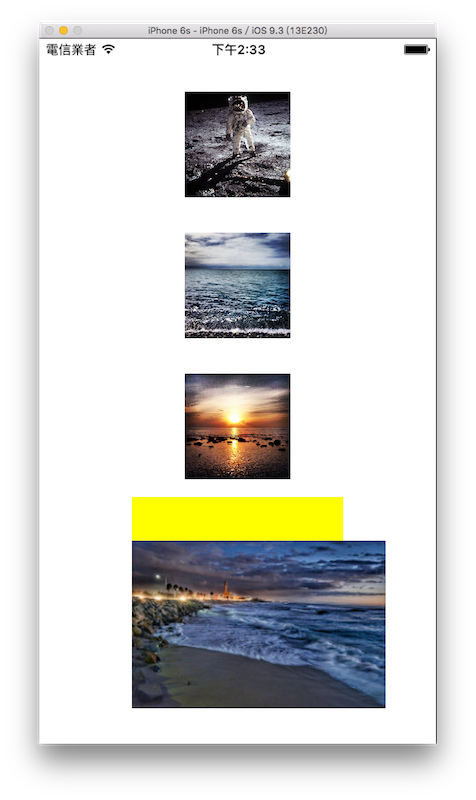

# 圖片 UIImageView

顯示圖片主要是使用 UIImageView 及 UIImage 來完成，本節會介紹兩個範例，第一個範例會示範三種建立 UIImageView 的方式以及顯示模式，第二個範例則會示範一個自動輪播圖片的功能。


### 建立 UIImageView

這個範例的目標如下圖：



首先在 Xcode 裡，[新建一個 **Single View Application** 類型的專案](../more/open_project.md#create_a_new_project)，取名為 ExUIImageView 。

一開始先以[加入檔案](../more/copyfile.md)的方式加入四張圖片，並在`viewDidLoad()`中取得螢幕尺寸，以供後續使用，如下：

```swift
// 取得螢幕的尺寸
let fullScreenSize = UIScreen.mainScreen().bounds.size

```

▼ 第一個建立 UIImageView 的方式為使用`UIImageView(frame:)`：

```swift
// 使用 UIImageView(frame:) 建立一個 UIImageView
var myImageView = UIImageView(
  frame: CGRect(
    x: 0, y: 0, width: 100, height: 100))

// 使用 UIImage(named:) 放置圖片檔案
myImageView.image = UIImage(named: "01.jpg")

// 設置新的位置並放入畫面中
myImageView.center = CGPoint(
  x: fullScreenSize.width * 0.5,
  y: fullScreenSize.height * 0.15)
self.view.addSubview(myImageView)

```

上述程式可以看到，`UIImageView`不是直接放置圖片檔案名稱，而是要藉由`UIImage(named:)`建立，再設置給`UIImageView`的屬性`image`，未來其他元件需要使用圖片時，也都是使用`UIImage(named:)`設置圖片檔案。

▼ 第二個建立 UIImageView 的方式為使用`UIImageView(image:)`，在初始化時直接給一個`UIImage`，後續再設定尺寸：

```swift
// 使用 UIImageView(image:) 建立一個 UIImageView
myImageView = UIImageView(
  image: UIImage(named: "02.jpg"))

// 設置原點及尺寸
myImageView.frame = CGRect(
  x: 0, y: 0, width: 100, height: 100)

// 設置新的位置並放入畫面中
myImageView.center = CGPoint(
  x: fullScreenSize.width * 0.5,
  y: fullScreenSize.height * 0.35)
self.view.addSubview(myImageView)

```

▼ 第三個建立 UIImageView 的方式為使用`UIImageView(image:, highlightedImage:)`，在初始化時除了直接設置一個`UIImage`外，還設置了一個 highlighted 狀態時的`UIImage`：

```swift
// 使用 UIImageView(image:, highlightedImage:)
// 建立一個 UIImageView
myImageView = UIImageView(
  image: UIImage(named: "02.jpg"),
  highlightedImage: UIImage(named: "03.jpg"))

// 設置原點及尺寸
myImageView.frame = CGRect(
  x: 0, y: 0, width: 100, height: 100)

// 設置圖片 highlighted 狀態
myImageView.highlighted = true

// 設置新的位置並放入畫面中
myImageView.center = CGPoint(
  x: fullScreenSize.width * 0.5,
  y: fullScreenSize.height * 0.55)
self.view.addSubview(myImageView)

```

上面三個 UIImageView 的圖片剛好都為正方形，所以可以剛好適合視圖的尺寸，而如果當圖片尺寸與 UIImageView 的尺寸不一樣時，就需要使用 UIImageView 的一個屬性`contentMode`來設置顯示模式：

```swift
// 建立一個 UIImageView
myImageView = UIImageView(
  image: UIImage(named: "04.jpg"))
myImageView.frame = CGRect(
  x: 0, y: 0, width: 200, height: 200)

// 設置背景顏色
myImageView.backgroundColor = UIColor.yellowColor()

// 設置圖片顯示模式
myImageView.contentMode = .BottomLeft

// 設置新的位置並放入畫面中
myImageView.center = CGPoint(
  x: fullScreenSize.width * 0.5,
  y: fullScreenSize.height * 0.8)
self.view.addSubview(myImageView)

```

上述程式可以看到 UIImageView 的尺寸為`200x200`，而圖片的尺寸為`240x159`，所以沒有辦法剛好放進去，這時就使用`contentMode`這個屬性來設定顯示模式，這邊示範設置為`.BottomLeft`，也就是以左下角為準。將 UIImageView 底色設為黃色，所以你可以看到最後會超出原本 UIImageView 設置的尺寸，並在上面露出了一些底色。

##### Hint

- 預設`contentMode`屬性的值為`ScaleToFill`，會自動縮放圖片以填滿 UIImageView 的尺寸。
- `contentMode`屬性其他可以設定的模式，還有**以長或寬為準的縮放**、**重新裁切**或是**以八個方向或是中心為準**等等，你可以自己測試看看。


### 自動輪播圖片

這個範例的目標如下圖，圖片會自動輪播，且有兩個按鈕可以播放及停止輪播：


首先在 Xcode 裡，[新建一個 **Single View Application** 類型的專案](../more/open_project.md#create_a_new_project)，取名為 ExAutoPlayImage 。

一開始先以[加入檔案](../more/copyfile.md)的方式加入三張輪播的圖片及兩張按鈕的圖片。

首先為`ViewController`建立一個`myImageView`屬性：

```swift
class ViewController: UIViewController {
    var myImageView: UIImageView!
 
    // 省略
}
```

以及在`viewDidLoad()`中取得螢幕尺寸，以供後續使用，如下：

```swift
// 取得螢幕的尺寸
let fullScreenSize = UIScreen.mainScreen().bounds.size

```

#### 設置輪播圖片的資訊

```swift
myImageView = UIImageView(
  frame: CGRect(x: 0, y: 0, width: 200, height: 200))

// 建立一個陣列 用來放置要輪播的圖片
let imgArr = [
  UIImage(named:"01.jpg")!,
  UIImage(named:"02.jpg")!,
  UIImage(named:"03.jpg")!]

// 設置要輪播的圖片陣列
myImageView.animationImages = imgArr

// 輪播一次的總秒數
myImageView.animationDuration = 6

// 要輪播幾次 (設置 0 則為無限次)
myImageView.animationRepeatCount = 0

// 開始輪播
myImageView.startAnimating()

// 設置位置及放入畫面中
myImageView.center = CGPoint(
  x: fullScreenSize.width * 0.5,
  y: fullScreenSize.height * 0.4)
self.view.addSubview(myImageView)

```

建立圖片輪播一樣是使用 UIImageView ，以下是需要的屬性說明：

- animationImages：為一個型別為`[UIImage]`的陣列，其內使用`UIImage(named:)`生成的圖片因為是可選的( optional )，所以必須將其解析( unwrap ，即加上驚嘆號`!`)，當然你必須確定這些圖片檔案都存在，不然可能會導致程式錯誤並中止。
- animationDuration：輪播一次的總秒數，如果一張圖片要顯示 2 秒，則乘上圖片張數 3 張，所以這裡設置為 6 秒。
- animationRepeatCount：要輪播的次數，如果設置 0 則是無限次。

另外還有兩個關於輪播的方法：

- startAnimating()：開始圖片輪播。
- stopAnimating()：停止圖片輪播。

<a name="image_in_button"></a>
#### 設置使用圖片的按鈕

```swift
// 建立一個播放按鈕
let playButton = UIButton(
  frame: CGRect(x: 0, y: 0, width: 64, height: 64))

// 設置播放按鈕的圖片
playButton.setImage(
  UIImage(named: "play"), forState: .Normal)

// 設置按下播放按鈕的動作的方法
playButton.addTarget(
  self,
  action: #selector(ViewController.play),
  forControlEvents: .TouchUpInside)

// 設置位置及放入畫面中
playButton.center = CGPoint(
  x: fullScreenSize.width * 0.35,
  y: fullScreenSize.height * 0.65)
self.view.addSubview(playButton)

// 建立一個停止按鈕
let stopButton = UIButton(
  frame: CGRect(x: 0, y: 0, width: 64, height: 64))

// 設置停止按鈕的圖片
stopButton.setImage(
  UIImage(named: "stop"), forState: .Normal)

// 設置按下停止按鈕的動作的方法
stopButton.addTarget(
  self,
  action: #selector(ViewController.stop), 
  forControlEvents: .TouchUpInside)

// 設置位置及放入畫面中
stopButton.center = CGPoint(
  x: fullScreenSize.width * 0.65,
  y: fullScreenSize.height * 0.65)
self.view.addSubview(stopButton)

```

按鈕除了可以使用文字之外，也可以設置成圖片，利用 UIButton 的方法`setImage()`，設置一個 UIImage 給它即可。 UIButton 的詳細說明請參考[前節說明](../uikit/uibutton.md)。

接著`ViewController`新增兩個按下按鈕後執行動作的方法：

```swift
func play() {
    print("play images auto play")
    myImageView.startAnimating()
}

func stop() {
    print("stop images auto play")
    myImageView.stopAnimating()
}

```

##### Hint

- 圖片如果為 png 檔案類型，使用`UImage(named:)`生成元件時，可以不用寫副檔名 png ，如上面程式中的`UImage(named:"play")`，程式會自己找到`play.png`的圖片檔案。
- 另外你可能會發現範例檔案內，播放按鈕的圖片除了`play.png`外，還有`play@2x.png`跟`play@3x.png`檔案，這是為了因應不同解析度的 iPhone ，可以設置不同解析度的圖片，像是 iPhone 5、iPhone 6 及 iPhone 6s 使用 @2x 的圖片，而 iPhone 6 Plus 及 iPhone 6s Plus 則是使用 @3x 的圖片。只要將檔案名稱設定好，程式就會自己找到檔案，當然如果沒有 @2x 及 @3x 的圖片檔案，就會一律使用同樣尺寸的圖片檔案。


### 圖片來源

- https://www.flickr.com/photos/134525588@N04/20344150965
- https://www.flickr.com/photos/voilaquoi/18911800758
- https://www.flickr.com/photos/nasacommons/5136519916/
- https://www.flickr.com/photos/136245400@N03/24183123165/
- https://www.iconfinder.com/icons/106223/play_icon
- https://www.iconfinder.com/icons/106221/stop_icon

### 範例

本節範例程式碼放在 [uikit/uiimageview](https://github.com/itisjoe/swiftgo_files/tree/master/uikit/uiimageview)

