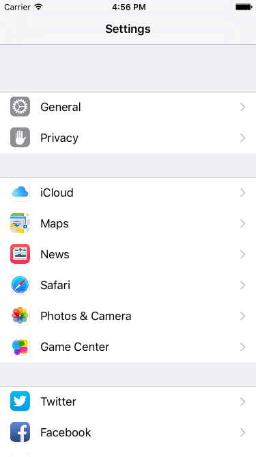
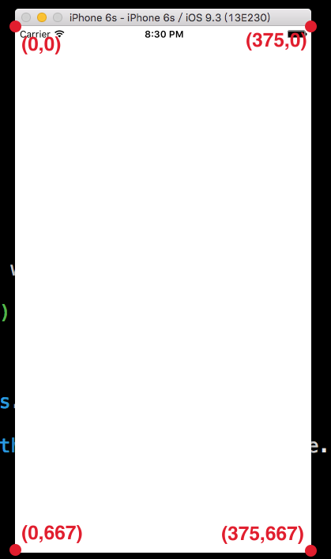
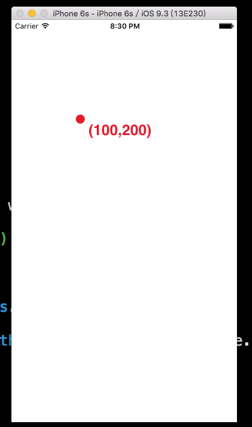

# UIKit 初探

從這節起，我們會開始介紹如何使用 UIKit 框架來建構一個應用程式。UIKit 框架代表著把一些建構 UI 功能的工具集合在一起，可以讓你快速、方便的使用這些工具。

首先在 Xcode 裡，[新建一個 **Single View Application** 類型的專案](../more/open_project.md#create_a_new_project)，取名為 MyFirstProject 。

▼ 已經有預先建立一些檔案在專案裡面，如下圖：


首先看到有兩隻 .swift 檔案：`AppDelegate.swift`及`ViewController.swift`，程式主要都是寫在這兩隻檔案裡面。

應用程式開啟時，會自`AppDelegate.swift`開始，這隻檔案負責應用程式的生命週期，像是啟動、閒置、進入後台、返回前台或是退出時要執行的動作。

接著看到 ViewController.swift ，是應用程式預設的主要視圖(`View`)控制器(`Controller`)，所有需要的 UI 功能(像是按鈕、文字或圖案等等)，都必須在這個 ViewController 裡面建立，通常會寫在`viewDidLoad()`這個方法裡面。

要如何建立 UI (`User Interface`使用者介面)呢？就是要用到內建的許多 UIKit 元件。

##### Hint

- 一個 UIViewController 負責一個畫面(即視圖`View`)的功能，未來如果有多個畫面時，就需要各自建立一個不同的 UIViewController。


### 隨處可見的 UIKit

在使用 iPhone 的經驗裡，你可能會發現很多應用程式的樣貌及使用方式都差不多，除了 Apple 官方提供了一些 UI 規則給開發者遵循之外，其實是因為大多數功能都是使用內建的 UIKit 元件就可以完成的。

▼ iPhone 的**設定 App **就是由許多的 UIKit 元件所組成，像是`UINavigationController`、`UITableView`及`UIImageView`等等，如下圖：



你也許可以觀察得到，這些元件都以`UI`為開頭，這是在 UIKit 設計時便特地命名的(也可以說是一種習慣)，讓你可以很輕易、清楚的明白你現在使用的東西的主要目的：這些元件都是用來建構 UI 的。

##### Hint

- 在往後的學習中，也可能會遇到一些有相同縮寫字母開頭的函式或類別，這都是在建立這些功能時特地命名的，所以你可以很清楚的知道哪些函式是用於同一種類型的功能。


### 建立第一個 UIKit 元件

最開頭的一開始，我們先介紹最基礎的一個元件：`UIView`，所有 UIKit 的元件(像是按鈕`UIButton`、文字`UITextView`等等)都是繼承自 UIView ，所以 UIView 其實很單純，只是有著每個元件都需要的、最基礎的屬性及方法。

要將元件放進畫面(即視圖`View`)中，需要了解有三個條件：原點、尺寸以及要疊加上去的父視圖。

#### 原點

iPhone 的原點是以左上角為`(0,0)`開始向右( x 軸)跟向下( y 軸)，如下圖以 iPhone 6s 為例：



上圖表示整個畫面中四個角各自`(x, y)`的數值。

而每個元件的原點，都是以相對於父視圖的`(0,0)`為準，如果一個元件的原點為`(100,200)`，表示 x 軸相對於父視圖的`(0,0)`還要向右 100， y 軸相對於父視圖的`(0,0)`還要向下 200，如下圖：



#### 尺寸

每個元件都可以設定自己的寬(`Width`)與長(`Height`)，而當有了原點及長寬之後，就可以構成一個矩形，也就是組合成了這個元件的形狀跟位置。

#### 父視圖

建構一個應用程式的畫面其實就像疊積木一樣，最底下的就是基底，將元件一個一個疊在另一個元件上來完成。每個元件都必須疊加在一個父視圖上才能顯示出來，而最基底的視圖則是 UIViewController 的一個屬性，在其內的方法都可以用`self.view`來表示這個基底視圖。

#### 以程式碼來完成

綜合上述元件的三個條件，可以用程式寫成如下：

```swift
// 定義一個 UIView 的常數 名稱為 firstView
let firstView = UIView(frame:
  CGRect(x: 0, y: 0, width: 100, height: 100))

// 將 firstView 加入到 self.view
self.view.addSubview(firstView)

```

上述程式可以看到，定義一個 UIView 可以使用`UIView(frame:)`這個函式，函式的參數是一個`CGRect`，`CGRect`就是由一個原點`(x, y)`及一個尺寸`(width, height)`組成，這行即定義了這個元件的原點與尺寸。

接著可以看到在基底視圖`self.view`使用`addSubview()`方法來加入前面定義的這個 UIView，這樣就完成了將這個元件加進畫面的動作。

這個 UIView 對於其父視圖(也就是`self.view`)的原點距離為`(0, 0)`(其實也就是同一點)，而尺寸為`(100, 100)`(長寬皆為 100 )。


### 以相對尺寸來設置元件

接著介紹另一個工具：`UIScreen`，這主要是用來代表螢幕的資訊，通常是用來取得整個螢幕的尺寸，如下：

```swift
// 取得螢幕的尺寸
let fullScreenSize = UIScreen.mainScreen().bounds.size

```

上述程式中，`UIScreen.mainScreen()`表示的是主畫面的資訊，其內有一個屬性為`bounds`，`bounds`又包含了兩個主要屬性：`origin`及`size`，分別是主畫面的**原點**及**尺寸**。

- origin：有兩個屬性`x`及`y`，也就是原點。通常會使用`CGPoint(x:,y:)`來設置一個點。
- size：有兩個屬性`width`及`height`，也就是尺寸，通常會使用`CGSize(width:,height:)`來設置一個尺寸。

而往後都會利用這個主畫面的尺寸來為每個元件設置相對的位置。

##### Hint

- 因為本書所有畫面都是用純程式碼構成，為了可以較為彈性的適用各尺寸 iPhone ，所以大多會以相對於整個螢幕畫面尺寸來設置 UIKit 元件的大小及位置。

在獲得了螢幕的尺寸以後，我們來將前面定義的 UIView 設置一個新的位置：

```swift
// 設置 UIView 的位置到畫面的中心
firstView.center = CGPoint(
  x: fullScreenSize.width * 0.5,
  y: fullScreenSize.height * 0.5)

```

上述程式可以看到，使用了 UIView 另一個屬性`center`，這代表著這個元件的**中心點位置**，也是以`(x, y)`來表示，所以可以用`CGPoint(x:,y:)`來設置一個新的點。這邊便以前面所取得的螢幕長與寬的一半數值來設置，這樣這個 UIView 便會被放置在畫面的正中央。

最後為了讓這個 UIView 可以明顯表示出來(不然原本都是白色，看不出來在哪)，為它加上一個底色：

```swift
// 將 UIView 的底色設置為藍色
firstView.backgroundColor = UIColor.blueColor()

```

這邊提到了 UIView 的一個屬性`backgroundColor`，是用來表示這個元件的底色。

而要設置成什麼顏色，就要用到另一個工具`UIColor`，用來產生顏色。`UIColor`已經內建許多直接產生顏色的方法，像是上面寫的`blueColor()`就是藍色，或是可以使用`init(red:,green:,blue:,alpha:)`來產生一個 RGB 顏色。

以上便完成了這節所要說明的內容，最後使用模擬器來看看成果，如下：


##### Hint

- 如果將 iPhone 6s 模擬器整個螢幕的 width 及 height 用`print()`印出來，你會發現寬與長分別為 375 與 667 ，但它實際的尺寸其實是 750 x 1334 ，這是因為單位不同。在程式中使用的單位是**點**( Point )，而實際尺寸是 **像素**( Pixel )，剛好是兩倍，也就是以 iPhone 6s 來說，一個點會包含 2x2 個像素。


### 範例

本節範例程式碼放在 [uikit/uikit_intro](https://github.com/itisjoe/swiftgo_files/tree/master/uikit/uikit_intro)

