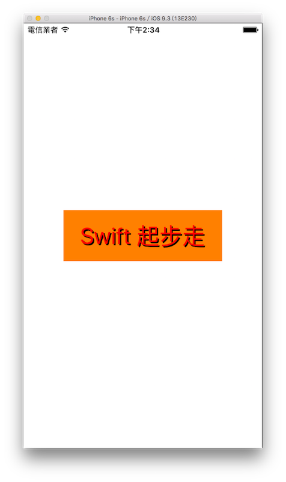

# 文字標籤 UILabel

UILabel 是用來顯示文字的元件，如果你需要單純顯示像是標題、人名、數字或是一段文字，就很適合使用 UILabel 。下圖為本節內容的目標：



#### 建立一個 UILabel

首先在 Xcode 裡，[新建一個 **Single View Application** 類型的專案](../more/open_project.md#create_a_new_project)，取名為 ExUILabel 。

使用`UILabel(frame:)`來建立一個 UILabel ：

```swift
// 使用 UILabel(frame:) 建立一個 UILabel
let myLabel = UILabel(frame: CGRect(x: 0, y: 0, width: 300, height: 80))

```

使用`CGRect(x:,y:,width:,height:)`來設定原點及尺寸。

#### 設定 UILabel 文字屬性

UILabel 的文字可以設定很多屬性，以下是常用到的：

```swift
// 文字內容
myLabel.text = "Swift 起步走"

// 文字顏色
myLabel.textColor = UIColor.redColor()

// 文字的字型與大小
myLabel.font = UIFont(name: "Helvetica-Light", size: 20)

// 可以再修改文字的大小
myLabel.font = myLabel.font.fontWithSize(24)

// 或是可以使用系統預設字型 並設定文字大小
myLabel.font = UIFont.systemFontOfSize(36)

// 設定文字位置 置左、置中或置右等等
myLabel.textAlignment = NSTextAlignment.Right

// 也可以簡寫成這樣
myLabel.textAlignment = .Center

// 文字行數
myLabel.numberOfLines = 1

// 文字過多時 過濾的方式
myLabel.lineBreakMode = NSLineBreakMode.ByTruncatingTail

// 陰影的顏色 如不設定則預設為沒有陰影
myLabel.shadowColor = UIColor.blackColor()

// 陰影的偏移量 需先設定陰影的顏色
myLabel.shadowOffset = CGSize(width: 2, height: 2)

```

上述內容在第一次看到時可能覺得那麼多東西怎麼記得著哪個要用哪個，但請記得常使用`esc`鍵來顯示自動完成功能，看看這個元件有什麼屬性或方法可以使用，以及按住`option`鍵再用滑鼠點選你有疑問的方法或屬性(像是按住`option`鍵再點`textColor`或`font`等等)，會列出更詳細的說明。

另外注意到 UILabel 的`textAlignment`及`lineBreakMode`這兩個屬性的值，使用到 [Swift 列舉](../ch2/enumerations.md)的特性，所以可以簡寫成`.Center`這種方式，如果忘記了可以回去該章節再看看。

還有關於`lineBreakMode`這個屬性，指的是文字過多時，要如何處理，像是`.ByTruncatingTail`就是保留開頭的文字，而將後面超出的文字以`...`代替。

#### 通用屬性

前一節提到大多數的元件都是繼承自`UIView`，所以很多屬性都是通用的，如下：

```swift
// 可以單獨設置新的 x 或 y
myLabel.bounds.origin.x = 50
myLabel.bounds.origin.y = 100
// 或是使用 CGPoint(x:,y:) 設置新的原點
myLabel.bounds.origin = CGPoint(x: 60, y: 120)

// 可以單獨設置新的 width 或 height
myLabel.bounds.size.width = 200
myLabel.bounds.size.height = 100
// 或是使用 CGSize(width:,height:) 設置新的尺寸
myLabel.bounds.size = CGSize(width: 250, height: 80)

// 取得螢幕的尺寸
let fullScreenSize = UIScreen.mainScreen().bounds.size

// 設置於畫面的中心點
myLabel.center = CGPoint(
  x: fullScreenSize.width * 0.5,
  y: fullScreenSize.height * 0.5)

// UILabel 的背景顏色
myLabel.backgroundColor = UIColor.orangeColor()

// 加入到畫面中
self.view.addSubview(myLabel)

```


### 範例

本節範例程式碼放在 [uikit/uilabel](https://github.com/itisjoe/swiftgo_files/tree/master/uikit/uilabel)

