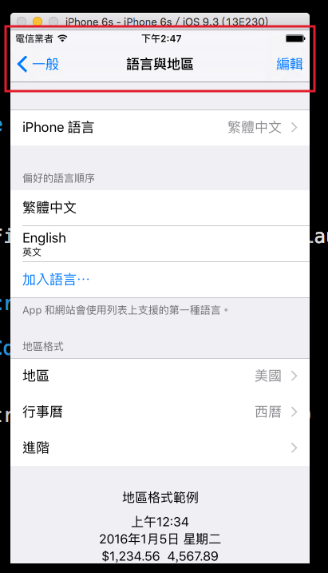
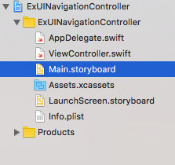
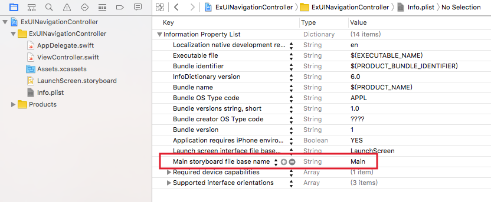
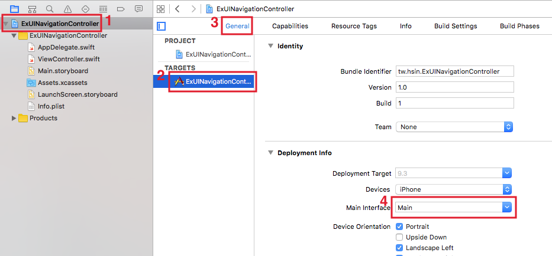
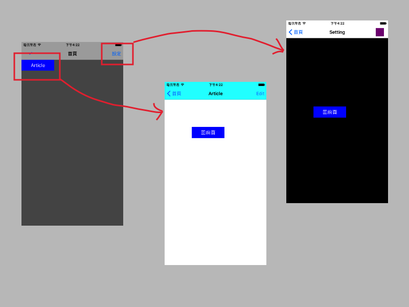

# 導覽控制器 UINavigationController

前一個章節介紹了如何[在多個頁面間切換](../uikit/multipages.md)，這節接著要介紹一個相當常見的元件：導覽控制器 UINavigationController，可以更為方便的掌控頁面切換。

導覽控制器就像是一個容器，裡面可以用來放置及疊放各個頁面，畫面上方預設會有一個導覽列( Navigation Bar ) ，其中可以放置標題及按鈕，來切換或退出頁面，像是內建的 **設定 App** 就是一個例子，如下：




### 手動建立頁面

在講導覽控制器之前，要先介紹如何手動建立頁面。最一開始有提過這本書的內容都是以純程式碼為主，但實際上每次[新建一個 **Single View Application** 類型的專案](../more/open_project.md#create_a_new_project)時，這個專案已經都內建了一個 Storyboard 以及相關的設定，這小節會介紹如何移除掉內建的 Storyboard 並手動建立頁面。

第一步先以[刪除檔案](../more/deletefile.md)的方式將 Storyboard 刪除，也就是下圖中列表的這隻檔案 Main.storyboard ：



第二步接著看到 Info.plist ，找到並刪除 Main storyboard file base name 這個欄位。(按減號` - `就可以刪除了。)



或是將`General > Deployment Info > Main Interface`這個欄位清空，如下：(這邊的設定會與上面指的 Info.plist 設定連動，所以兩邊清空其中一個，另一個就會一併清空，沒有的話就通通清空。)



最後一步轉往到 AppDelegate.swift ，在[UIKit 初探](../uikit/uikit_intro.md)有提到，這隻檔案是負責應用程式的生命週期，所以接著要在`AppDelegate`類別中的`application(application: UIApplication, didFinishLaunchingWithOptions launchOptions: [NSObject: AnyObject]?) -> Bool`方法中手動加上頁面，這個方法執行的時間點在應用程式啟動後：

```swift
func application(application: UIApplication,
  didFinishLaunchingWithOptions launchOptions: 
  [NSObject: AnyObject]?) -> Bool {
    // 建立一個 UIWindow
    self.window = UIWindow(frame:
      UIScreen.mainScreen().bounds)

    // 設置底色
    self.window!.backgroundColor = UIColor.whiteColor()
    
    // 設置根視圖控制器
    self.window!.rootViewController = ViewController();
    
    // 將 UIWindow 設置為可見的
    self.window!.makeKeyAndVisible()
    
    return true
}

```

上述程式中，先建立一個 UIWindow ，用來顯示應用程式所有畫面的視窗，有點像是桌面程式的視窗，不過在寫 Mac 應用程式時可能會有多個視窗可以切換，而 iOS 下則較為單純，只會有一個視窗，也就是這邊設置的`self.window`。

接著要為視窗設置屬性** rootViewController 根視圖控制器**，也就是應用程式啟動後進到的第一個視圖( View )所處的視圖控制器( ViewController )，這邊設置為`ViewController()`，你也可以依照需求設置成自己另外建立的 UIViewController 。

最後將這個視窗以`makeKeyAndVisible()`方法設置為可見的，完成手動建立頁面的步驟。

之後就如同先前的學習一樣，在 ViewController.swift 裡面設置自己需要的功能與元件。


### 建立 UINavigationController

這個範例的目標如下，建立一個導覽控制器，並內建一個主頁與兩個次頁，可以使用導覽列上的按鈕或是視圖中的按鈕切換頁面：



首先在 Xcode 裡，[新建一個 **Single View Application** 類型的專案](../more/open_project.md#create_a_new_project)，取名為 ExUINavigationController 。

接著以[加入檔案](../more/copyfile.md)的方式加入一張按鈕的圖片。

#### AppDelegate.swift

一開始先依據前一小節的步驟移除 Storyboard 檔案與相關設定，接著在 AppDelegate.swift 中將根視圖控制器設為一個 UINavigationController ，如下：

```swift
func application(application: UIApplication,
  didFinishLaunchingWithOptions launchOptions: 
  [NSObject: AnyObject]?) -> Bool {
    // 建立一個 UIWindow
    self.window = UIWindow(frame:
      UIScreen.mainScreen().bounds)

    // 設置底色
    self.window!.backgroundColor = UIColor.whiteColor()
    
    // 設置根視圖控制器
    let nav = UINavigationController(
      rootViewController: ViewController())
    self.window!.rootViewController = nav
    
    // 將 UIWindow 設置為可見的
    self.window!.makeKeyAndVisible()
    
    return true
}

```

上述程式可以看到將`self.window`的`rootViewController`設為導覽控制器 UINavigationController ，而這個導覽控制器只是一個容器，所以它也需要設置一個`rootViewController`，這邊則是設置成已經存在的`ViewController()`，你也可以依照需求設置成自己另外建立的 UIViewController 。

#### ViewController.swift

接著轉到 ViewController.swift 的`viewDidLoad()`方法中，將導覽列的設定與按鈕設置寫入：

```swift
// 底色
self.view.backgroundColor = UIColor.darkGrayColor()

// 導覽列標題
self.title = "首頁"

// 導覽列底色
self.navigationController?.navigationBar.barTintColor =
  UIColor.lightGrayColor()

// 導覽列是否半透明
self.navigationController?.navigationBar.translucent = false

// 導覽列左邊按鈕
let leftButton = UIBarButtonItem(
  image: UIImage(named:"check"), 
  style:.Plain , 
  target:self , 
  action: #selector(ViewController.check))
// 加到導覽列中
self.navigationItem.leftBarButtonItem = leftButton

// 導覽列右邊按鈕
let rightButton = UIBarButtonItem(
  title:"設定",
  style:.Plain, 
  target:self,
  action:#selector(ViewController.setting))
// 加到導覽列中
self.navigationItem.rightBarButtonItem = rightButton

// 建立一個按鈕
let myButton = UIButton(frame: CGRect(
  x: 0, y: 0, width: 120, height: 40))
myButton.setTitle("Article", forState: .Normal)
myButton.backgroundColor = UIColor.blueColor()
myButton.addTarget(
  self, 
  action: #selector(ViewController.article),
  forControlEvents: .TouchUpInside)
self.view.addSubview(myButton)

```

上述程式中，首先看到`self.navigationController?.navigationBar.translucent`這個屬性，用來表示導覽列是否要半透明，但需要在導覽列沒有設置底色時才有這個效果。另外還影響到內部視圖的原點位置，如果設為`true`，則原點與導覽列的原點一樣，都是整個畫面的左上角，而設為`false`時，內部視圖的原點則會被設在導覽列下方，你可以將這個屬性設為不同值來看看兩種情況。

接著看到設置導覽列按鈕是使用`UIBarButtonItem()`方法，而不是原始的`UIButton()`，它有四種常見的不同初始化方式，這邊先介紹兩個，稍後兩個次頁會分別各介紹一種。按鈕設置完成後要使用`self.navigationItem`的`leftBarButtonItem`或`rightBarButtonItem`屬性來加到導覽列中。

首先兩個方式為，**導覽列左邊按鈕**是將按鈕設置為一個圖片。而**導覽列右邊按鈕**則是設置為一個自定義文字。

接著則在`ViewController`中加上按鈕執行動作的方法：

```swift
func article() {
    self.navigationController?.pushViewController(
      ArticleViewController(), animated: true)
}

func check() {
    print("check button action")
}

func setting() {
    self.navigationController?.pushViewController(
      SettingViewController(), animated: true)
}

```

上述程式可以看到，導覽控制器用來切換頁面的方法為`pushViewController()`，參數分別為**要前往的頁面的視圖控制器**及**是否要有過場動畫**。

#### ArticleViewController.swift

接著看到 ArticleViewController.swift 的`viewDidLoad()`：

```swift
// 底色
self.view.backgroundColor = UIColor.whiteColor()

// 導覽列標題
self.title = "Article"

// 導覽列底色
self.navigationController?.navigationBar.barTintColor =
  UIColor.cyanColor()

// 導覽列是否半透明
self.navigationController?.navigationBar.translucent = false

// 導覽列右邊按鈕
let rightButton = UIBarButtonItem(
  barButtonSystemItem: .Edit,
  target: self,
  action: #selector(ArticleViewController.edit))
// 加到導覽列中
self.navigationItem.rightBarButtonItem = rightButton

// 建立一個按鈕
let myButton = UIButton(frame: CGRect(
  x: 100, y: 100, width: 120, height: 40))
myButton.setTitle("回前頁", forState: .Normal)
myButton.backgroundColor = UIColor.blueColor()
myButton.addTarget(
  self, 
  action: #selector(ArticleViewController.back),
  forControlEvents: .TouchUpInside)
self.view.addSubview(myButton)

```

進到這頁你應該可以發現，導覽列左邊按鈕已經預設為回前頁的按鈕，當然你也可以再重新設定左邊按鈕的功能。

而導覽列右邊按鈕，這邊是第三種方式，設置為系統內建樣式的按鈕，參數`barButtonSystemItem`提供了很多預設的文字可以設定，使用這個方式的好處是，它會依照你系統預設的語系顯示文字，如果有設置多國語系功能的話，這個按鈕就不需要再設置不同語言的文字。

接著則在`ArticleViewController`中加上按鈕執行動作的方法：

```swift
func edit() {
    print("edit action")
}

func back() {
    self.navigationController?.popViewControllerAnimated(true)
}

```

上述程式可以看到，雖然導覽列左邊按鈕已經有預設回前頁的按鈕，但這邊仍然建立一個自定義的按鈕，用來示範如何手動設置回前頁，導覽控制器用來返回頁面的方法為`popViewControllerAnimated()`，參數為**是否要有過場動畫**。

#### SettingViewController.swift

最後看到 SettingViewController.swift 的`viewDidLoad()`：

```swift
// 底色
self.view.backgroundColor = UIColor.blackColor()

// 導覽列標題
self.title = "Setting"

// 導覽列底色
self.navigationController?.navigationBar.barTintColor =
  UIColor.whiteColor()

// 導覽列是否半透明
self.navigationController?.navigationBar.translucent = false

// 導覽列右邊 UIView
let myUIView = UIView(frame: CGRect(
  x: 0, y: 0, width: 30, height: 30))
myUIView.backgroundColor = UIColor.purpleColor()
let rightButton = UIBarButtonItem(customView: myUIView)
// 加到導覽列中
self.navigationItem.rightBarButtonItem = rightButton

// 建立一個按鈕
let myButton = UIButton(frame: CGRect(
  x: 100, y: 250, width: 120, height: 40))
myButton.setTitle("回前頁", forState: .Normal)
myButton.backgroundColor = UIColor.blueColor()
myButton.addTarget(
  self, 
  action: #selector(SettingViewController.back),
  forControlEvents: .TouchUpInside)
self.view.addSubview(myButton)

```

上述程式可以看到最後一種建立 UIBarButtonItem 的方式，如果前面三種方式都不合你意的話，你可以設置一個自定義的 UIView 來代替按鈕，所以實際上你要擺什麼視圖在這上面都行(大部分元件都是繼承自 UIView)。

以上便為這節範例的內容。


### 圖片來源

- https://www.iconfinder.com/icons/510851/affirmative_check_mark_success_yes_icon


### 範例

本節範例程式碼放在 [uikit/uinavigationcontroller](https://github.com/itisjoe/swiftgo_files/tree/master/uikit/uinavigationcontroller)

