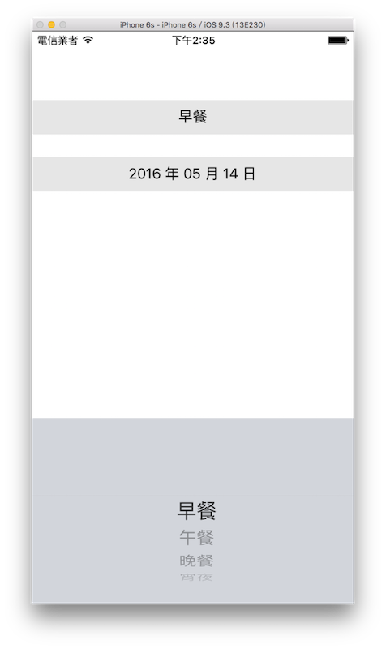

# 選擇器 UIPickerView

UIPickerView 與 UIDatePicker 有點類似，但彈性更大，當你需要有一個或多個選擇項目時，可以設定自定義的選項及數目。

本節會介紹兩個範例，第一個會介紹如何使用 UIPickerView ，接著則會介紹 UIPickerView 與 UIDatePicker 如何跟 UITextField 結合在一起應用。


### 建立 UIPickerView

這個範例會建立一個含有兩個選項的 UIPickerView ，可以分別選擇自己的選項，選完後可以再執行自定義的動作，目標如下：


首先在 Xcode 裡，[新建一個 **Single View Application** 類型的專案](../more/open_project.md#create_a_new_project)，取名為 ExUIPickerView 。

一開始先以[新增檔案](../more/addfile.md)的方式加入一個繼承自 UIViewController 的檔案，命名為 MyViewController ，這要用來實作 UIPickerView 委任模式的方法。

先看到`ViewController`，我們在`viewDidLoad()`裡建立一個`UIPickerView`，設定好它的位置、尺寸及委任對象，並加入到畫面中：

```swift
// 取得螢幕的尺寸
let fullScreenSize = UIScreen.mainScreen().bounds.size

// 建立 UIPickerView 設置位置及尺寸
let myPickerView = UIPickerView(frame: CGRect(
  x: 0, y: fullScreenSize.height * 0.3,
  width: fullScreenSize.width, height: 150))

// 新增另一個 UIViewController 
// 用來實作委任模式的方法
let myViewController = MyViewController()

// 必須將這個 UIViewController 加入
self.addChildViewController(myViewController)

// 設定 UIPickerView 的 delegate 及 dataSource
myPickerView.delegate = myViewController
myPickerView.dataSource = myViewController

// 加入到畫面
self.view.addSubview(myPickerView)

```

上述程式可以看到，利用稍前新建的 MyViewController.swift 檔案來做為 UIPickerView 的委任對象，在前面章節 [以 UITextField 為例的委任模式](../uikit/uitextfield.md#delegation) 中，是將委任對象設置為`self`，也就是本身所在的`ViewController`，而這邊則是使用另一個方式，將委任對象設置為另一個檔案，交由它來實作。

兩個方式都可以，端看你如何設計，像如果需要設置委任對象的元件太多時，你就可以分別為元件各自建立所屬的檔案來實作委任模式的方法，未來如果有需要這個獨立檔案也可以很快速的拿過去使用。

#### 委任模式

接著我們看到新建的`MyViewController`，首先為它加上委任模式需要的協定 UIPickerViewDelegate 與 UIPickerViewDataSource ，如下：

```swift
class MyViewController: UIViewController,
  UIPickerViewDelegate, UIPickerViewDataSource {
  // 省略
}
```

加上協定後你會看到出現如下圖的錯誤，因為這個委任模式有設置**必須實作的方法**：


所以你必須實作**它設置為必須實作的方法**，這邊必須實作的方法有兩個，如下：


上圖中返回的數字`1`是暫時的，稍後會完成這兩個方法的內容。

再來先為`MyViewController`加上四個屬性，稍後會使用於示範中：

```swift
class MyViewController: UIViewController,
  UIPickerViewDelegate, UIPickerViewDataSource {

    let week = [
      "星期日","星期一","星期二","星期三",
      "星期四","星期五","星期六"]
    let meals = ["早餐","午餐","晚餐","宵夜"]
    var whatDay = "星期日"
    var whatMeal = "早餐"

    // 省略
}

```

接著在`MyViewController`內實作其餘需要的委任的方法，以完善 UIPickerView 的內容，如下：

```swift
// UIPickerViewDataSource 必須實作的方法：
// UIPickerView 有幾列可以選擇
func numberOfComponentsInPickerView(
  pickerView: UIPickerView) -> Int {
    return 2
}

// UIPickerViewDataSource 必須實作的方法：
// UIPickerView 各列有多少行資料
func pickerView(pickerView: UIPickerView,
  numberOfRowsInComponent component: Int) -> Int {
    // 設置第一列時
    if component == 0 {
        // 返回陣列 week 的成員數量
        return week.count
    }

    // 否則就是設置第二列
    // 返回陣列 meals 的成員數量
    return meals.count
}

// UIPickerView 每個選項顯示的資料
func pickerView(pickerView: UIPickerView,
  titleForRow row: Int, forComponent component: Int) 
  -> String? {
    // 設置第一列時
    if component == 0 {
        // 設置為陣列 week 的第 row 項資料
        return week[row]
    }

    // 否則就是設置第二列
    // 設置為陣列 meals 的第 row 項資料
    return meals[row]
}

// UIPickerView 改變選擇後執行的動作
func pickerView(pickerView: UIPickerView,
  didSelectRow row: Int, inComponent component: Int) {
    // 改變第一列時
    if component == 0 {
        // whatDay 設置為陣列 week 的第 row 項資料
        whatDay = week[row]
    } else {
        // 否則就是改變第二列
        // whatMeal 設置為陣列 meals 的第 row 項資料
        whatMeal = meals[row]
    }
    
    // 將改變的結果印出來
    print("選擇的是 \(whatDay) ， \(whatMeal)")
}

```

上述程式的方法中，可以看到出現的參數`component`及`row`，分別代表著哪一列以及這列的哪一行資料，例如第二列的第三行資料，就是`component`為`1`以及`row`為`2`。

請注意，**這兩個參數`component`及`row`都是從`0`開始算起**，剛好與陣列從`0`開始算起相同，所以可以很方便的使用`week[row]`這種方式來找到需要的資料。

以上建立 UIPickerView 並實作好它需要的委任方法，即完成這個範例的程式內容。


### 與 UITextField 的綜合應用

以實務經驗來說， UIPickerView 大多會與 UITextField 結合應用，將選擇器嵌入在輸入框原先鍵盤的視圖位置，這樣就只會在需要的時候才顯示整個選擇器的畫面。

這個範例會放入兩個輸入框 UITextField ，並分別使用 UIPickerView 及 UIDatePicker 來當做輸入框的輸入工具，以下是目標：



首先在 Xcode 裡，[新建一個 **Single View Application** 類型的專案](../more/open_project.md#create_a_new_project)，取名為 ExPickerInUITextField 。

先為`ViewController`建立兩個屬性：

```swift
class ViewController: UIViewController {
    let meals = ["早餐","午餐","晚餐","宵夜"]
    var formatter: NSDateFormatter! = nil

    // 省略
}
```

以及在`viewDidLoad()`中取得螢幕尺寸，以供後續使用，如下：

```swift
// 取得螢幕的尺寸
let fullScreenSize = UIScreen.mainScreen().bounds.size

```

#### UIPickerView 與 UITextField

一開始先在`ViewController`內建立一個與 UIPickerView 結合應用的 UITextField ，如下：

```swift
// 建立一個 UITextField
var myTextField = UITextField(frame: CGRect(
  x: 0, y: 0,
  width: fullScreenSize.width, height: 40))

// 建立 UIPickerView
let myPickerView = UIPickerView()

// 設定 UIPickerView 的 delegate 及 dataSource
myPickerView.delegate = self
myPickerView.dataSource = self

// 將 UITextField 原先鍵盤的視圖更換成 UIPickerView
myTextField.inputView = myPickerView

// 設置 UITextField 預設的內容
myTextField.text = meals[0]

// 設置 UITextField 的 tag 以利後續使用
myTextField.tag = 100

// 設置 UITextField 其他資訊並放入畫面中
myTextField.backgroundColor = UIColor.init(
  red: 0.9, green: 0.9, blue: 0.9, alpha: 1)
myTextField.textAlignment = .Center
myTextField.center = CGPoint(
  x: fullScreenSize.width * 0.5,
  y: fullScreenSize.height * 0.15)
self.view.addSubview(myTextField)

```

上述程式可以看到 UITextField 的屬性`inputView`，預設為一個鍵盤的視圖，而將它設置為 UIPickerView ，便可以將其鍵盤取代。

另外還有一個屬性`tag`，所有 UIKIT 元件都有`tag`這個屬性，你可以為它設置一個整數數字，在之後要使用時，可以用父視圖的方法`viewWithTag()`來取得。像是上述的 UITextField 元件的`tag`設為`100`且加入到`self.view`，那稍後要取回這個 UITextField 時，就是使用`self.view?.viewWithTag(100) as? UITextField`。

接著如同前面一個範例檔案一樣，要設置委任對象，這次是將委任對象設為`self`，所以以下為`ViewController`加上需要的協定：

```swift
class ViewController: UIViewController,
  UIPickerViewDelegate, UIPickerViewDataSource {
  // 省略
}

```

再為`ViewController`加上委任需要的方法：

```swift
// UIPickerViewDataSource 必須實作的方法：
// UIPickerView 有幾列可以選擇
func numberOfComponentsInPickerView(
  pickerView: UIPickerView) -> Int {
    return 1
}

// UIPickerViewDataSource 必須實作的方法：
// UIPickerView 各列有多少行資料
func pickerView(
  pickerView: UIPickerView, 
  numberOfRowsInComponent component: Int) -> Int {
    // 返回陣列 meals 的成員數量
    return meals.count
}

// UIPickerView 每個選項顯示的資料
func pickerView(pickerView: UIPickerView,
  titleForRow row: Int,
  forComponent component: Int) -> String? {
    // 設置為陣列 meals 的第 row 項資料
    return meals[row]
}

// UIPickerView 改變選擇後執行的動作
func pickerView(pickerView: UIPickerView,
  didSelectRow row: Int, inComponent component: Int) {
    // 依據元件的 tag 取得 UITextField
    let myTextField = 
      self.view?.viewWithTag(100) as? UITextField
    
    // 將 UITextField 的值更新為陣列 meals 的第 row 項資料
    myTextField?.text = meals[row]
}

```

##### Hint 

- `as?`的用法請參考[向下型別轉換](../ch2/type-casting.md#change)。

#### UIDatePicker 與 UITextField

再來在`ViewController`內建立一個與 UIDatePicker 結合應用的 UITextField ，如下：

```swift
// 建立另一個 UITextField
myTextField = UITextField(frame: CGRect(
  x: 0, y: 0,
  width: fullScreenSize.width, height: 40))

// 初始化 formatter 並設置日期顯示的格式
formatter = NSDateFormatter()
formatter.dateFormat = "yyyy 年 MM 月 dd 日"

// 建立一個 UIDatePicker
let myDatePicker = UIDatePicker()

// 設置 UIDatePicker 格式
myDatePicker.datePickerMode = .Date

// 設置 UIDatePicker 顯示的語言環境
myDatePicker.locale = 
  NSLocale(localeIdentifier: "zh_TW")

// 設置 UIDatePicker 預設日期為現在日期
myDatePicker.date = NSDate()

// 設置 UIDatePicker 改變日期時會執行動作的方法
myDatePicker.addTarget(
  self, 
  action: 
    #selector(ViewController.datePickerChanged), 
  forControlEvents: .ValueChanged)

// 將 UITextField 原先鍵盤的視圖更換成 UIDatePicker
myTextField.inputView = myDatePicker

// 設置 UITextField 預設的內容
myTextField.text = 
  formatter.stringFromDate(myDatePicker.date)

// 設置 UITextField 的 tag 以利後續使用
myTextField.tag = 200

// 設置 UITextField 其他資訊並放入畫面中
myTextField.backgroundColor = UIColor.init(
  red: 0.9, green: 0.9, blue: 0.9, alpha: 1)
myTextField.textAlignment = .Center
myTextField.center = CGPoint(
  x: fullScreenSize.width * 0.5,
  y: fullScreenSize.height * 0.25)
self.view.addSubview(myTextField)

```

接著為`ViewController`加上變換日期後執行動作的方法：

```swift
// UIDatePicker 改變選擇時執行的動作
func datePickerChanged(datePicker:UIDatePicker) {
    // 依據元件的 tag 取得 UITextField
    let myTextField = 
      self.view?.viewWithTag(200) as? UITextField
    
    // 將 UITextField 的值更新為新的日期
    myTextField?.text =
      formatter.stringFromDate(datePicker.date)
}

```

#### 隱藏編輯狀態

最後為了選擇完後可以隱藏 UIPickerView (或 UIDatePicker )，加上點擊空白處可以隱藏編輯狀態的功能，先在`ViewController`中加上觸控事件：

```swift
// 增加一個觸控事件
let tap = UITapGestureRecognizer(
  target: self,
  action:
    #selector(ViewController.hideKeyboard(_:)))

tap.cancelsTouchesInView = false

// 加在最基底的 self.view 上
self.view.addGestureRecognizer(tap)

```

再為`ViewController`加上觸控事件的方法：

```swift
// 按空白處會隱藏編輯狀態
func hideKeyboard(tapG:UITapGestureRecognizer){
    self.view.endEditing(true)
}

```

以上便為這個範例的程式說明。


### 範例

本節範例程式碼放在 [uikit/uipickerview](https://github.com/itisjoe/swiftgo_files/tree/master/uikit/uipickerview)

