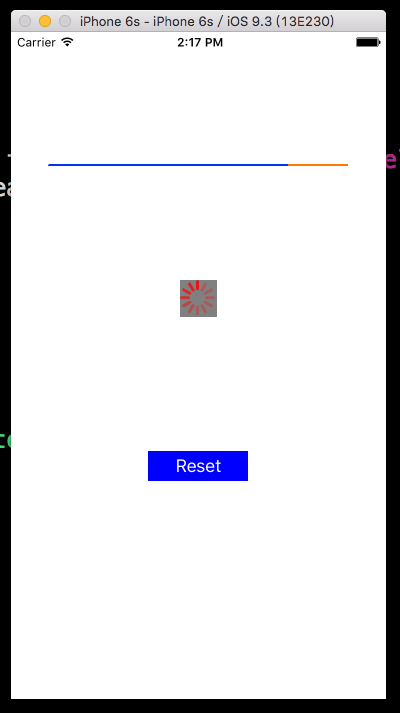

# 進度條 UIProgressView

當應用程式要執行一個需要花點時間的工作時，通常會使用進度條來告訴使用者，目前正在執行程式中，請稍後。UIKit 提供了兩種可以使用的進度條，一個是**長條進度條 UIProgressView** 以及**環狀進度條 UIActivityIndicatorView** 。

這節會一起示範這兩種進度條，以下是本節目標，分別建立兩種進度條，並放置一個按鈕用來重新執行進度條：



首先在 Xcode 裡，[新建一個 **Single View Application** 類型的專案](../more/open_project.md#create_a_new_project)，取名為 ExUIProgressView 。

一開始先為`ViewController`建立六個屬性：

```swift
class ViewController: UIViewController {
    var myProgressView:UIProgressView!
    var myActivityIndicator:UIActivityIndicatorView!
    var myTimer:NSTimer?
    var myButton:UIButton!
    var count = 0
    let complete = 100
 
    // 省略
}
```

以及在`viewDidLoad()`中取得螢幕尺寸，以供後續使用，如下：

```swift
// 取得螢幕的尺寸
let fullScreenSize = UIScreen.mainScreen().bounds.size

```


### 建立 UIProgressView

先在`viewDidload`裡建立一個長條進度條 UIProgressView ，如下：

```swift
// 建立一個 UIProgressView
myProgressView = UIProgressView(
  progressViewStyle : .Default)

// UIProgressView 的進度條顏色
myProgressView.progressTintColor=UIColor.blueColor()

// UIProgressView 進度條尚未填滿時底下的顏色
myProgressView.trackTintColor=UIColor.orangeColor()

// 設置尺寸與位置並放入畫面中
myProgressView.frame=CGRectMake(
  0,0,fullScreenSize.width * 0.8,50)
myProgressView.center = CGPoint(
  x: fullScreenSize.width * 0.5,
  y: fullScreenSize.height * 0.2)
self.view.addSubview(myProgressView)

```

上述程式中可以看到，使用`UIProgressView(progressViewStyle:)`建立，有兩種樣式可以選擇，分別為`.Default`及`.Bar`。要讓進度可以推進則是使用到`progess`屬性，稍後會繼續介紹。

請注意 UIProgressView 只可以設定寬度( width ) ，而高度( height )是固定的。


### 建立 UIActivityIndicatorView

接著在`viewDidload`裡建立一個環狀進度條 UIActivityIndicatorView ，如下：

```swift
// 建立一個 UIActivityIndicatorView
myActivityIndicator = UIActivityIndicatorView(
  activityIndicatorStyle:.WhiteLarge)

// 環狀進度條的顏色
myActivityIndicator.color = UIColor.redColor()

// 底色
myActivityIndicator.backgroundColor =
  UIColor.grayColor()

// 設置位置並放入畫面中
myActivityIndicator.center = CGPoint(
  x: fullScreenSize.width * 0.5,
  y: fullScreenSize.height * 0.4)
self.view.addSubview(myActivityIndicator);

```

上述程式中可以看到，使用`UIActivityIndicatorView(activityIndicatorStyle:)`建立，有三種樣式可以選擇，分別為`.Gray`、`.White`及`.WhiteLarge`。要啟動與停止則是使用到`startAnimating()`及`stopAnimating()`方法，稍後會繼續介紹。

請注意 UIActivityIndicatorView 設定的尺寸只會影響底色部分的大小，環狀進度條的尺寸部份則是固定無法變動。


### 模擬進度推進

在`viewDidload`裡建立一個按鈕用來重設進度以測試，並在`viewDidload`的最後先執行一次進度條的動作：

```swift
// 建立一個 UIButton
myButton = UIButton(frame: CGRect(
  x: 0, y: 0, width: 100, height: 30))
myButton.setTitle("Reset", forState: .Normal)
myButton.backgroundColor = UIColor.blueColor()
myButton.addTarget(
  nil,
  action:
    #selector(ViewController.clickButton),
  forControlEvents: .TouchUpInside)
myButton.center = CGPoint(
  x: fullScreenSize.width * 0.5,
  y: fullScreenSize.height * 0.65)
self.view.addSubview(myButton)

// 先執行一次進度條的動作
self.clickButton()

```

接著是按下按鈕後執行動作的方法：

```swift
func clickButton() {
    // 進度推進時讓按鈕無法作用
    myButton.enabled = false
    
    // 分別重設兩個進度條
    myProgressView.progress = 0
    myActivityIndicator.startAnimating()
    
    // 建立一個 NSTimer
    myTimer = NSTimer.scheduledTimerWithTimeInterval(
		0.2,
		target: self,
        selector:
          #selector(ViewController.showProgress),
        userInfo: ["test":"for userInfo test"],
        repeats: true)
}

```

上述程式可以看到利用 NSTimer 來設定一個計時器，以模擬進度推進。

NSTimer 是一個用來定時執行動作的類別，以下介紹`scheduledTimerWithTimeInterval()`方法的各參數：

- ti：第一個參數是間隔多久執行一次動作，單位是秒。
- target：執行動作的對象，通常是`self`。
- selector：定時執行的方法。
- userInfo：可以把需要的參數帶入方法中，沒有的話就填`nil`。
- repeats：是否可以重複執行，如果填`false`則是執行一次即不再動作。

在按下按鈕後，就會啟動一個 NSTimer ，以下則是這個計時器定時執行的方法：

```swift
func showProgress(sender: NSTimer) {
    // 以一個計數器模擬背景處理的動作
    count += 5
    
    // 每次都為進度條增加進度
    myProgressView.progress =
      Float(count) / Float(complete)

    // 進度完成時
    if count >= complete {
        // 示範 userInfo 傳入的參數
        var info = 
          sender.userInfo as? 
            Dictionary<String, AnyObject>
        print(info?["test"])
        
        // 重設計數器及 NSTimer 供下次按下按鈕測試
        count = 0
        myTimer?.invalidate()
        myTimer = nil

        // 隱藏環狀進度條
        myActivityIndicator.stopAnimating()

        // 將按鈕功能啟動
        myButton.enabled = true
    }
}

```

上述程式可以看到，使用屬性`count`每 0.2 秒 +5 ，來模擬進度推進的效果，當`count`加到 100 時則是完成進度，會重設各設定，以利下次按下按鈕繼續測試。

以上就是本節範例的介紹。請注意，本節範例只是示範用，實際使用進度條的情況應該是，在執行一個需要花點時間的工作時啟動，在這個工作完成時結束。


### 範例

本節範例程式碼放在 [uikit/uiprogressview](https://github.com/itisjoe/swiftgo_files/tree/master/uikit/uiprogressview)

