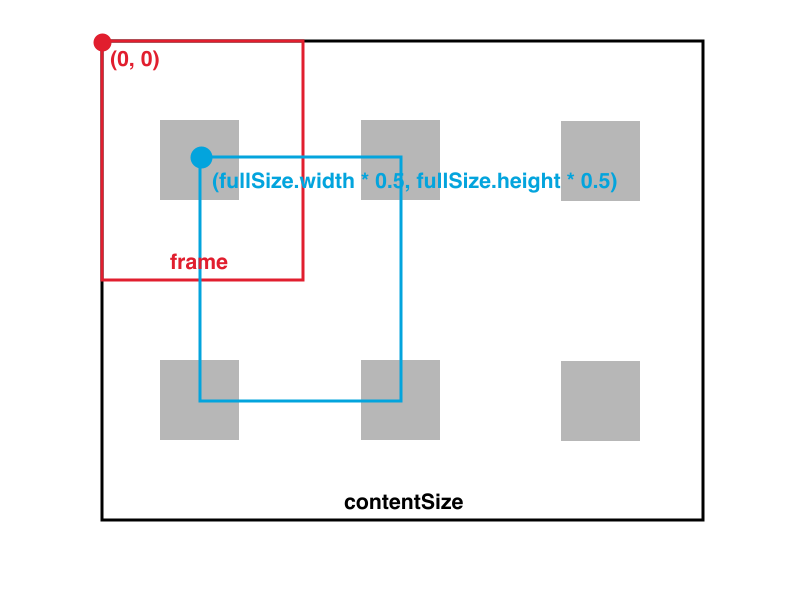

# 滑動視圖 UIScrollView

當一個元件的**實際視圖範圍**比**可見視圖範圍**大時，會加上滑動條( scroll bar )讓使用者自由滑動，UIScrollView 就是有這一特性的最基本元件。實際上，前面章節介紹過的 [UITextView](../uikit/uitextview.md) 、 [UITableView](../uikit/uitableview.md) 及 [UICollectionView](../uikit/uicollectionview.md) 都是繼承自 UIScrollView ，所以他們也都繼承了 UIScrollView 的特性。

本節會先介紹如何建立一個基本的 UIScrollView 並介紹常用的屬性及方法，接著會配合 UIPageControl 元件建立像是新手導覽左右滑動的分頁功能。


### 基本的 UIScrollView

首先在 Xcode 裡，[新建一個 **Single View Application** 類型的專案](../more/open_project.md#create_a_new_project)，取名為 ExUIScrollView 。

一開始先為`ViewController`建立兩個屬性：

```swift
class ViewController: UIViewController {
    var myScrollview: UIScrollView!
    var fullSize :CGSize!
 
    // 省略
}

```

以及在`viewDidLoad()`中取得螢幕尺寸，以供後續使用，如下：

```swift
// 取得螢幕的尺寸
fullSize = UIScreen.mainScreen().bounds.size

```

下圖是這個範例的示意圖，紅色矩形為屬性`frame`的尺寸，也就是可見視圖範圍。黑色矩形為屬性`contentSize`的尺寸，也就是實際視圖範圍。藍色點點則是屬性`contentOffset`設置的點( CGPoint )，表示起始畫面偏移量，如果不設定則是預設為紅色點點`(0, 0)`：



接著使用程式碼在`viewDidLoad()`中建立一個 UIScrollView ：

```swift
// 建立 UIScrollView
myScrollview = UIScrollView()

// 設置尺寸 也就是可見視圖範圍
myScrollview.frame = CGRect(
  x: 0, y: 20, width: fullSize.width,
  height: fullSize.height - 20)

// 實際視圖範圍 為 3*2 個螢幕大小
myScrollview.contentSize = CGSize(
  width: fullSize.width * 3,
  height: fullSize.height * 2)

// 是否顯示水平的滑動條
myScrollview.showsHorizontalScrollIndicator = true

// 是否顯示垂直的滑動條
myScrollview.showsVerticalScrollIndicator = true

// 滑動條的樣式
myScrollview.indicatorStyle = .Black

// 是否可以滑動
myScrollview.scrollEnabled = true

// 是否可以按狀態列回到最上方
myScrollview.scrollsToTop = false

// 是否限制滑動時只能單個方向 垂直或水平滑動
myScrollview.directionalLockEnabled = false

// 滑動超過範圍時是否使用彈回效果
myScrollview.bounces = true

// 縮放元件的預設縮放大小
myScrollview.zoomScale = 1.0

// 縮放元件可縮小到的最小倍數
myScrollview.minimumZoomScale = 0.5

// 縮放元件可放大到的最大倍數
myScrollview.maximumZoomScale = 2.0

// 縮放元件縮放時是否在超過縮放倍數後使用彈回效果
myScrollview.bouncesZoom = true

// 設置委任對象
myScrollview.delegate = self

// 起始的可見視圖偏移量 預設為 (0, 0)
// 設定這個值後 就會將原點滑動至這個點起始
myScrollview.contentOffset = CGPoint(
  x: fullSize.width * 0.5, y: fullSize.height * 0.5)

// 以一頁為單位滑動
myScrollview.pagingEnabled = false

// 加入到畫面中
self.view.addSubview(myScrollview)

```

以及在`viewDidLoad()`中建立用來凸顯滑動效果的六個 UIView ：

```swift
// 建立六個 UIView 來顯示出滑動的路徑
var myUIView = UIView()
for i in 0...2 {
    for j in 0...1 {
        myUIView = UIView(frame: CGRect(
          x: 0, y: 0, width: 100, height: 100))
        myUIView.tag = i * 10 + j + 1
        myUIView.center = CGPoint(
          x: fullSize.width * (0.5 + CGFloat(i)),
          y: fullSize.height * (0.5 + CGFloat(j)))
        let color =
          ((CGFloat(i) + 1) * (CGFloat(j) + 1)) / 12.0
        myUIView.backgroundColor = UIColor.init(
          red: color, green: color, blue: color, alpha: 1)
        myScrollview.addSubview(myUIView)
    }
}

```

可以縮放的元件還需要由委任對象實作的方法來設置，所以緊接著再設置委任需要的協定：

```swift
class ViewController: UIViewController, UIScrollViewDelegate {
  // 省略
}

```

以及委任模式可以實作的方法。 UIScrollView 提供給委任對象可以實作的方法很多，你可以在滑動或是縮放的各個階段(開始、進行中與結束等等)設置自定義的動作，以下示範幾個常用的：

```swift
// 開始滑動時
func scrollViewWillBeginDragging(scrollView: UIScrollView) {
    print("scrollViewWillBeginDragging")
}

// 滑動時
func scrollViewDidScroll(scrollView: UIScrollView) {
    //print("scrollViewDidScroll")
}

// 結束滑動時
func scrollViewDidEndDragging(scrollView: UIScrollView,
  willDecelerate decelerate: Bool) {
    print("scrollViewDidEndDragging")
}

// 縮放的元件
func viewForZoomingInScrollView(scrollView: UIScrollView) 
  -> UIView? {
    // 這邊用來示範縮放的元件是 tag 為 1 的 UIView
    // 也就是左上角那個 UIView
    return self.view.viewWithTag(1)
}

// 開始縮放時
func scrollViewWillBeginZooming(scrollView: UIScrollView,
  withView view: UIView?) {
    print("scrollViewWillBeginZooming")
}

// 縮放時
func scrollViewDidZoom(scrollView: UIScrollView) {
    //print("scrollViewDidZoom")
}

// 結束縮放時
func scrollViewDidEndZooming(scrollView: UIScrollView,
  withView view: UIView?, atScale scale: CGFloat) {
    print("scrollViewDidEndZooming")
    
    // 縮放元件時 會將 contentSize 設為這個元件的尺寸
    // 會導致 contentSize 過小而無法滑動
    // 所以縮放完後再將 contentSize 設回原本大小
    myScrollview.contentSize = CGSize(
      width: fullSize.width * 3, height: fullSize.height * 2)
}

```

如果要在模擬器上使用縮放手勢，請按著`option`，模擬器畫面上會出現兩個灰色的圈圈，就可以開始做縮放的動作。

以上就是這個範例的內容。


### 與 UIPageControl 的綜合應用


### 範例

本節範例程式碼放在 [uikit/uiscrollview](https://github.com/itisjoe/swiftgo_files/tree/master/uikit/uiscrollview)

