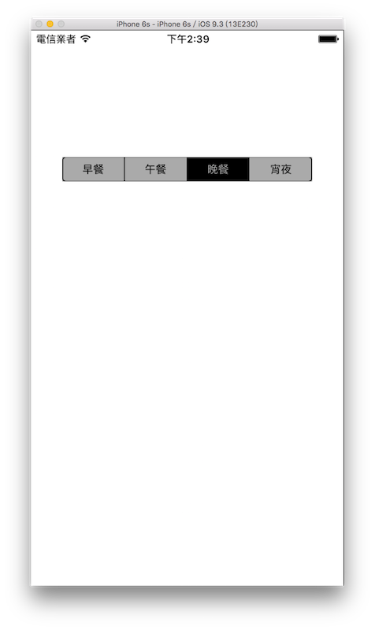

# 分段控制 UISegmentedControl

UISegmentedControl 最常見到的地方就是 iPhone 螢幕上緣下拉後出現的通知中心，你可以看到有 **今天** 與 **通知** 兩個選項( iOS 9 )，來切換底下不同的內容。

以下是本節的目標，分成四段選項，切換選項時會印出選到的值：



首先在 Xcode 裡，[新建一個 **Single View Application** 類型的專案](../more/open_project.md#create_a_new_project)，取名為 ExUISegmentedControl 。

一開始先在`viewDidLoad()`中取得螢幕尺寸，以供後續使用，如下：

```swift
// 取得螢幕的尺寸
let fullScreenSize = UIScreen.mainScreen().bounds.size

```

接著在`viewDidLoad()`中建立 UISegmentedControl ：

```swift
// 使用 UISegmentedControl(items:) 建立 UISegmentedControl
// 參數 items 是一個陣列 會依據這個陣列顯示選項
// 除了文字 也可以擺放圖片 像是 [UIImage(named:"play")!,"晚餐"]
let mySegmentedControl = UISegmentedControl(
  items: ["早餐","午餐","晚餐","宵夜"])

// 設置外觀顏色 預設為藍色
mySegmentedControl.tintColor = UIColor.blackColor()

// 設置底色 沒有預設的顏色
mySegmentedControl.backgroundColor =
  UIColor.lightGrayColor()

// 設置預設選擇的選項
// 從 0 開始算起 所以這邊設置為第一個選項
mySegmentedControl.selectedSegmentIndex = 0

// 設置切換選項時執行的動作
mySegmentedControl.addTarget(
  self,
  action:
    #selector(ViewController.onChange),
  forControlEvents: .ValueChanged)

// 設置尺寸及位置並放入畫面中
mySegmentedControl.frame.size = CGSize(
  width: fullScreenSize.width * 0.8, height: 30)
mySegmentedControl.center = CGPoint(
  x: fullScreenSize.width * 0.5,
  y: fullScreenSize.height * 0.25)
self.view.addSubview(mySegmentedControl)

```

最後為`ViewController`新增切換選項時執行動作的方法：

```swift
// 切換選項時執行動作的方法
func onChange(sender: UISegmentedControl) {
    // 印出選到哪個選項 從 0 開始算起
    print(sender.selectedSegmentIndex)
    
    // 印出這個選項的文字
    print(
      sender.titleForSegmentAtIndex(
        sender.selectedSegmentIndex))
}

```

以上即為本節範例的內容。


### 範例

本節範例程式碼放在 [uikit/uisegmentedcontrol](https://github.com/itisjoe/swiftgo_files/tree/master/uikit/uisegmentedcontrol)


