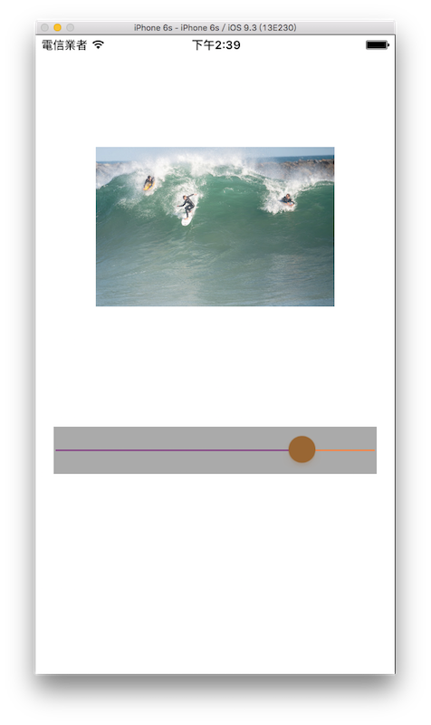

# 滑桿 UISlider

UISlider 常用在控制音量或影片播放進度。以下是本節的目標，建立一張圖片，並使用 UISlider 來控制圖片的透明度：



首先在 Xcode 裡，[新建一個 **Single View Application** 類型的專案](../more/open_project.md#create_a_new_project)，取名為 ExUISlider 。

一開始先為`ViewController`建立兩個屬性：

```swift
class ViewController: UIViewController {
    var imageView :UIImageView!
    var mySlider :UISlider!
 
    // 省略
}
```

以及在`viewDidLoad()`中取得螢幕尺寸，以供後續使用，如下：

```swift
// 取得螢幕的尺寸
let fullScreenSize = UIScreen.mainScreen().bounds.size

```

先建立一張圖片，以供後續示範使用：

```swift
// 建立一個 UIImageView
imageView = UIImageView(
  image: UIImage(named: "01.jpg"))
imageView.contentMode = .ScaleAspectFit
imageView.frame = CGRect(
  x: 0, y: 0, width: 250, height: 250)
imageView.center = CGPoint(
  x: fullScreenSize.width * 0.5,
  y: fullScreenSize.height * 0.3)
self.view.addSubview(imageView)

```


### 建立 UISlider

接著建立一個 UISlider ：

```swift
// 建立一個 UISlider
mySlider=UISlider(frame: CGRect(
  x: 0, y: 0, width:
  fullScreenSize.width * 0.9, height: 50))

// UISlider 底色
mySlider.backgroundColor = UIColor.lightGrayColor()

// UISlider 滑桿按鈕右邊 尚未填滿的顏色
mySlider.maximumTrackTintColor = UIColor.orangeColor()

// UISlider 滑桿按鈕左邊 已填滿的顏色
mySlider.minimumTrackTintColor = UIColor.purpleColor()

// UISlider 滑桿按鈕的顏色
mySlider.thumbTintColor = UIColor.brownColor()

// UISlider 的最小值
mySlider.minimumValue = 0

// UISlider 的最大值
mySlider.maximumValue = 100

// UISlider 預設值
mySlider.value = 100

// UISlider 是否可以在變動時同步執行動作
// 設定 false 時 則是滑動完後才會執行動作
mySlider.continuous = true

// UISlider 滑動滑桿時執行的動作
mySlider.addTarget(
  self,
  action:
    #selector(ViewController.onSliderChange),
  forControlEvents: UIControlEvents.ValueChanged)

// 設置位置並放入畫面中
mySlider.center = CGPoint(
  x: fullScreenSize.width * 0.5,
  y: fullScreenSize.height * 0.65)
self.view.addSubview(mySlider)

```

請注意 UISlider 可以設定寬度( width )，而高度( height )則是固定無法變動。

接著在`ViewController`中加入滑動滑桿時執行動作的方法：

```swift
func onSliderChange() {
    // 設置圖片的透明度
    imageView.alpha = CGFloat(
      mySlider.value / mySlider.maximumValue)
}

```

上述程式可以看到利用 UISlider 目前的值與最大值相比，來設定圖片的透明度。一個元件的`alpha`屬性是用來表示此元件的透明度，範圍是 0 到 1 ， 0 為完全透明，一直到 1 為完全顯示。

以上即為本節範例的內容。


### 圖片來源

- https://www.flickr.com/photos/66603656@N05/17349463116/


### 範例

本節範例程式碼放在 [uikit/uislider](https://github.com/itisjoe/swiftgo_files/tree/master/uikit/uislider)

