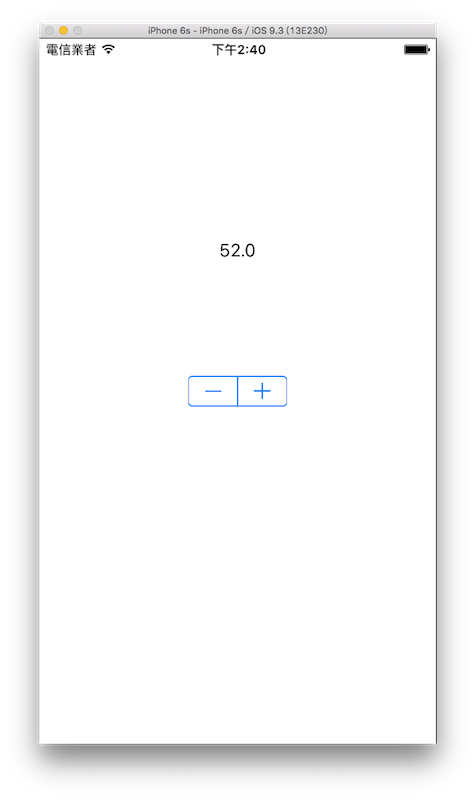

# 步進器 UIStepper

UIStepper 可以用來為一個數值作增減的動作，這個元件已經設定好增加及減少的按鈕，可以快速的建立起來。以下是本節的目標，使用 UIStepper 來增減數值並顯示在一個 UILabel 上：



首先在 Xcode 裡，[新建一個 **Single View Application** 類型的專案](../more/open_project.md#create_a_new_project)，取名為 ExUIStepper 。

一開始先為`ViewController`建立兩個屬性：

```swift
class ViewController: UIViewController {
    var myLabel :UILabel!
    var myStepper :UIStepper!
 
    // 省略
}
```

以及在`viewDidLoad()`中取得螢幕尺寸，以供後續使用，如下：

```swift
// 取得螢幕的尺寸
let fullScreenSize = UIScreen.mainScreen().bounds.size

```

先在`viewDidLoad()`中建立一個 UILabel ，以供後續示範使用：

```swift
// 建立一個 UILabel
myLabel = UILabel(frame: CGRect(
  x: 0, y: 0, width: 100, height: 40))
myLabel.text = "0"
myLabel.textColor = UIColor.blackColor()
myLabel.textAlignment = .Center
myLabel.center = CGPoint(
  x: fullScreenSize.width * 0.5,
  y: fullScreenSize.height * 0.3)
self.view.addSubview(myLabel)

```


### 建立 UIStepper

接著在`viewDidLoad()`中建立一個 UIStepper ：

```swift
// 建立一個 UIStepper
myStepper = UIStepper()

// UIStepper 預設值
myStepper.value = 0

// UIStepper 最小值
myStepper.minimumValue = 0

// UIStepper 最大值
myStepper.maximumValue = 100

// UIStepper 每按一次按鈕 增減的數值
myStepper.stepValue = 2

// UIStepper 是否可按著增減按鈕持續變化數值
myStepper.autorepeat = true

// UIStepper 是否可以在變動時同步執行動作
// 設定 false 時 則是放開按鈕後才會執行動作
myStepper.continuous = true

// UIStepper 數值是否可以循環
// 例如填 true 時 如果值已達到最大值
// 再按一次 + 會循環到最小值繼續加
myStepper.wraps = true

// UIStepper 按下增減按鈕後 執行的動作
myStepper.addTarget(
  self,
  action:
    #selector(ViewController.onStepperChange),
  forControlEvents: .ValueChanged)

// 設置 UIStepper 位置並放入畫面中
myStepper.center = CGPoint(
  x: fullScreenSize.width * 0.5,
  y: fullScreenSize.height * 0.5)
self.view.addSubview(myStepper)

```

請注意 UIStepper 的尺寸長寬是固定的，無法變動。

接著為`ViewController`加入 UIStepper 按下按鈕後執行動作的方法：

```swift
func onStepperChange() {
    // 將 UILabel 的值設置為 UIStepper 目前的值
    myLabel.text = "\(myStepper.value)"
}

```

以上即為本節範例的內容。


### 範例

本節範例程式碼放在 [uikit/uistepper](https://github.com/itisjoe/swiftgo_files/tree/master/uikit/uistepper)

