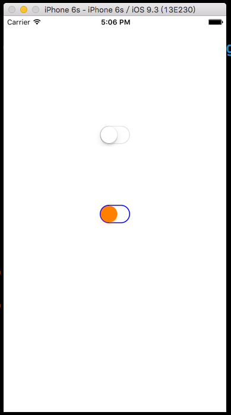

# 開關 UISwitch

UISwitch 適用於設定一個功能要開啟或關閉，是一個很常見的元件。

本節的目標如下，建立一個預設顏色的 UISwitch ，以及一個自定義顏色的 UISwitch ，並設定切換開關時變換底色：



首先在 Xcode 裡，[新建一個 **Single View Application** 類型的專案](../more/open_project.md#create_a_new_project)，取名為 ExUISwitch 。

先在`viewDidLoad()`中取得螢幕尺寸，以供後續使用，如下：

```swift
// 取得螢幕的尺寸
let fullScreenSize = UIScreen.mainScreen().bounds.size

```

一開始在`viewDidLoad`中建立一個預設狀態的 UISwitch ：

```swift
// 建立一個 UISwitch
var mySwitch = UISwitch()

// 設置位置並放入畫面中
mySwitch.center = CGPoint(
  x: fullScreenSize.width * 0.5,
  y: fullScreenSize.height * 0.3)
self.view.addSubview(mySwitch)

```

接著在`viewDidLoad`中建立一個自定義顏色的 UISwitch ，並設定切換開關時變換底色：

```swift
// 建立另一個 UISwitch
mySwitch = UISwitch()

// 設置滑桿鈕的顏色
mySwitch.thumbTintColor = UIColor.orangeColor()

// 設置未選取時( off )的外觀顏色
mySwitch.tintColor = UIColor.blueColor()

// 設置選取時( on )的外觀顏色
mySwitch.onTintColor = UIColor.brownColor()

// 設置切換 UISwitch 時執行的動作
mySwitch.addTarget(
  self,
  action:
    #selector(ViewController.onChange),
  forControlEvents: .ValueChanged)

// 設置位置並放入畫面中
mySwitch.center = CGPoint(
  x: fullScreenSize.width * 0.5,
  y: fullScreenSize.height * 0.5)
self.view.addSubview(mySwitch)

```

最後為`ViewController`新增一個切換開關時執行動作的方法：

```swift
// UISwitch 切換時 執行動作的方法
func onChange(sender: AnyObject) {
    // 取得這個 UISwtich 元件
    let tempSwitch = sender as! UISwitch
    
    // 依據屬性 on 來為底色變色
    if tempSwitch.on {
        self.view.backgroundColor =
          UIColor.blackColor()
    } else {
        self.view.backgroundColor =
          UIColor.whiteColor()
    }
}

```

以上便為本節範例的內容。

### 範例

本節範例程式碼放在 [uikit/uiswitch](https://github.com/itisjoe/swiftgo_files/tree/master/uikit/uiswitch)

