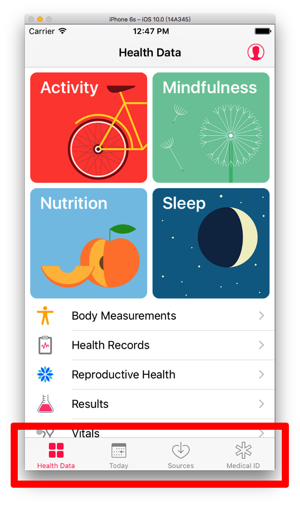
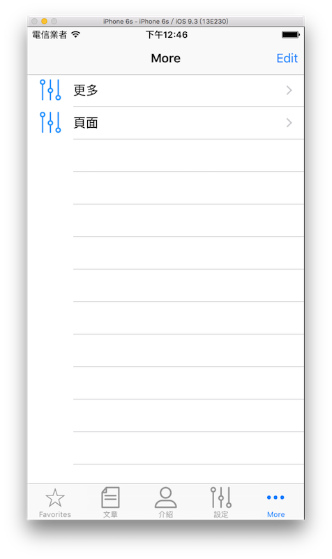

# 標籤列控制器 UITabBarController

前面兩節分別介紹了[在多個頁面間切換](../uikit/multipages.md)以及[導覽控制器 UINavigationController ](../uikit/uinavigationcontroller.md)，這節要介紹另一個也是相當常見的元件：標籤列控制器 UITabBarController 。

標籤列控制器與 UINavigationController 類似，也像是個容器，可以用來放置多個頁面，不同的地方在於，它會將可以前往的頁面以標籤列的方式列出，像是內建的 **健康 App** 就是一個例子，如下：




### 建立 UITabBarController

這個範例的目標如下，有四個頁面可供切換，皆列在標籤列中：


首先在 Xcode 裡，[新建一個 **Single View Application** 類型的專案](../more/open_project.md#create_a_new_project)，取名為 ExUITabBarController 。

接著先以[新增檔案](../more/addfile.md)的方式加入三個繼承自 UIViewController 的`.swift`檔案，分別命名為`ArticleViewController`、`IntroViewController`及`SettingViewController`。以及以[加入檔案](../more/copyfile.md)的方式加入四張按鈕的圖片。

#### AppDelegate.swift

一開始先依據[手動建立頁面](../uikit/uinavigationcontroller.md#handmade)的步驟移除 Storyboard 檔案與相關設定，接著在 AppDelegate.swift 中將根視圖控制器設為一個 UITabBarController ，如下：

```swift
func application(application: UIApplication,
  didFinishLaunchingWithOptions launchOptions: 
  [NSObject: AnyObject]?) -> Bool {
    // 建立一個 UIWindow
    self.window = UIWindow(frame:
      UIScreen.mainScreen().bounds)
    
    // 設置底色
    self.window!.backgroundColor = UIColor.whiteColor()
    
    // 建立 UITabBarController
    let myTabBar = UITabBarController()
    
    // 設置標籤列
    // 使用 UITabBarController 的屬性 tabBar 的各個屬性設置
    myTabBar.tabBar.backgroundColor = UIColor.clearColor()
    
    // 建立頁面 使用系統圖示
    let mainViewController = ViewController()
    mainViewController.tabBarItem =
      UITabBarItem(tabBarSystemItem: .Favorites, tag: 100)

    // 建立頁面 使用自定義圖示 有預設圖片及按下時圖片
    let articleViewController = ArticleViewController()
    articleViewController.tabBarItem = UITabBarItem(
      title: "文章", 
      image: UIImage(named: "article"), 
      selectedImage: UIImage(named: "articleSelected"))

    // 建立頁面 使用自定義圖示 只有預設圖片
    let introViewController = IntroViewController()
    introViewController.tabBarItem = UITabBarItem(
      title: "介紹", 
      image: UIImage(named: "profile"), 
      tag: 200)

    // 建立頁面 使用自定義圖示 可使用 tabBarItem 的屬性各自設定
    let settingViewController = SettingViewController()
    settingViewController.tabBarItem.image = 
      UIImage(named: "setting")
    settingViewController.tabBarItem.title = "設定"

    // 加入到 UITabBarController
    myTabBar.viewControllers = [
      mainViewController, articleViewController,
      introViewController, settingViewController]

    // 預設開啟的頁面 (從 0 開始算起)
    myTabBar.selectedIndex = 2
    
    // 設置根視圖控制器
    self.window!.rootViewController = myTabBar
    
    // 將 UIWindow 設置為可見的
    self.window!.makeKeyAndVisible()
    
    return true
}

```

上述程式可以看到，如果要設置標籤列的樣式，是使用 UITabBarController 的 tabBar 屬性設置。而各頁面可以使用不同的方式設置標籤列樣式，除了可以使用系統內建的圖示外，也可以設置自定義圖示。

標籤列最多可以放五個圖示，超過的話，最右邊的會變成一個`More`的圖示，按下後會列出來後續可前往的頁面，如下：



各頁面都放置一個 UILabel 來代表不同內容，這邊便不再複述，完整程式碼請參考文末的範例程式碼。

以上即為本節範例的內容。


### 圖片來源

- http://www.flaticon.com/free-icon/file_118714
- http://www.flaticon.com/free-icon/speech-bubble_118712
- http://www.flaticon.com/free-icon/profile_118781
- http://www.flaticon.com/free-icon/settings_118769


### 範例

本節範例程式碼放在 [uikit/uitabbarcontroller](https://github.com/itisjoe/swiftgo_files/tree/master/uikit/uitabbarcontroller)

