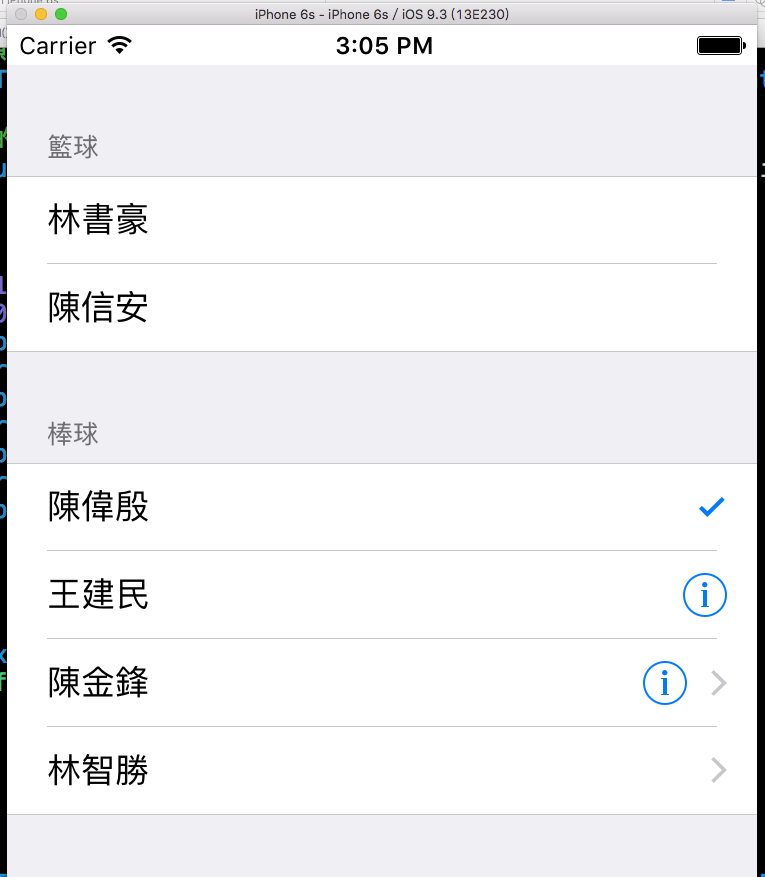
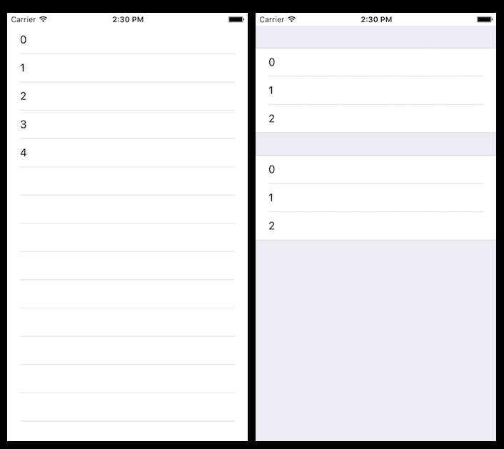

# 表格 UITableView

UITableView 是一個很常見的元件，當你需要將一批資料逐列顯示時常會使用到，每一個儲存格稱作一個 cell ，每個 cell 除了可以顯示文字外，還可以放置多個不同的元件。本節的目標如下：



首先在 Xcode 裡，[新建一個 **Single View Application** 類型的專案](../more/open_project.md#create_a_new_project)，取名為 ExUITableView 。

一開始先為`ViewController`建立一個測試用的陣列屬性：

```swift
class ViewController: UIViewController {
    var info = [
        ["林書豪","陳信安"],
        ["陳偉殷","王建民","陳金鋒","林智勝"]
    ]
 
    // 省略
}
```

以及在`viewDidLoad()`中取得螢幕尺寸，以供後續使用，如下：

```swift
// 取得螢幕的尺寸
let fullScreenSize = UIScreen.mainScreen().bounds.size

```


### 建立 UITableView

先在`viewDidLoad()`中建立 UITableView ：

```swift
// 建立 UITableView 並設置原點及尺寸
let myTableView = UITableView(frame: CGRect(
  x: 0, y: 20, 
  width: fullScreenSize.width,
  height: fullScreenSize.height - 20),
  style: .Grouped)

// 註冊 cell
myTableView.registerClass(
  UITableViewCell.self, forCellReuseIdentifier: "Cell")

// 設置委任對象
myTableView.delegate = self
myTableView.dataSource = self

// 分隔線的樣式
myTableView.separatorStyle = .SingleLine

// 分隔線的間距 四個數值分別代表 上、左、下、右 的間距
myTableView.separatorInset =
  UIEdgeInsetsMake(0, 20, 0, 20)

// 是否可以點選 cell
myTableView.allowsSelection = true

// 是否可以多選 cell
myTableView.allowsMultipleSelection = false

// 加入到畫面中
self.view.addSubview(myTableView)

```

UITableView 可以設置為兩種樣式，如下圖，左邊為`.Plain`及右邊的`.Grouped`：



可依照需求設置不同的樣式，本節範例會以`.Grouped`作為示範。

接著看到`registerClass()`這個註冊 cell 的方法。要先了解到當 cell 數量超過一個畫面可顯示時，目前存在的 cell 只有畫面上的這些(否則資料有成千上萬時，誰受得了)，當上下滑動時，會隨顯示畫面的不同同時移出並加入 cell，這個動作不是一直建立新的 cell 而是會重複使用( reuse )，所以必須先註冊這個 reuse 的 cell ，辨識名稱設為`"Cell"`，來讓後續顯示時可以使用。


### 委任模式

UITableView 必須設置委任模式的對象來完善這個表格的內容，先為`ViewController`加上委任需要的協定：

```swift
class ViewController: UIViewController,
  UITableViewDelegate, UITableViewDataSource {
  // 省略
}

```

以及兩個必須實作的方法：

```swift
// 必須實作的方法：每一組有幾個 cell
func tableView(tableView: UITableView,
  numberOfRowsInSection section: Int) -> Int {
    return info[section].count
}

// 必須實作的方法：每個 cell 要顯示的內容
func tableView(tableView: UITableView,
  cellForRowAtIndexPath indexPath: NSIndexPath)
  -> UITableViewCell {
    // 取得 tableView 目前使用的 cell
    let cell = 
      tableView.dequeueReusableCellWithIdentifier(
        "Cell", forIndexPath: indexPath) as 
        UITableViewCell
    
    // 設置 Accessory 按鈕樣式
    if indexPath.section == 1 {
        if indexPath.row == 0 {
            cell.accessoryType = .Checkmark
        } else if indexPath.row == 1 {
            cell.accessoryType = .DetailButton
        } else if indexPath.row == 2 {
            cell.accessoryType =
              .DetailDisclosureButton
        } else if indexPath.row == 3 {
            cell.accessoryType = .DisclosureIndicator
        }
    }
    
    // 顯示的內容
    if let myLabel = cell.textLabel {
        myLabel.text = 
          "\(info[indexPath.section][indexPath.row])"
    }

    return cell
}

```

UITableView 委任的方法大多會有`indexPath`參數，這個參數有兩個屬性分別為`section`及`row`，是用來表示目前要設置的 cell 是屬於哪一組( section )的哪一列( row )，型別都為 Int 且都是由 0 開始算起。

主要注意到第二個方法**每個 cell 要顯示的內容**。一開始可以看到需要使用稍前註冊的 cell 使用的辨識名稱`"Cell"`，這邊就是告訴程式要使用哪一個 cell 來重複使用。

接著看到設置 Accessory 按鈕樣式，顯示在每個 cell 右邊的按鈕，可依照需求設置不同的樣式，如果不設置就是留空。

最後可以看到`cell.textLabel`，型別為`UILabel?`，分別依照不同組的不同列來設置顯示的文字。

委任對象除了**必須實作的方法**之外，還有許多可以額外設置的方法，如下：

```swift
// 點選 cell 後執行的動作
func tableView(tableView: UITableView,
  didSelectRowAtIndexPath indexPath: NSIndexPath) {
    // 取消 cell 的選取狀態
    tableView.deselectRowAtIndexPath(
      indexPath, animated: true)
    
    let name = info[indexPath.section][indexPath.row]
    print("選擇的是 \(name)")
}

// 點選 Accessory 按鈕後執行的動作
// 必須設置 cell 的 accessoryType
// 設置為 .DisclosureIndicator (向右箭頭)之外都會觸發
func tableView(tableView: UITableView, 
  accessoryButtonTappedForRowWithIndexPath 
  indexPath: NSIndexPath) {
    let name = info[indexPath.section][indexPath.row]
    print("按下的是 \(name) 的 detail")
}

// 有幾組 section
func numberOfSectionsInTableView(
  tableView: UITableView) -> Int {
    return info.count
}

// 每個 section 的標題
func tableView(tableView: UITableView,
  titleForHeaderInSection section: Int) -> String? {
    let title = section == 0 ? "籃球" : "棒球"
    return title
}

```

以上便為本節範例的內容。


### 更多委任對象的方法

UITableView 提供給委任對象可以實作的方法很多，除了本節範例中示範的之外，以下再列出常使用到的方法，可依照需求彈性使用：

```swift
// 設置每個 section 的 title 為一個 UIView
// 如果實作了這個方法 會蓋過單純設置文字的 section title
func tableView(tableView: UITableView,
  viewForHeaderInSection section: Int) -> UIView? {
    return UIView()
}

// 設置 section header 的高度 
func tableView(tableView: UITableView,
  heightForHeaderInSection section: Int) -> CGFloat {
    return 80
}

// 每個 section 的 footer
func tableView(tableView: UITableView,
  titleForFooterInSection section: Int) -> String? {
    return "footer"
}

// 設置每個 section 的 footer 為一個 UIView
// 如果實作了這個方法 會蓋過單純設置文字的 section footer
func tableView(tableView: UITableView,
  viewForFooterInSection section: Int) -> UIView? {
    return UIView()
}

// 設置 section footer 的高度
func tableView(tableView: UITableView,
  heightForFooterInSection section: Int) -> CGFloat {
    return 80
}

// 設置 cell 的高度
func tableView(tableView: UITableView,
  heightForRowAtIndexPath indexPath: NSIndexPath) 
  -> CGFloat {
    return 80
}


```


### 範例

本節範例程式碼放在 [uikit/uitableview](https://github.com/itisjoe/swiftgo_files/tree/master/uikit/uitableview)

