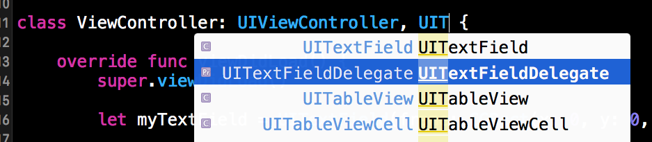
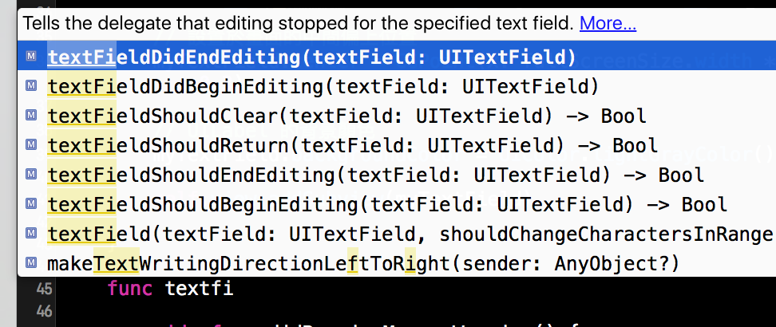

# 文字輸入 UITextField

應用程式很常遇到需要輸入文字的時候，像是登入時的帳號或密碼，這時會需要用到 UITextField，本節的目標如下：


首先在 Xcode 裡，[新建一個 **Single View Application** 類型的專案](../more/open_project.md#create_a_new_project)，取名為 ExUITextField 。

以下使用 UITextField(frame:) 建立一個 UITextField，並介紹其常用的屬性：

```swift
// 使用 UITextField(frame:) 建立一個 UITextField
let myTextField = UITextField(frame: CGRect(x: 0, y: 0, width: 200, height: 50))

// 尚未輸入時的預設顯示提示文字
myTextField.placeholder = "請輸入文字"

// 輸入框的樣式 這邊選擇圓角樣式
myTextField.borderStyle = .RoundedRect

// 輸入框右邊顯示清除按鈕時機 這邊選擇當編輯時顯示
myTextField.clearButtonMode = .WhileEditing

// 輸入框適用的鍵盤 這邊選擇 適用輸入 Email 的鍵盤(會有 @ 跟 . 可供輸入)
myTextField.keyboardType = .EmailAddress

// 鍵盤上的 return 鍵樣式 這邊選擇 Done
myTextField.returnKeyType = .Done

// 輸入文字的顏色
myTextField.textColor = UIColor.whiteColor()

// UITextField 的背景顏色
myTextField.backgroundColor = UIColor.lightGrayColor()

```

上述程式中的`borderStyle`、`clearButtonMode`、`keyboardType`和`returnKeyType`屬性，都各自有多種選擇可供使用，你可以在輸入`.`之後按下`esc`鍵，會列出來所有可以選擇的項目，其他的項目就交由你自己玩玩看。

UITextField 也可以使用多種通用屬性，上述程式只設置了`textColor`及`backgroundColor`，但其實像是`font`或`textAlignment`，它也可以設置。


### 委任模式

基於[ Swift 協定](../ch2/protocols.md)的特性，這邊會開始介紹一個極為重要且在後續學習中會大量見到的設計模式：[委任模式](../ch2/protocols.md#delegation)( Delegation )。如果覺得不太熟悉的話，可以先回到前面的章節看看。

委任模式的意思是，在設計元件或功能時，會定義數個不等的方法( method )，但只會定義出這些方法的名稱，而這些方法要做什麼事，則是要交由**委任( delegate )的對象**來實作。

這邊使用 UITextField 來示範你的第一個使用委任模式的應用程式。例如在設計一個 UITextField (輸入框)時，通常用來輸入內容的鍵盤上會有一個**完成**的按鈕(通常位於鍵盤的右下角`Return`鍵)。

原始設計上都不會實際把按下**完成**按鈕會做什麼事寫死在元件裡，而是設計成委任模式，表示我這邊有一個事件(即按下完成後要幹嘛)待完成，我會交給委任的對象來實作。

而交付委任對象的方式，就是要設置`delegate`屬性，如下：

```swift
// 委任模式( Delegation )所要實作方法的對象
// 這邊就是交由 self 也就是 ViewController 本身
myTextField.delegate = self

```

以上設置完成後，你會得到一個紅色的錯誤，先別緊張，因為這是提示你為 UITextField 設置了一個委任的對象，但這個對象尚未遵循這個委任，所以要為 ViewController 加上協定`UITextFieldDelegate`，如下圖：



設置完成的 ViewController 會長得如下：

```swift
class ViewController: UIViewController, UITextFieldDelegate {
    // 省略內容
}

```

##### Hint

- 如果看不太懂，請往前參考[ Swift 協定](../ch2/protocols.md)章節。

這時你就可以依據委任的協定來建立應該要實作的方法，如下圖：



上圖可以看到，為 ViewController 建立一個委任模式需要的新方法，輸入`func textfi`這樣到一半時，會自動顯示多個方法可供實作，以 UITextField 這邊來說就是輸入框各個動作階段，像是圖中前三個方法就是**結束輸入時**、**開始輸入時**及**按下清除按鈕時**。

以下為實作**按下`return`按鈕時**的方法：

```swift
func textFieldShouldReturn(textField: UITextField) -> Bool {
    // 結束編輯 把鍵盤隱藏起來
    self.view.endEditing(true)
    
    return true
}

```

上述程式就是當按下`return`按鈕時，會將鍵盤隱藏起來。

##### Hint

- 委任模式會將需要實作的方法設置為`必須`或`可選`，如果設置為**必須的方法**，則委任對象一定要將這個方法實作出來，不然會直接吐錯誤給你，叫你一定要實作，而如果設置為**可選的方法**，則是依照你的需求，看要實作哪些方法，才實際實作出來，像是上面示範的 UITextField 委任的方法就都是**可選的方法**，不用每一個都實作出來。


### 範例

本節範例程式碼放在 [uikit/uitextfield](https://github.com/itisjoe/swiftgo_files/tree/master/uikit/uitextfield)

