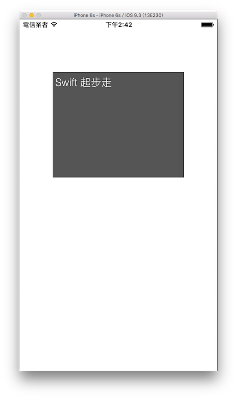

# 輸入多行文字 UITextView

UITextView 與 UITextField 有點類似，時常用在輸入或顯示多行文字，很常見的應用就是通訊軟體的文字輸入框，你可以輸入多行文字一次送出。本節的目標如下：




### 建立一個 UITextView

首先在 Xcode 裡，[新建一個 **Single View Application** 類型的專案](../more/open_project.md#create_a_new_project)，取名為 ExUITextView 。

這節建立 UITextView 時，我們會為 ViewController 建立一個 UITextView 屬性，以因應後續的使用，如下：

```swift
class ViewController: UIViewController {
    // 建立一個 UITextView 的屬性
    var myTextView: UITextView!

    override func viewDidLoad() {
        // 省略
    }
}

```

接著便在`viewDidLoad()`中建立 UITextView ，可以看到這邊是使用屬性`myTextView`來生成，如下：

```swift
// 使用 UITextView(frame:) 建立一個 UITextView
myTextView = UITextView(
  frame: CGRect(x: 0, y: 0, width: 250, height: 200))

```

與 UITextField 類似，有許多一樣的屬性可以設定，如下：

```swift
// 背景顏色
myTextView.backgroundColor = UIColor.darkGrayColor()

// 文字顏色
myTextView.textColor = UIColor.whiteColor()

// 文字字型及大小
myTextView.font = UIFont(name: "Helvetica-Light", size: 20)

// 文字向左對齊
myTextView.textAlignment = .Left

// 預設文字內容
myTextView.text = "Swift 起步走"

// 適用的鍵盤樣式 這邊選擇預設的
myTextView.keyboardType = .Default

// 鍵盤上的 return 鍵樣式 這邊選擇預設的
myTextView.returnKeyType = .Default

```

另外常用的屬性還有如下：

```swift
// 文字是否可以被編輯
myTextView.editable = true

// 文字是否可以被選取
myTextView.selectable = true

```

最後就是將元件加入畫面中：

```swift
// 取得螢幕的尺寸
let fullScreenSize = UIScreen.mainScreen().bounds.size

// 設置於畫面的中間偏上位置
myTextView.center = CGPoint(
  x: fullScreenSize.width * 0.5,
  y: fullScreenSize.height * 0.3)

// 加入畫面
self.view.addSubview(myTextView)

```


### 自訂選取內容後的選項

當顯示一段文字時，可以在選取文字後，對這段文字進行操作，像是全選、複製、貼上等等。除此之外，我們還可以自己增加需要的功能選項，如下：

```swift
// 建立兩個新的選項
let mail = UIMenuItem(
  title: "寄送", 
  action: #selector(ViewController.sendMail))
let facebook = UIMenuItem(
  title: "FB",
  action: #selector(ViewController.sendFB))

// 建立選單
let menu = UIMenuController()

// 將新的選項加入選單
menu.menuItems = [mail,facebook]

```

上述程式中，建立選項時可以看到`UIMenuItem()`的其中一個參數為`action`，這代表按下這個選項後要執行的動作，而這個動作會寫在`#selector(ViewController.sendMail)`，也就是`ViewController`的`sendMail`方法中，所以我們還需要為這兩個新的選項加上新的`ViewController`的方法，用來處理按下後的動作，如下：

```swift
func sendMail() {
    print("sendMail")
}

func sendFB() {
    print("sendFB")
}

```

選項建立好後，就可以看到下面這樣的結果，有額外的選項可供選擇：


### 按空白處隱藏鍵盤

介紹前一節的 UITextField 時，是使用鍵盤上的`return`鍵來隱藏鍵盤，而使用 UITextView 時，有時候會需要換行就沒辦法使用`return`鍵來結束編輯，這時就需要使用別的方式來替換。這邊介紹一個常用的方式，以**按輸入框之外其他空白處**的方式來隱藏鍵盤。

```swift
// 增加一個觸控事件
let tap = UITapGestureRecognizer(
  target: self,
  action: #selector(ViewController.hideKeyboard(_:)))

tap.cancelsTouchesInView = false

// 加在最基底的 self.view 上
self.view.addGestureRecognizer(tap)

```

上述程式可以看到同樣需要一個`action`來處理這個觸控事件，所以需要為`ViewController`加上一個新的方法`hideKeyboard(_:)`，如下：

```swift
func hideKeyboard(tapG:UITapGestureRecognizer){
    // 除了使用 self.view.endEditing(true)
    // 也可以用 resignFirstResponder()
    // 來針對一個元件隱藏鍵盤
    self.myTextView.resignFirstResponder()
}

```

要隱藏鍵盤，除了前一節介紹的`self.view.endEditing(true)`之外，也可以對元件使用`resignFirstResponder()`方法。

First Responder 代表的是目前畫面中，處於焦點狀態的元件，而當輸入文字時，這個輸入框就是 First Responder ，所以如果要隱藏鍵盤，當然就是將 First Responder 取消，也就是使用`resignFirstResponder()`方法。


### 範例

本節範例程式碼放在 [uikit/uitextview](https://github.com/itisjoe/swiftgo_files/tree/master/uikit/uitextview)

