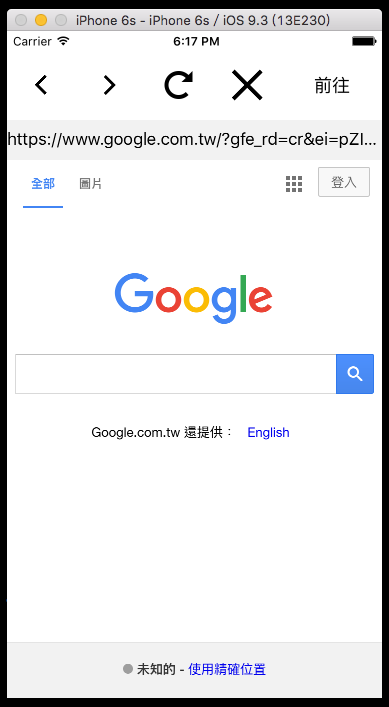
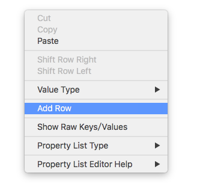
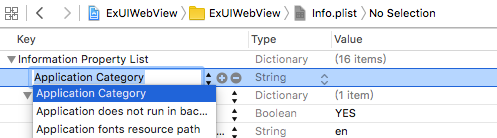
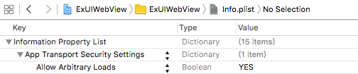

# 網頁 UIWebView

應用程式中有時如果需要載入一些外部網站時，可以使用 UIWebView ，可以很快速的建立起來。以下是本節的目標，一個超輕量瀏覽器，上方有五個按鈕，功能分別為**上一頁**、**下一頁**、**重新讀取**、**取消讀取**及**前往網址**，以及一個網址列與 UIWebView ：



首先在 Xcode 裡，[新建一個 **Single View Application** 類型的專案](../more/open_project.md#create_a_new_project)，取名為 ExUIWebView 。再以[加入檔案](../more/copyfile.md)的方式加入四張按鈕的圖片。

先為`ViewController`建立四個屬性：

```swift
class ViewController: UIViewController {
    var myTextField :UITextField!
    var myWebView :UIWebView!
    var myActivityIndicator:UIActivityIndicatorView!
 
    // 省略
}
```

以及在`viewDidLoad()`中取得螢幕尺寸跟預設尺寸，以供後續使用，如下：

```swift
// 取得螢幕的尺寸
let fullScreenSize = UIScreen.mainScreen().bounds.size

// 預設尺寸
let goWidth = 100.0
let actionWidth =
  ( Double(fullScreenSize.width) - goWidth ) / 4

```


### 前置作業

一開始先在`viewDidLoad()`裡建立五個 UIButton 及一個用來輸入網址的 UITextField ：

```swift
// 建立五個 UIButton
var myButton = UIButton(frame: CGRect(
  x: 0, y: 20,
  width: actionWidth, height: actionWidth))
myButton.setImage(
  UIImage(named: "back")!, forState: .Normal)
myButton.addTarget(
  self, 
  action:
    #selector(ViewController.back),
  forControlEvents: .TouchUpInside)
self.view.addSubview(myButton)

myButton = UIButton(frame: CGRect(
  x: actionWidth, y: 20,
  width: actionWidth, height: actionWidth))
myButton.setImage(
  UIImage(named: "forward")!, forState: .Normal)
myButton.addTarget(
  self,
  action:
    #selector(ViewController.forward), 
  forControlEvents: .TouchUpInside)
self.view.addSubview(myButton)

myButton = UIButton(frame: CGRect(
  x: actionWidth * 2, y: 20,
  width: actionWidth, height: actionWidth))
myButton.setImage(
  UIImage(named: "refresh")!, forState: .Normal)
myButton.addTarget(
  self,
  action:
    #selector(ViewController.reload),
  forControlEvents: .TouchUpInside)
self.view.addSubview(myButton)

myButton = UIButton(frame: CGRect(
  x: actionWidth * 3, y: 20,
  width: actionWidth, height: actionWidth))
myButton.setImage(
  UIImage(named: "stop")!, forState: .Normal)
myButton.addTarget(
  self,
  action:
    #selector(ViewController.stop),
  forControlEvents: .TouchUpInside)
self.view.addSubview(myButton)

myButton = UIButton(frame: CGRect(
  x: Double(fullScreenSize.width) - goWidth, y: 20, 
  width: goWidth, height: actionWidth))
myButton.setTitle("前往", forState: .Normal)
myButton.setTitleColor(
  UIColor.blackColor(), forState: .Normal)
myButton.addTarget(
  self,
  action:
    #selector(ViewController.go),
  forControlEvents: .TouchUpInside)
self.view.addSubview(myButton)

// 建立一個 UITextField 用來輸入網址
myTextField = UITextField(frame: CGRect(
  x: 0, y: 20.0 + CGFloat(actionWidth),
  width: fullScreenSize.width, height: 40))
myTextField.text = "https://www.google.com"
myTextField.backgroundColor = UIColor.init(
  red: 0.95, green: 0.95, blue: 0.95, alpha: 1)
myTextField.clearButtonMode = .WhileEditing
myTextField.returnKeyType = .Go
myTextField.delegate = self
self.view.addSubview(myTextField)

```

接著設置 UITextField 的委任需要的協定：

```swift
class ViewController: 
  UIViewController, UITextFieldDelegate {
  // 省略
}

```

再於`ViewController`中，將按下按鈕及鍵盤執行動作的方法加入：

```swift
func back() {
    // 上一頁
    myWebView.goBack()
}

func forward() {
    // 下一頁
    myWebView.goForward()
}

func reload() {
    // 重新讀取
    myWebView.reload()
}

func stop() {
    // 取消讀取
    myWebView.stopLoading()
    
    // 隱藏環狀進度條
    myActivityIndicator.stopAnimating()
}

func go() {
    // 隱藏鍵盤
    self.view.endEditing(true)

    // 前往網址
    let url = NSURL(string:myTextField.text!)
    let urlRequest = NSURLRequest(URL: url!)
    myWebView.loadRequest(urlRequest)
}

func textFieldShouldReturn(textField: UITextField) -> Bool {
    self.go()
    
    return true
}

```


### 建立 UIWebView

在`viewDidLoad()`裡建立 UIWebView 以及讀取網頁時顯示的環狀進度條。在`viewDidLoad()`的最後先讀取一次網址：

```swift
// 建立 UIWebView
myWebView = UIWebView(frame: CGRect(
	x: 0, y: 60.0 + CGFloat(actionWidth), 
	width: fullScreenSize.width,
    height:
      fullScreenSize.height - 60
      - CGFloat(actionWidth)))

// 設置委任對象
myWebView.delegate = self

// 加入到畫面中
self.view.addSubview(myWebView)

// 建立環狀進度條
myActivityIndicator = UIActivityIndicatorView(
  activityIndicatorStyle:.Gray)
myActivityIndicator.center = CGPoint(
  x: fullScreenSize.width * 0.5,
  y: fullScreenSize.height * 0.5)
self.view.addSubview(myActivityIndicator);

// 先讀取一次網址
self.go()

```

為了讓進度條可以顯示及隱藏，必須設定 UIWebView 的委任並實作兩個方法，首先加上委任需要的協定：

```swift
class ViewController: UIViewController, 
  UITextFieldDelegate, UIWebViewDelegate {
  // 省略
}

```

兩個委任需要實作的方法，分別是開始讀取網址時執行動作，以及讀取網址完成時執行動作：

```swift
func webViewDidStartLoad(webView: UIWebView) {
    // 顯示進度條
    myActivityIndicator.startAnimating()
}

func webViewDidFinishLoad(webView: UIWebView) {
    // 隱藏進度條
    myActivityIndicator.stopAnimating()
    
    // 更新網址列的內容
    if let currentURL = myWebView.request?.URL!.absoluteString {
        myTextField.text = currentURL
    }
}

```

以上便為本節範例的內容。


### 讀取靜態 HTML 原始碼

UIWebView 還有另一個功能，可以讓你讀取 HTML 原始碼並顯示出來，使用`loadHTMLString()`方法，如下：

```swift
// 你也可以設置 HTML 內容到一個常數
// 用來載入一個靜態的網頁內容
let content = 
  "<html><body><h1>Hello World !</h1></body></html>"
myWebView.loadHTMLString(content, baseURL: nil)

```


### 無法載入 http 的網址

在 iOS 9 之後，應用程式內的 UIWebView 預設為只能載入 https 的網頁(也就是加密過的)，如果是普通 http 的網頁會無法開啟，這邊介紹如何設定成可開啟 http 網頁。

首先在 Xcode 左側專案的檔案列表中，找到 info.plist 並點開，在其內空白處點右鍵，接著按下`Add Row`，如下圖：



接著他會多出一列，並要你填寫，如下圖：



先填入`NSAppTransportSecurity`，再對剛新增的這列按右鍵點選`Add Row`，填入`NSAllowsArbitraryLoads`並設為`YES`，最後會變成如下圖所示：



這樣便設定完成，你的 UIWebView 就可以載入 http 網頁了。不過這只是暫緩之計，以長遠來看，還是將所有讀取的網頁都設定為 https 還是比較安全。


### 圖片來源

- https://www.iconfinder.com/icons/211686/arrow_back_icon
- https://www.iconfinder.com/icons/211688/arrow_forward_icon
- https://www.iconfinder.com/icons/293657/x_icon
- https://www.iconfinder.com/icons/293697/refresh_icon


### 範例

本節範例程式碼放在 [uikit/uiwebview](https://github.com/itisjoe/swiftgo_files/tree/master/uikit/uiwebview)

